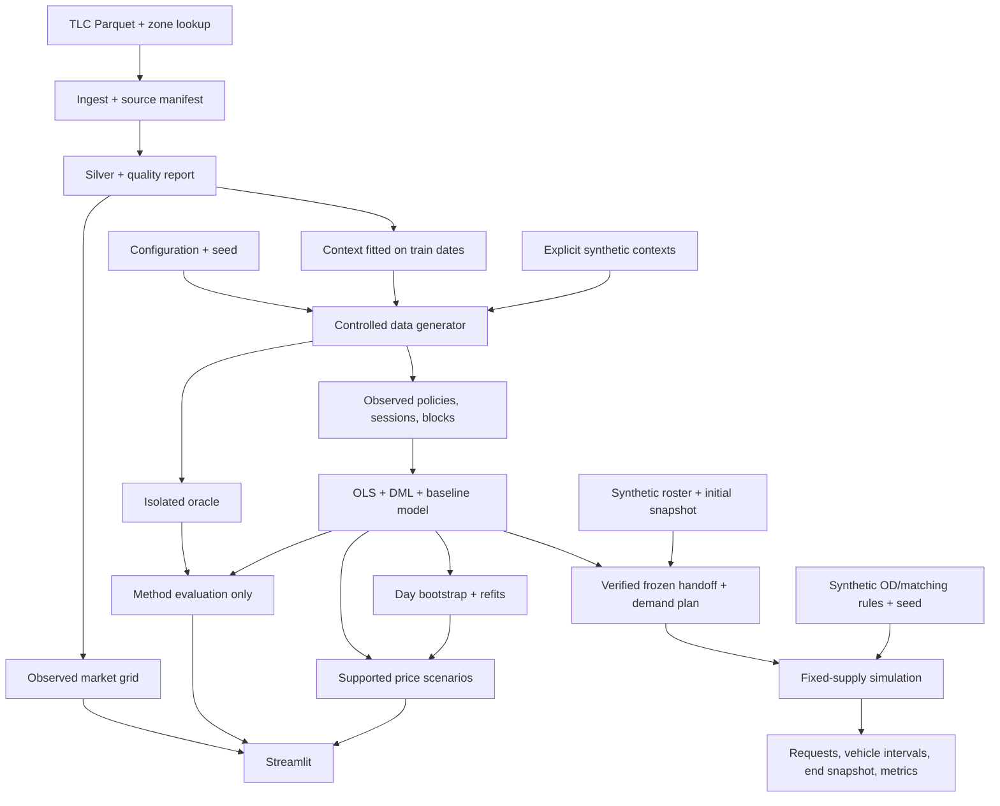

# Project architecture

```text
configs/                  TOML profiles; no secrets
src/gsm_poc/
  config.py               validated configuration and date scope
  artifacts.py            hashing, atomic files, manifests and stage lifecycle
  ingest.py               immutable TLC sources and download validation
  validate.py             TLC schema and shared probability checks
  build_silver.py         DuckDB normalization and row-level quality flags
  build_marts.py          complete operational grid and reconciliation
  build_context.py        train-only context templates and fallback metadata
  generate.py             policy, sessions, block tables, isolated oracle
  features.py             allowlisted encoding and day-based splits
  estimate.py             OLS / LinearDML and model bundle
  uncertainty.py          bootstrap with complete refits by original day
  evaluate.py             oracle-only method evaluation and seed checkpoints
  scenario.py             supported price changes and uncertainty
  demand.py               frozen choice-to-request bridge and initial snapshot validation
  marketplace_simulator.py bounded SimPy fixed-supply trajectories and accounting
  pipeline.py             stage orchestration and content-based reuse
  cli.py, __main__.py      python -m gsm_poc
  app.py                  Streamlit artifact reader
tests/                    deterministic fixtures and behavior coverage
docs/                     active roadmap, contract, architecture and protocols
docs/reference/           proposal and target engine design
docs/submission/          dated reports and preserved result bundles
data/bronze/              source bytes and source manifests (ignored)
data/silver/, data/gold/   versioned observed artifacts (ignored)
data/synthetic/<id>/
  observed/               estimator-visible policy/session/block data
  oracle/                 true probabilities, hidden U, coefficients
runs/<id>/                manifests, bundles, effects, diagnostics, exports
```



## Boundaries

The generator may create oracle artifacts. Only the evaluator and method
verification tab may read them. The estimator receives the observed block table;
its encoder constructs W from a fixed allowlist. Scenarios use a fitted model
bundle and frozen held-out context, never oracle probabilities.

TLC operational records have `source_kind=observed_tlc`. Offline simulations have
`source_kind=synthetic`; simulations using train-fitted TLC context have
`source_kind=semi_synthetic`. All simulated behavior has evidence level C.

Models are fitted in batch. UI controls do not train models, download raw data, or
launch Monte Carlo jobs. Joblib bundles are trusted local artifacts, not an upload
format. A completed manifest and artifact checksums gate dashboard loading.

## Storage and execution

Tables use Parquet; metadata uses strict JSON; exchange outputs use CSV/JSON.
Every stage writes outputs atomically, records failure context, and reuses a result
only when input, source-code, configuration, and artifact hashes match. Run manifests
record code revision, configuration, data identity, seed, dependency lock hash,
Python/package versions, timings, and successful artifacts.

The CLI implements `ingest`, `build`, `generate`, `fit`, `evaluate`, `scenario`,
`prepare-demand`, `simulate-marketplace` and `run-all`. Dataset and model run IDs
explicitly select dependent artifacts.
Synthetic mode can run without network access or TLC data. TLC mode never
substitutes synthetic trips for missing observed records.

The demand bridge and fixed-supply simulator run in batch, using verified local
artifacts. They preserve the frozen choice scope, apply price effects once and
count the shared X/Y fleet once. The simulator uses explicit synthetic OD/matching
rules, fixed shifts and static SOC. Version 2 supports consecutive windows with
queued/busy carry-in, pickup deadlines and explicit customer cancellation before
pickup. Operational checkpoints retain the frozen arrival schedule, original
request timestamps, vehicle activity and pending events; aborted pickup legs
finish before vehicle release. Request/state-time accounting is checked per
window. Supply response, energy/charging, operational calibration and the solver
remain later work. Execution instructions and artifact-reading guidance are in
[USAGE.md](USAGE.md).

## Research table schemas

The following are proposed logical schemas for researcher-built GSM tables.
They are not GSM export requirements or implemented table names. Native sources
are requested in [GSM_DATA_CONTRACT.md](GSM_DATA_CONTRACT.md); their mappings must
be validated before these grains are used.

| Logical table | Grain/key | Content |
|---|---|---|
| `quote_session` | One session / `session_id` | Customer key, context, observation window, outcome/censoring |
| `quote_option` | One option per display/refresh / quote-set + quote + display-event key | Service, displayed/available, visible price/discount/ETA/position, policy version |
| `booking_event` | One native status event / source + event key | Request/booking/trip/session links, status/time, cancel actor/reason, retry/parent |
| `policy_assignment` | One assignment / assignment key | Unit/time, arm, offered/assigned/applied, probability/rule, exposure/override |
| `driver_offer_shift` | One offer/shift decision event / native decision key | Driver/shift, eligibility, terms known before decision, acceptance/rejection, outcome |
| `driver_vehicle_state` | Native state event or constructed interval / source + event/interval key | Driver/vehicle/shift, zone, state/eligibility/SOC, gaps/coverage |
| `payment_cost` | One ledger item / source + native ledger key | Business links, revenue/refund/pay/bonus/cost/funder/currency, rule version |
| `operational_event` | One dispatch/trip/charging event / source + native event key | Attempts/responses, timestamps/duration/distance, station/energy, matching version |
| `demand_block` | Zone × time block × service | Quote exposure, requests, conversion, pretreatment context, completeness |
| `baseline_snapshot` | One baseline window / snapshot version | Initial states, roster, request rates, calibration/rules, quality |

Mappings preserve raw data and record source/schema versions, grain, quality
flags and denominators. Check join cardinality, effective periods, retries/parents
and failed links; nearest-time joins need uncertainty labels. Distinguish observed
zero, missing, unknown and not applicable. No trips does not establish offline state.

The controlled PoC currently writes `synthetic_policy_block`,
`synthetic_quote_session` and `choice_block` under `observed/`. The estimation
grain is zone × time block, with session counts and X/Y/NONE proportions.
These generated tables do not establish a mapping from GSM native schemas.

## Artifact conventions

| Artifact | Current support | Content/convention |
|---|---|---|
| `demand_plan` | Implemented choice-to-request bridge | Zone/service, block start/end, requests/hour, model/source references, fixed quote exposure and support; baseline rates accompany target rates |
| `admission_plan` | Proposed supply interface | Driver/vehicle/shift keys, shift start/end, service eligibility, roster reference, target serviceable hours, compensation version |
| `scenario_result` | Choice scenarios implemented; full marketplace comparison proposed | Scenario/run/model references and scope; baseline/target/delta, unit/population/denominator, source/evidence, interval/support/status/reason; snapshot references for operational comparisons |
| `prediction_record` | Proposed experiment record | Frozen model/snapshot/policy/assignment references, forecast and analysis plan; reconciliation appends results without overwriting the frozen forecast |

Current model bundles use trusted local `.joblib` files and retain feature,
outcome and treatment order, baseline model and support diagnostics. A full
demand/supply/calibration response bundle remains a target interface. New logical
schemas require explicit versioning and implementation mapping; current manifests
provide run/source/configuration references and checksums.

Research durations, distances and energy use seconds, km and kWh, with SOC in
`[0,1]`. Preserve original TLC miles/USD alongside normalized distance; currency
conversion does not transfer behavioral coefficients. Timestamp conversions
follow source metadata, including the declared timezone for naive TLC timestamps
and simulation windows. Block duration is configurable; analysis blocks, shifts,
event times and experimental washout are distinct.

Request rates are requests/hour; expected choices and completed trips are separate
quantities. Serviceable hours count idle, dispatch/reserved, pickup and on-trip
time, excluding charging/charging queue, breaks and ineligible time. Idle hours
are a subset, and the shared fleet is counted once. Price effects enter request
generation once; a fitted choice model alone does not forecast completed trips.

## Dashboard conventions

The Streamlit workbench uses a run/DGP/seed selector and three sections:
Operations, Method checks, and Price scenarios, with exports and interpretation
notes beside the outputs. Charts read computed artifacts. Source, support and
uncertainty labels remain adjacent to results.

The existing Hallmark design uses cool paper, restrained cobalt, Bahnschrift
display text and Segoe UI body text. Portable values live in `tokens.css`;
layout styling lives in `src/gsm_poc/ui.css` and native Streamlit theme settings.
Widgets use native state/loading/error feedback, immediate focus rings and
reduced-motion support. Tables retain local horizontal scrolling on narrow screens.
The historical browser QA record is in
[historical validation](submission/days/20261003/validation.md#browser-verification).

## Statistical contract

[IDENTIFICATION.md](IDENTIFICATION.md) owns the estimand, matrix ordering,
baseline/scenario formulas, support and inference rules.
[BENCHMARK.md](BENCHMARK.md) owns evaluation protocols and acceptance thresholds;
[USAGE.md](USAGE.md#reading-result-statuses) explains how to read result statuses.
