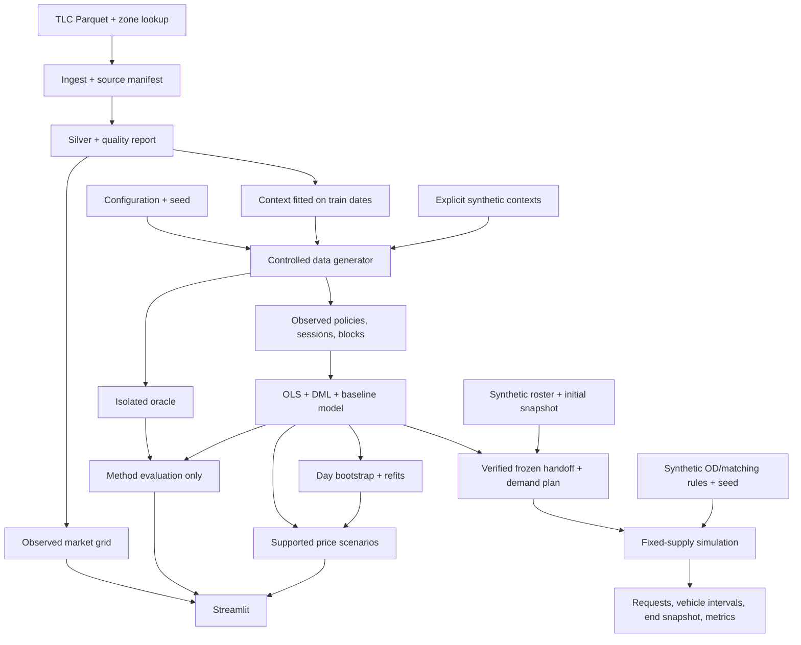
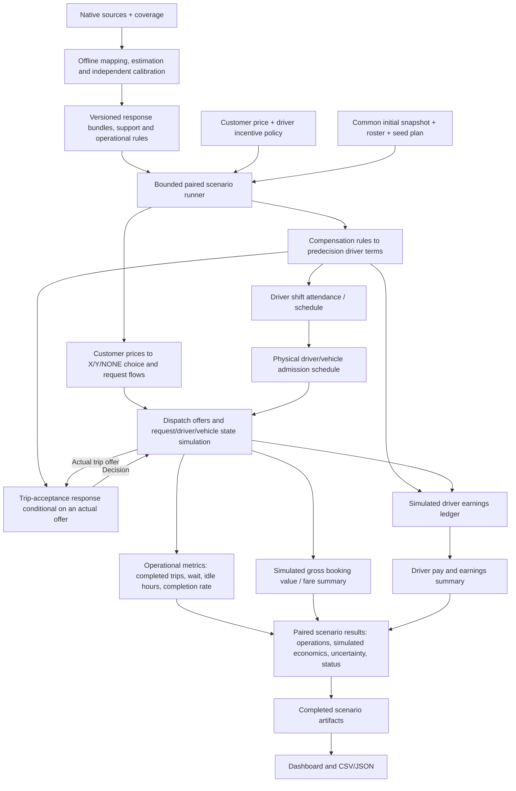

# Project architecture

```text
gsm-ride-hailing/
├── src/gsm_poc/              # Core application package
│   ├── core/                 # Shared configs, validators, and artifact lifecycle
│   ├── data/                 # Medallion data pipeline (ingest, silver, marts, context)
│   ├── causal/               # Econometrics, estimation, uncertainty, and scenarios
│   │   └── benchmarks/       # Discrete choice and policy benchmarks
│   ├── simulation/           # DGP generator, demand planning, and marketplace
│   ├── pipeline/             # Batch orchestration and stage execution
│   └── ui/                   # Streamlit dashboard and visual tabs
│       └── tabs/             # Operations, method checks, scenario explorer
├── configs/                  # TOML execution and experiment profiles
├── scripts/                  # Coverage evaluation runners and compute probes
├── tests/                    # Deterministic regression, unit, and integration tests
├── docs/                     # Specifications, contracts, and roadmap
│   ├── reference/            # Proposal and engine design reference docs
│   └── submission/           # Preserved reports and milestone evaluations
├── data/                     # Versioned artifacts (bronze, silver, gold, synthetic)
└── runs/                     # Execution runs, manifests, bundles, and diagnostics
```

## Current implemented flow

The following flow describes the current demand/choice PoC and fixed-roster
simulator. Driver participation, compensation-aware trip acceptance and the
income-supply solver below are target capabilities, not implemented stages.



## Boundaries

The generator may create oracle artifacts. Only the evaluator and method
verification tab may read them. The estimator receives the observed block table;
its encoder constructs W from a fixed allowlist. Scenarios use a fitted model
bundle and frozen held-out context, never oracle probabilities.

TLC operational records have `source_kind=observed_tlc`. Offline simulations have
`source_kind=synthetic`; simulations using train-fitted TLC context have
`source_kind=semi_synthetic`. All simulated behavior has evidence level C.

Models are fitted in batch. UI controls do not train models, download raw data, or
launch Monte Carlo jobs. Joblib bundles are trusted local artifacts, not an upload
format. A completed manifest and artifact checksums gate dashboard loading.

## Storage and execution

Tables use Parquet; metadata uses strict JSON; exchange outputs use CSV/JSON.
Every stage writes outputs atomically, records failure context, and reuses a result
only when input, source-code, configuration, and artifact hashes match. Run manifests
record code revision, configuration, data identity, seed, dependency lock hash,
Python/package versions, timings, and successful artifacts.

The CLI implements `ingest`, `build`, `generate`, `fit`, `evaluate`, `scenario`,
`prepare-demand`, `simulate-marketplace` and `run-all`. Dataset and model run IDs
explicitly select dependent artifacts.
Synthetic mode can run without network access or TLC data. TLC mode never
substitutes synthetic trips for missing observed records.

The demand bridge and fixed-supply simulator run in batch, using verified local
artifacts. They preserve the frozen choice scope, apply price effects once and
count the shared X/Y fleet once. The simulator uses explicit synthetic OD/matching
rules, fixed shifts and static SOC. Version 2 supports consecutive windows with
queued/busy carry-in, pickup deadlines and explicit customer cancellation before
pickup. Operational checkpoints retain the frozen arrival schedule, original
request timestamps, vehicle activity and pending events; aborted pickup legs
finish before vehicle release. Request/state-time accounting is checked per
window. Supply response, energy/charging, operational calibration and the solver
remain later work. Execution instructions and artifact-reading guidance are in
[USAGE.md](USAGE.md).

## Target customer and driver architecture

The [core engine design](reference/CORE_ENGINE_DESIGN.md) owns the target
algorithms, estimands and validation rules. Extend the existing packages through
versioned interfaces rather than treating the current fixed-supply trajectory
as a complete price/incentive forecast.

| Package | Target responsibility |
|---|---|
| `data/` | Map native sources to validated quote, eligibility, shift, trip-offer, state and finance ledger tables; retain nonparticipants, zero outcomes and cost-source coverage |
| `causal/` | Fit and independently validate demand/choice, driver participation/conditional hours and trip-acceptance models; export separate estimands, support and evidence in model bundles |
| `simulation/` | Apply compensation rules; construct physical driver/vehicle schedules; dispatch offers, resolve acceptance and operate the state simulator; produce individual earnings ledgers and bounded income-supply trials |
| `pipeline/` | Freeze compatible model/calibration/policy/snapshot inputs; orchestrate bounded jobs, paired baseline/target scenarios, operational metrics, simulated economics, uncertainty and exports |
| `core/` | Define shared contracts, units, versions, support/status checks, seeds, budgets and artifact lifecycle |
| `ui/` | Read completed scenario artifacts and expose the same values, evidence, limitations and statuses as headless execution and CSV/JSON |



Offline fitting and calibration precede scenario execution. A frozen model
version links the demand/choice, participation and acceptance bundles, calibration,
compensation rules, units, support and evidence. Scenario trials use those inputs;
they do not fit responses from their own simulated outcomes.

Customer prices and driver compensation are separate policy paths. A tariff
change affects offered driver pay only through an explicit compensation rule.
Predecision terms and information feed driver decisions; realized earnings are
ledger outcomes. Participation predicts who joins a shift and conditional hours;
the admission schedule enforces physical roster/shift constraints. Trip acceptance
models a decision after dispatch makes an eligible offer. Not receiving an offer
is not rejection, and rejection does not mechanically remove idle serviceable
hours. The shared X/Y fleet is counted once throughout.

The solver reconciles expected income, participation/serviceable hours and
simulated utilization under fixed compensation rules. Each trial restarts from
the same initial snapshot; iterations are not consecutive operating windows.
Per-trip pay divided by pickup/trip duration may describe an offer, but is not
shift-level expected income because it excludes idle time and offer opportunity.
Use the declared decision denominator and explicit failure/nonconvergence status.

The evaluation layer converts each completed scenario into operational service
quality (completed trips, fill/completion rate, wait times, cancellations, idle
vehicle-hours) and simulated gross booking value under declared scenario fares.
Baseline/target comparisons lead with operational fulfillment and booking value;
driver earnings are summarized under declared compensation rules. Real GSM-wide
profit and complete cost reconciliation remain conditional on GSM providing
confirmed accounting scope, cost categories and allocation rules; until those inputs
qualify, profit retains an explicit `not_evaluated` status without blocking
operational scenario evaluation.

The initial demand mode remains `reduced_form_policy`: do not apply simulated
wait/ETA effects to booking again. A separately identified `structural_choice`
mode may add ETA/availability feedback later. Paired comparisons use a common
initial scope and seed plan, with independent replicates and uncertainty/evidence
statuses; a single trajectory is not an estimated policy effect.

## Research table schemas

The following are proposed logical schemas for researcher-built GSM tables.
They are not GSM export requirements or implemented table names. Native sources
are requested in [GSM_DATA_CONTRACT.md](GSM_DATA_CONTRACT.md); their mappings must
be validated before these grains are used.

| Logical table | Grain/key | Content |
|---|---|---|
| `quote_session` | One session / `session_id` | Customer key, context, observation window, outcome/censoring |
| `quote_option` | One option per display/refresh / quote-set + quote + display-event key | Service, displayed/available, visible price/discount/ETA/position, policy version |
| `booking_event` | One native status event / source + event key | Request/booking/trip/session links, status/time, cancel actor/reason, retry/parent |
| `policy_assignment` | One assignment / assignment key | Unit/time, arm, offered/assigned/applied, probability/rule, exposure/override |
| `driver_shift_eligibility` | One eligible driver × decision window or shift opportunity / eligibility key | Eligible population including drivers receiving no offer/incentive and nonparticipants; contract/vehicle/service eligibility, effective periods, exposure/coverage and recorded participation or unknown outcome |
| `driver_offer_shift` | One shift offer/decision event / native decision key | Driver/shift/eligibility links, terms known before the shift decision, offered/received/accepted/declined/absent status and participation/hours outcome; distinct from trip dispatch |
| `driver_trip_offer` | One actual driver dispatch offer / source + offer key, linked to dispatch attempt | Request/driver/vehicle/shift, sent/received/deadline/response times, pending/accepted/rejected/timed_out/withdrawn status and observation coverage; immutable predecision displayed pay/conditions, known pickup/trip estimates, compensation/policy versions and source references |
| `driver_vehicle_state` | Native state event or constructed interval / source + event/interval key | Driver/vehicle/shift, zone, state/eligibility/SOC, gaps/coverage |
| `payment_cost` | One ledger item / source + native ledger key | Business links, customer fare payment or driver payout/bonus, funder/currency, rule version and period |
| `operational_event` | One dispatch/trip/charging event / source + native event key | Attempts/responses, timestamps/duration/distance, station/energy, matching version |
| `demand_block` | Zone × time block × service | Quote exposure, requests, conversion, pretreatment context, completeness |
| `baseline_snapshot` | One baseline window / snapshot version | Initial states, roster, request rates, calibration/rules, quality |

Mappings preserve raw data and record source/schema versions, grain, quality
flags and denominators. Check join cardinality, effective periods, retries/parents
and failed links; nearest-time joins need uncertainty labels. Distinguish observed
zero, missing, unknown and not applicable. No trips does not establish offline state.

Trip offers preserve the terms and information actually available at offer time,
separately from final fare/pay and later trip outcomes. If terms must be
reconstructed, retain the applicable rule version, timestamped source inputs,
join provenance and reconstruction status; missing historical inputs leave terms
unavailable. Do not replace them with realized earnings. Shift participation,
trip acceptance conditional on an offer and dispatch exposure have separate
populations and denominators; missing exposure/response is not a recorded zero.

The controlled PoC currently writes `synthetic_policy_block`,
`synthetic_quote_session` and `choice_block` under `observed/`. The estimation
grain is zone × time block, with session counts and X/Y/NONE proportions.
These generated tables do not establish a mapping from GSM native schemas.

## Artifact conventions

| Artifact | Current support | Content/convention |
|---|---|---|
| `demand_plan` | Implemented choice-to-request bridge | Zone/service, block start/end, requests/hour, model/source references, fixed quote exposure and support; baseline rates accompany target rates |
| `driver_response_bundle` | Proposed participation and acceptance interfaces | Separate participation/conditional-hours and offered-trip acceptance models, decision populations, predecision features, estimands, units, splits, support, diagnostics and evidence |
| `compensation_spec` | Proposed driver-pay interface | Versioned offered terms and applicable pay/incentive rules, eligibility/effective periods, currency/decision basis, payment conditions and source/evidence; separate from customer tariff |
| `admission_plan` | Proposed physical supply interface | Eligible-population/model references, participation decisions, driver/vehicle/shift keys, shift start/end, service eligibility, roster reference, target and feasible serviceable hours, capacity gaps and compensation version |
| `trip_offer_log` | Proposed simulator decision trace | Offer/request/dispatch/driver/vehicle/shift keys, immutable predecision terms/version, exposure and response events, acceptance-model reference and seeded decision provenance; preserve unaccepted offers |
| `earnings_ledger` | Proposed compensation outcome | Individual driver/shift/trip pay, bonus/deduction and currency entries under frozen rules; offered-term references, earned/paid basis and zero-trip outcomes; separate from rider-payment and cost entries |
| `economic_ledger` | Proposed economic summary | Simulated gross booking value from completed trips and driver payouts under frozen policy rules; full profit and cost allocation remain conditional on GSM inputs |
| `equilibrium_result` | Proposed income-supply interface | Expected/realized income and hours by decision group, unit/denominator, residuals, iteration/replicate budgets and convergence/failure status; references to the common initial snapshot |
| `operational_checkpoint` | Implemented fixed-supply continuation; driver-decision extension proposed | Current `end_snapshot.json` preserves arrivals, requests, vehicles and pending events; future versions must also preserve offer attempts/decisions, remaining driver activity and compatible model/compensation references |
| `scenario_result` | Choice scenarios implemented; full marketplace comparison proposed | Scenario/run/model references and scope; baseline/target/delta for operational metrics (completed trips, fill rate, wait time, idle vehicle-hours) and simulated gross booking value; driver earnings summary; profit and ROI reported as conditional with explicit `not_evaluated` status when GSM cost inputs are pending; snapshot references |
| `prediction_record` | Proposed experiment record | Frozen model/snapshot/policy/assignment references, forecast and analysis plan; reconciliation appends results without overwriting the frozen forecast |

Current model bundles use trusted local `.joblib` files and retain feature,
outcome and treatment order, baseline model and support diagnostics. A full
demand/participation/acceptance/calibration model version remains a target
interface. New logical schemas require explicit versioning and implementation
mapping; current manifests provide run/source/configuration references and checksums.

Research durations, distances and energy use seconds, km and kWh, with SOC in
`[0,1]`. Preserve original TLC miles/USD alongside normalized distance; currency
conversion does not transfer behavioral coefficients. Timestamp conversions
follow source metadata, including the declared timezone for naive TLC timestamps
and simulation windows. Block duration is configurable; analysis blocks, shifts,
event times and experimental washout are distinct.

Request rates are requests/hour; expected choices and completed trips are separate
quantities. Serviceable hours count idle, dispatch/reserved, pickup and on-trip
time, excluding charging/charging queue, breaks and ineligible time. Idle hours
are a subset, and the shared fleet is counted once. Price effects enter request
generation once; a fitted choice model alone does not forecast completed trips.

## Dashboard conventions

The Streamlit workbench uses a run/DGP/seed selector and three sections:
Operations, Method checks, and Price scenarios, with exports and interpretation
notes beside the outputs. Charts read computed artifacts. Source, support and
uncertainty labels remain adjacent to results.

The existing Hallmark design uses cool paper, restrained cobalt, Bahnschrift
display text and Segoe UI body text. Portable values live in `tokens.css`;
layout styling lives in `src/gsm_poc/ui/ui.css` and native Streamlit theme settings.
Widgets use native state/loading/error feedback, immediate focus rings and
reduced-motion support. Tables retain local horizontal scrolling on narrow screens.
The historical browser QA record is in
[historical validation](submission/days/20261003/validation.md#browser-verification).

## Statistical contract

[IDENTIFICATION.md](IDENTIFICATION.md) owns the estimand, matrix ordering,
baseline/scenario formulas, support and inference rules.
[BENCHMARK.md](BENCHMARK.md) owns evaluation protocols and acceptance thresholds;
[USAGE.md](USAGE.md#reading-result-statuses) explains how to read result statuses.
