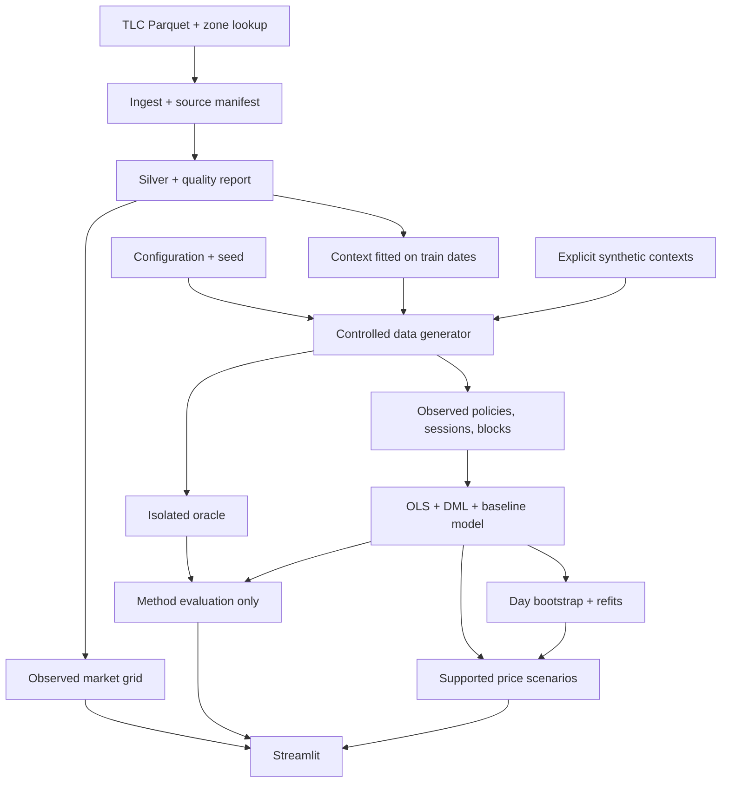

# Project architecture

```text
configs/                  TOML profiles; no secrets
src/gsm_poc/
  config.py               validated configuration and date scope
  artifacts.py            hashing, atomic files, manifests and stage lifecycle
  ingest.py               immutable TLC sources and download validation
  validate.py             TLC schema and shared probability checks
  build_silver.py         DuckDB normalization and row-level quality flags
  build_marts.py          complete operational grid and reconciliation
  build_context.py        train-only context templates and fallback metadata
  generate.py             policy, sessions, block tables, isolated oracle
  features.py             allowlisted encoding and day-based splits
  estimate.py             OLS / LinearDML and model bundle
  uncertainty.py          bootstrap with complete refits by original day
  evaluate.py             oracle-only method evaluation and seed checkpoints
  scenario.py             supported price changes and uncertainty
  pipeline.py             stage orchestration and content-based reuse
  cli.py, __main__.py      python -m gsm_poc
  app.py                  Streamlit artifact reader
tests/                    deterministic fixtures and behavior coverage
docs/                     scope, identification, data contract, validation
data/bronze/              source bytes and source manifests (ignored)
data/silver/, data/gold/   versioned observed artifacts (ignored)
data/synthetic/<id>/
  observed/               estimator-visible policy/session/block data
  oracle/                 true probabilities, hidden U, coefficients
runs/<id>/                manifests, bundles, effects, diagnostics, exports
```



## Boundaries

The generator may create oracle artifacts. Only the evaluator and method
verification tab may read them. The estimator receives the observed block table;
its encoder constructs W from a fixed allowlist. Scenarios use a fitted model
bundle and frozen held-out context, never oracle probabilities.

TLC operational records have `source_kind=observed_tlc`. Offline simulations have
`source_kind=synthetic`; simulations using train-fitted TLC context have
`source_kind=semi_synthetic`. All simulated behavior has evidence level C.

Models are fitted in batch. UI controls do not train models, download raw data, or
launch Monte Carlo jobs. Joblib bundles are trusted local artifacts, not an upload
format. A completed manifest and artifact checksums gate dashboard loading.

## Storage and execution

Tables use Parquet; metadata uses strict JSON; exchange outputs use CSV/JSON.
Every stage writes outputs atomically, records failure context, and reuses a result
only when input, source-code, configuration, and artifact hashes match. Run manifests
record code revision, configuration, data identity, seed, dependency lock hash,
Python/package versions, timings, and successful artifacts.

The CLI implements `ingest`, `build`, `generate`, `fit`, `evaluate`, `scenario`, and
`run-all`. Dataset and model run IDs explicitly select dependent artifacts.
Synthetic mode can run without network access or TLC data. TLC mode never
substitutes synthetic trips for missing observed records.

## Statistical contract

Rows of theta are outcomes X/Y; columns are log price multipliers X/Y. The
probability baseline is fitted on `q - T @ theta.T`. Scenario changes use log
ratios; NONE is the complement. Intervals come from day bootstrap with complete
model refits and fixed evaluation context. Underidentified matrices, invalid
probabilities, insufficient support, and unstable intervals are explicit states.
