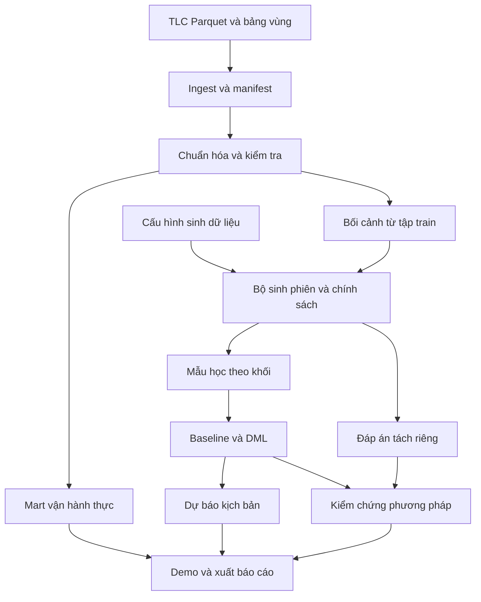

# Thiết kế PoC GSM Causal Marketplace cho hai tuần đầu

Ngày chốt thiết kế: 02/10/2026. Tài liệu nền: `GSM_Causal_Marketplace_Proposal.docx` do Nguyễn Thành An cung cấp. Mốc cập nhật PoC: Chủ nhật 04/10/2026. Mốc hoàn thành khối lượng hai tuần đầu theo lịch tăng tốc: 11/10/2026.

Tài liệu này chốt dữ liệu mẫu, kiến trúc, hợp đồng dữ liệu, phương pháp và tiêu chí nghiệm thu để bắt đầu viết mã. Đây là thiết kế triển khai; các kết quả ước lượng, chất lượng mô hình và thời gian chạy chưa được thực nghiệm. Riêng schema, kích thước và số dòng của tệp dữ liệu mẫu đã được kiểm tra trực tiếp, như trình bày tại mục 3.

## 1. Quyết định triển khai

PoC dùng NYC TLC High Volume For-Hire Vehicle Trip Records tháng 01/2024 làm nguồn dữ liệu thực. Pipeline tạo bảng vận hành theo khu vực và thời gian, đồng thời trích bối cảnh cho một bộ dữ liệu bán tổng hợp. Trong bộ bán tổng hợp, chính sách giá và lựa chọn khách được sinh bằng cơ chế có đáp án để kiểm chứng baseline và Double Machine Learning, viết tắt là DML.

Hai luồng có mục đích riêng. Luồng dữ liệu thật chứng minh khả năng xử lý và phân tích bản ghi vận hành. Luồng bán tổng hợp chứng minh khả năng thu hồi tác động dưới các giả định được kiểm soát. Tất cả kết quả hành vi từ luồng thứ hai ở mức bằng chứng C theo proposal; chưa phải độ co giãn của GSM, Uber hay Lyft.

### 1.1 Phạm vi so với proposal

| Hạng mục | Kết quả cần có cuối đợt | Trạng thái thiết kế |
|---|---|---|
| Tuần 1 trong proposal | Định nghĩa bài toán, khảo sát dữ liệu, DAG, điều kiện nhận diện, yêu cầu dữ liệu GSM | Thực hiện đầy đủ với dữ liệu công khai và nêu rõ phần cần GSM xác nhận |
| Tuần 2 trong proposal | Pipeline, ước lượng độ nhạy giá và thay thế chéo, kiểm tra thu hồi tham số | Thực hiện trên dữ liệu bán tổng hợp |
| Phản ứng nguồn cung | Định nghĩa outcome, schema và cơ chế cần xác nhận | Chuẩn bị để triển khai từ tuần 3 |
| Simulator ghép khách với xe | Giao diện đầu vào dự kiến | Chưa xây trong hai tuần đầu |
| Demo | Quan sát vận hành, kiểm chứng thuật toán, so sánh kịch bản giá | Bản tối thiểu được đưa lên sớm để phục vụ báo cáo 04/10 |
| DiD | Tiêu chí lựa chọn nguồn biến thiên chính sách | Chưa cài đặt nếu chưa có sự kiện chính sách đủ điều kiện |
| Switchback thực địa | Phác thảo đơn vị phân bổ và yêu cầu log | Chưa chạy trên GSM; ngẫu nhiên hóa trong bộ giả lập không phải thử nghiệm thực địa |

### 1.2 Câu hỏi mà phiên bản này trả lời

Trong một thị trường mô phỏng có hai dịch vụ X và Y, khi hệ số giá X hoặc Y thay đổi, tỷ lệ đặt từng dịch vụ và tổng tỷ lệ đặt thay đổi bao nhiêu? Thuật toán có thu hồi được tác động đã biết, với khoảng bất định hợp lý, khi giá ngẫu nhiên hoặc khi tồn tại gây nhiễu đã quan sát được hay không?

Số phiên báo giá được giữ cố định trong mỗi kịch bản. Do đó, kết quả là phản ứng lựa chọn có điều kiện trên nhóm đã xem báo giá, chưa phải thay đổi tổng lượng người mở ứng dụng hoặc nhu cầu dài hạn. Đầu ra thay thế chéo là thay đổi ròng xác suất lựa chọn; chưa nhận diện được từng khách cụ thể chuyển từ X sang Y.

## 2. Dữ liệu mẫu được đề xuất

### 2.1 Bộ dữ liệu chính

Chọn [NYC TLC Trip Record Data][S1], mục High Volume For-Hire Vehicle. Dữ liệu theo tháng, định dạng Parquet. Tệp khởi đầu là [fhvhv_tripdata_2024-01.parquet][D1], đi cùng [taxi_zone_lookup.csv][D2]. Chọn tháng cố định giúp tái lập; tháng 01/2024 cũng tránh trộn schema với trường phí mới bổ sung từ năm 2025. [S1]

TLC ghi nhận chuyến đã hoàn thành. Các mốc yêu cầu, đón và trả nằm trong bản ghi của chuyến đó; sự có mặt của `request_datetime` không có nghĩa tệp chứa tất cả yêu cầu thất bại hoặc bị hủy. [S3]

### 2.2 Các nguồn đã cân nhắc

| Nguồn | Nội dung hữu ích | Quyết định cho hai tuần đầu |
|---|---|---|
| NYC TLC High Volume FHV | Chuyến thực, thời gian, vùng, cự ly, giá và chi trả | Nguồn chính |
| [Uber & Lyft Cab Prices][S6] | Bối cảnh giá và thời tiết; schema của nhóm thu thập không có outcome chấp nhận báo giá [S7] | Nguồn dự phòng nếu sau này cần demo khảo sát giá; chưa tích hợp |
| [Porto Taxi Trajectories][S8] | Quỹ đạo taxi và bản ghi chuyến hoàn thành | Để giai đoạn mô phỏng di chuyển |

Không nối NYC và Boston thành một thị trường thống nhất: khác địa lý, thời kỳ, cơ chế lấy mẫu và không có khóa liên kết khách. Việc thêm hai nguồn chưa bổ sung được outcome còn thiếu của cùng một thị trường.

## 3. Kết quả kiểm tra trực tiếp dữ liệu mẫu

### 3.1 Phạm vi kiểm tra đã thực hiện

Ngày 02/10/2026 đã đọc HTTP metadata, footer Parquet, schema Arrow, ba bản ghi đầu của row group đầu tiên với 11 cột, và toàn bộ bảng vùng. Chưa quét toàn bộ dữ liệu để tính tỷ lệ thiếu, trùng hoặc phân bố outlier. Các bước đó là công việc của pipeline ngày đầu.

| Thuộc tính | Giá trị quan sát được |
|---|---|
| Tệp | `fhvhv_tripdata_2024-01.parquet` |
| Kích thước HTTP | 472.757.547 byte, khoảng 450,86 MiB |
| Số dòng theo footer | 19.663.930 |
| Số cột | 24 |
| Số row group | 19 |
| Writer ghi trong metadata | `parquet-cpp-arrow version 14.0.2` |
| Timestamp trong Arrow | `timestamp[us]`, không gắn timezone |
| Nullability trong schema | Cả 24 trường đều cho phép null; không đồng nghĩa thực tế đều có null |
| Thống kê null từ footer | Không đủ để tổng hợp đầy đủ; chưa báo cáo tỷ lệ thiếu |
| Bảng vùng | 265 dòng, 4 cột |
| Dữ liệu tải để kiểm tra Parquet | Khoảng 21,67 MB; chưa tải toàn bộ tệp |

Số dòng trên là toàn bộ tệp nguồn, không phải số dòng của năm khu vực được chọn. Không dùng ba bản ghi đầu để kết luận về phân bố của cả tháng.

### 3.2 Ba bản ghi thực để đối chiếu schema

| Nền tảng | Yêu cầu | Đón khách | Vùng đi → đến | Miles | Giây chuyến | Cước cơ bản USD | Trả tài xế USD |
|---|---|---|---|---:|---:|---:|---:|
| HV0003 | 2024-01-01 00:21:47 | 2024-01-01 00:28:08 | 161 → 158 | 2,83 | 2.251 | 45,61 | 40,18 |
| HV0003 | 2024-01-01 00:10:56 | 2024-01-01 00:12:53 | 137 → 79 | 1,57 | 432 | 10,05 | 6,12 |
| HV0003 | 2024-01-01 00:20:04 | 2024-01-01 00:23:05 | 79 → 186 | 1,98 | 731 | 18,07 | 9,47 |

Đây là trích xuất thực từ [D1], không phải dữ liệu giả lập. Chỉ dòng đầu thuộc phạm vi khu vực PoC được chọn dưới đây. Các timestamp giữ nguyên biểu diễn nguồn.

## 4. Từ điển trường dữ liệu

### 4.1 Đầy đủ 24 trường của tệp tháng 01/2024

Tên trường và kiểu Arrow được đọc trực tiếp từ tệp. Nghĩa nghiệp vụ đối chiếu [từ điển TLC][S2]. Cột xử lý là quyết định riêng của PoC, không phải quy định của TLC. `large_string` được chuẩn hóa thành chuỗi; tiền giữ đơn vị USD.

| Trường nguồn | Kiểu thực tế | Nghĩa ngắn | Xử lý trong PoC |
|---|---|---|---|
| `hvfhs_license_num` | large_string | Mã nền tảng | Phân nhóm Uber/Lyft |
| `dispatching_base_num` | large_string | Đơn vị điều phối | Giữ để truy vết |
| `originating_base_num` | large_string | Đơn vị nhận yêu cầu | Giữ nullable |
| `request_datetime` | timestamp[us] | Thời điểm yêu cầu | Tạo độ trễ tới đón |
| `on_scene_datetime` | timestamp[us] | Xe tới điểm đón | Chỉ khảo sát chất lượng |
| `pickup_datetime` | timestamp[us] | Thời điểm đón | Lọc phạm vi, chia khung |
| `dropoff_datetime` | timestamp[us] | Thời điểm trả | Kiểm tra thời gian |
| `PULocationID` | int32 | Vùng đón | Khóa nối bảng vùng |
| `DOLocationID` | int32 | Vùng trả | Khóa nối bảng vùng |
| `trip_miles` | double | Cự ly, mile | Giữ gốc; thêm km |
| `trip_time` | int64 | Thời lượng, giây | Phân bố phục vụ |
| `base_passenger_fare` | double | Cước trước phụ phí | Thống kê cước nền |
| `tolls` | double | Phí đường | Giữ nguyên |
| `bcf` | double | Quỹ Black Car | Giữ nguyên |
| `sales_tax` | double | Thuế bán hàng | Giữ nguyên |
| `congestion_surcharge` | double | Phụ thu ùn tắc | Giữ nguyên |
| `airport_fee` | double | Phí sân bay | Giữ nguyên |
| `tips` | double | Tiền boa | Tách khỏi chi trả gốc |
| `driver_pay` | double | Chi trả tài xế | Thống kê theo chuyến |
| `shared_request_flag` | large_string | Đồng ý đi chung | Chuẩn hóa Y/N/null |
| `shared_match_flag` | large_string | Đã ghép đi chung | Chuẩn hóa Y/N/null |
| `access_a_ride_flag` | large_string | Chương trình Access-A-Ride | Giữ để phân tầng |
| `wav_request_flag` | large_string | Yêu cầu xe tiếp cận | Giữ để phân tầng |
| `wav_match_flag` | large_string | Dùng xe tiếp cận | Giữ để phân tầng |

Theo từ điển, `on_scene_datetime` có phạm vi ghi nhận dành cho xe tiếp cận; không dùng mặc định làm ETA của toàn bộ mẫu. `driver_pay` không bao gồm tolls/tips và đã loại hoa hồng, phụ thu hoặc thuế theo định nghĩa nguồn. `shared_request_flag=Y` chưa bảo đảm đã ghép chuyến. [S2]

`cbd_congestion_fee` có trong schema công bố từ năm 2025 nhưng không có trong tệp đã kiểm tra. Adapter 2024 không được đòi trường này; nếu nâng phiên bản dữ liệu, phải ghi lại schema mới. [S1]

### 4.2 Bảng vùng và phạm vi lựa chọn

| Trường lookup | Kiểu nội bộ | Cách dùng |
|---|---|---|
| `LocationID` | int32 | Khóa duy nhất của vùng |
| `Borough` | string | Lọc quận và hiển thị |
| `Zone` | string | Nhãn vùng |
| `service_zone` | string | Thuộc tính phân vùng taxi; không phải loại dịch vụ X/Y |

Năm vùng sau đã đối chiếu trực tiếp với [D2]. Đây là phạm vi thử nghiệm kỹ thuật được đề xuất, không phải cụm thị trường đã được chứng minh độc lập về nhân quả.

| LocationID | Zone | Borough |
|---:|---|---|
| 161 | Midtown Center | Manhattan |
| 162 | Midtown East | Manhattan |
| 163 | Midtown North | Manhattan |
| 164 | Midtown South | Manhattan |
| 170 | Murray Hill | Manhattan |

Lọc theo vùng đón, vẫn giữ vùng trả nằm ngoài cụm để không cắt mất chuyến đi ra ngoài. Đơn vị tổng hợp mặc định là 30 phút. Giữ đầy đủ dòng trong phạm vi này; không dùng một mẫu ngẫu nhiên của chuyến để tính số chuyến tuyệt đối.

### 4.3 Trường không có và hệ quả thiết kế

| Thông tin cần cho proposal | Có trong nguồn công khai này? | Hệ quả |
|---|---|---|
| ID phiên báo giá, tập lựa chọn và giá từng lựa chọn | Không | Chưa quan sát được quá trình chọn dịch vụ |
| Phiên xem giá rồi không đặt | Không | Không tính được tỷ lệ chuyển đổi thật |
| Toàn bộ yêu cầu hủy, thất bại, không có xe | Không trong schema này | Không tính được tỷ lệ hủy và tổng cầu thực |
| ID khách, tài xế, xe | Không | Không nối hành trình khách hoặc tổng giờ online tài xế |
| ID chuyến duy nhất | Không | Cần khóa kỹ thuật; không tùy tiện xóa các dòng giống nhau |
| Giá báo trước quyết định, hệ số surge | Không | Cước chuyến hoàn thành không thay thế treatment báo giá |
| Thưởng được đề nghị và cơ chế phân bổ | Không | Chưa nhận diện phản ứng cung theo thưởng |
| Pin, sạc, idle, online/offline | Không | Chưa đo tổng cung khả dụng hoặc xe nhàn rỗi |
| Thời tiết và sự kiện | Không | Không gọi biến tự sinh là thời tiết quan sát được |

Các kết luận thiếu trường dựa trên schema đã kiểm tra. Không suy rộng rằng mọi hệ thống nội bộ của TLC đều thiếu các thông tin này.

## 5. Phạm vi dữ liệu và quy tắc chất lượng

### 5.1 Cấu hình mặc định

| Cấu hình | Giá trị đề xuất |
|---|---|
| Nguồn | Tệp tháng 01/2024 và bảng vùng |
| Phạm vi thời gian | `2024-01-01 <= pickup_datetime < 2024-02-01` |
| Vùng đón | 161, 162, 163, 164, 170 |
| Nền tảng | `HV0003`, `HV0005` |
| Mapping nền tảng | `HV0003 → Uber`, `HV0005 → Lyft`, theo [S2] |
| Cửa sổ tổng hợp | 30 phút |
| Chạy nhanh trước 04/10 | 7 ngày đầu cho dashboard; chế độ synthetic nhỏ cho kiểm tra |
| Chạy chính thức trong đợt | 31 ngày, giữ đầy đủ chuyến trong phạm vi |
| Huấn luyện | Ngày 01–20/01 |
| Chọn cấu hình và kiểm tra | Ngày 21–25/01 |
| Đánh giá cuối | Ngày 26–31/01, không dùng để chọn mô hình |

Các ngày trên là thời gian của dữ liệu mẫu, khác lịch làm việc 02–11/10/2026. Việc chia này là quy ước kiểm chứng kỹ thuật, không đại diện cho việc triển khai chính sách thực vào các ngày đó.

### 5.2 Giữ dữ liệu gốc và tạo khóa kỹ thuật

Bronze giữ nguyên byte của tệp đã tải. Lưu URL, thời điểm tải, kích thước, SHA-256, schema và phiên bản nguồn trong manifest. Không ghi đè tệp gốc khi xử lý lỗi.

Tạo `trip_row_id` từ SHA-256 của tệp và số dòng vật lý trong tệp trước khi lọc. DuckDB có tùy chọn `file_row_number`; với PyArrow có thể dùng offset row group cộng offset dòng. Khóa này truy vết bản ghi, không phải mã chuyến do TLC cấp. Không dùng `row_number()` sau một phép sort không xác định. [S9]

Không tự xóa dòng trùng hoàn toàn: hai chuyến có thể trùng các thuộc tính công khai. Chống nhập trùng bằng định danh tệp và khóa kỹ thuật; báo riêng tỷ lệ các bản ghi có nội dung giống nhau.

### 5.3 Chính sách kiểm tra

| Kiểm tra | Cách xử lý |
|---|---|
| Thiếu cột bắt buộc hoặc kiểu không chuyển được | Dừng build silver; giữ báo cáo schema |
| Thiếu pickup, vùng đón hoặc mã nền tảng | Cách ly khỏi mẫu PoC, ghi số dòng và lý do |
| Lookup vùng không nối được | Gắn cờ unknown; không đoán vị trí |
| `dropoff < pickup`, `trip_time <= 0`, cự ly âm | Giữ bản ghi để audit; loại khỏi phân bố phục vụ |
| Request thiếu hoặc sau pickup | Vẫn giữ chuyến nếu các trường lõi hợp lệ; metric độ trễ là null |
| Thời lượng nguồn khác `dropoff - pickup` | Ghi chênh lệch; ngưỡng cảnh báo ban đầu 60 giây, không tự sửa nguồn |
| Cước bằng 0 hoặc âm | Giữ trong thống kê giao dịch; loại khỏi mẫu dựng giá nền/log giá và báo số lượng |
| Thiếu một khoản tiền | Không tự điền 0; tổng các thành phần chỉ tính khi đủ trường cần thiết |
| Flag ngoài Y/N/null | Chuẩn hóa khoảng trắng/chữ hoa rồi gắn cờ giá trị chưa biết |
| Nhóm có dưới 30 chuyến hợp lệ | Không công bố phân vị như ước lượng ổn định; đánh dấu ít mẫu |

Không đặt ngưỡng outlier theo cảm tính rồi xóa âm thầm. Các giới hạn tùy chọn như thời lượng tối đa phải nằm trong cấu hình, báo số dòng ảnh hưởng và có kết quả độ nhạy khi bật/tắt.

### 5.4 Thời gian, đơn vị và ý nghĩa chỉ số

Giữ timestamp nguồn ở dạng wall-clock. Giả định vận hành của adapter là giờ địa phương New York; ghi `assumed_timezone=America/New_York` và cần xác nhận trước khi nối dữ liệu ngoài. Tệp không mang timezone, nên không gắn UTC một cách ngầm định. Tháng 01/2024 không có chuyển giờ mùa hè trong cửa sổ đã chọn.

Tạo `trip_km = trip_miles × 1.609344`. Giữ tiền bằng USD, không chuyển sang VND để suy ra hành vi GSM. `pickup_datetime - request_datetime` được đặt tên `request_to_pickup_seconds`, chỉ mô tả các chuyến đã hoàn thành; không gọi là ETA hiển thị cho khách hay thời gian chờ của mọi yêu cầu.

Tổng thời lượng chuyến không phải giờ online của đội xe; các bản ghi đi chung còn có thể chồng lấn thời gian xe. Cước trừ `driver_pay` không được gọi là lợi nhuận đóng góp vì còn thiếu định nghĩa khoản thu và các chi phí liên quan.

## 6. Kiến trúc PoC cụ thể

### 6.1 Cách triển khai

Chạy một ứng dụng Python trên một máy. Batch pipeline đọc Parquet bằng DuckDB/PyArrow, ghi các bảng trung gian, huấn luyện và xuất artifact. Streamlit đọc artifact đã hoàn thành; thao tác đổi kịch bản chỉ thực hiện phép dự báo nhẹ, không tải lại dữ liệu tháng hoặc huấn luyện mô hình.

Môi trường khởi đầu đề xuất là CPU 4–8 lõi, RAM 16 GB và 10 GB trống. Đây là ngân sách kỹ thuật cần đo lại, chưa phải benchmark. Chỉ đưa dữ liệu tổng hợp hoặc tập bán tổng hợp vào pandas; tránh nạp 19,66 triệu dòng thành DataFrame. DuckDB hỗ trợ đọc chọn cột và đẩy điều kiện lọc xuống Parquet, dù khả năng bỏ qua row group phụ thuộc metadata của tệp. [S9]

### 6.2 Sơ đồ thành phần và luồng dữ liệu

Đáp án chỉ được đọc bởi bộ kiểm chứng. Mô hình, mô-đun dự báo và tab kịch bản không được đọc đáp án. Hai nhánh kịch bản và kiểm chứng xuất artifact riêng trước khi đưa lên giao diện.

### 6.3 Thành phần và hợp đồng chức năng

| Thành phần | Mô-đun dự kiến | Đầu vào | Đầu ra | Điều kiện dừng |
|---|---|---|---|---|
| Ingest | `ingest.py` | URL/cấu hình | Bronze và source manifest | Tải lỗi, tệp chưa đầy đủ |
| Kiểm tra nguồn | `validate.py` | Bronze, lookup | Báo cáo chất lượng | Schema bắt buộc sai |
| Chuẩn hóa | `build_silver.py` | Bronze đã xác nhận | `silver_tlc_trip` | Khóa kỹ thuật không duy nhất |
| Phân tích vận hành | `build_marts.py` | Silver | `observed_market_30m` | Tổng đếm không đối soát được |
| Trích bối cảnh | `build_context.py` | Silver trong tập train | `context_templates` | Không đủ mẫu cho cả quy tắc fallback |
| Sinh dữ liệu | `generate.py` | Context, cấu hình, seed | Policy, sessions, oracle | Xác suất hoặc phân bổ không hợp lệ |
| Tạo mẫu học | `features.py` | Policy và sessions | `choice_block` | Trùng grain, không bảo toàn tổng lựa chọn |
| Ước lượng | `estimate.py` | Mẫu học và split | Model, hệ số, chẩn đoán | Giá không đủ biến thiên độc lập |
| Khoảng bất định | `uncertainty.py` | Mẫu học và cấu hình đã chốt | Bootstrap draws | Quá ít lần chạy hợp lệ |
| Đánh giá | `evaluate.py` | Ước lượng và oracle | Metrics, bảng so sánh | Không được biến lỗi thành kết quả 0 |
| Kịch bản | `scenario.py` | Model và yêu cầu giá | Scenario result | Ngoài hỗ trợ hoặc xác suất không hợp lệ |
| Demo | `app.py` | Run đã hoàn thành | Trang quan sát/kiểm chứng/kịch bản | Thiếu artifact thì hiện trạng thái rõ ràng |

### 6.4 Lưu trữ và ranh giới truy cập

| Vị trí dự kiến trong repository | Nội dung |
|---|---|
| `configs/` | Phạm vi dữ liệu, DGP, model, cấu hình đánh giá |
| `src/gsm_poc/` | Các mô-đun trong bảng trên |
| `data/bronze/` | Tệp gốc bất biến |
| `data/silver/` | Bản ghi chuẩn hóa và cờ chất lượng |
| `data/gold/` | Mart vận hành và context đã phiên bản hóa |
| `data/synthetic/{dataset_id}/observed/` | Dữ liệu mà estimator được phép đọc |
| `data/synthetic/{dataset_id}/oracle/` | Tham số thật, xác suất thật và biến bị giấu |
| `runs/{run_id}/` | Manifest, model, hệ số, bootstrap, metrics, kịch bản |
| `tests/` | Kiểm tra bảo toàn dữ liệu, chống rò rỉ và công thức tác động |
| `docs/` | Thiết kế nhận diện, đặc tả dữ liệu GSM và báo cáo |

Không cần FastAPI, Kafka, Airflow hoặc một dịch vụ model registry riêng trong phạm vi này. Parquet lưu bảng, JSON lưu metadata, CSV/JSON là định dạng bàn giao kết quả. Pin phiên bản thư viện sau lần cài đặt thành công đầu tiên và giữ lockfile; không tự suy ra phiên bản mới nhất từ số phiên bản của trang tài liệu.

### 6.5 Cách chạy và xử lý lỗi

Entrypoint dự kiến là `python -m gsm_poc`, nhận subcommand `ingest`, `build`, `generate`, `fit`, `evaluate`, `scenario` và `run-all`. Mỗi lệnh nhận `--config` và ghi `run_id`; lệnh liên quan mô hình nhận thêm dataset ID, còn scenario nhận model run ID. Đây là giao diện cần cài đặt, chưa phải lệnh đã có sẵn trong repository.

Mỗi stage ghi trạng thái `pending`, `running`, `succeeded` hoặc `failed`, cùng thời lượng, số dòng vào/ra và lý do lỗi. Ghi output vào tệp tạm rồi đổi tên sau khi thành công. Chạy lại chỉ tái sử dụng stage nếu hash đầu vào và cấu hình khớp; không tái sử dụng chỉ vì tên tệp tồn tại. Lỗi tải có thể retry tối đa ba lần; lỗi schema, không nhận diện được hoặc xác suất sai phải dừng và hiện lý do, không retry vô hạn.

`run-all` kết thúc bằng manifest liệt kê các stage đã thành công. Streamlit chỉ nhận một run có các artifact cần thiết hoàn thành; không đọc tệp đang ghi dở. Chuỗi chạy có thể được thực hiện bằng một script đơn giản, chưa cần scheduler.

## 7. Hợp đồng dữ liệu nội bộ

### 7.1 Grain và khóa của các bảng

| Bảng | Một dòng đại diện cho | Khóa |
|---|---|---|
| `silver_tlc_trip` | Một bản ghi nguồn trong phạm vi | `trip_row_id` |
| `observed_market_30m` | Một vùng đón × 30 phút × nền tảng | `zone_id, slot_start_local, platform` |
| `context_templates` | Một nhóm vùng × giờ × loại ngày từ tập train | `context_id` |
| `synthetic_policy_block` | Một vùng × 30 phút × ngày mô phỏng | `dataset_id, block_id` |
| `synthetic_quote_session` | Một phiên mô phỏng có một lựa chọn | `dataset_id, session_id` |
| `choice_block` | Tổng hợp các phiên thuộc một block | `dataset_id, block_id` |
| `oracle_block` | Đáp án của một block mô phỏng | `dataset_id, block_id` |
| `effect_estimate` | Một outcome × một treatment × estimator | `run_id, estimator, outcome, treatment` |
| `scenario_result` | Một kịch bản, có kết quả cho X/Y/không đặt | `run_id, scenario_id` |

### 7.2 Silver và mart vận hành

Silver giữ 24 trường nguồn, thêm `trip_row_id`, `source_id`, `platform`, `pickup_date_local`, `slot_start_local`, `trip_km`, `request_to_pickup_seconds`, `computed_trip_seconds` và các cờ `valid_core`, `valid_duration`, `valid_price`, `valid_wait`. Cờ phải độc lập để một lỗi về wait không làm mất một chuyến khỏi thống kê đếm.

| Trường mart | Định nghĩa |
|---|---|
| `completed_trip_count` | Số bản ghi có core hợp lệ trong grain |
| `n_valid_duration`, `n_valid_price`, `n_valid_wait` | Mẫu số hợp lệ riêng của từng nhóm metric |
| `trip_seconds_p50`, `trip_seconds_p90` | Phân vị thời lượng nguồn trên mẫu duration hợp lệ |
| `trip_km_p50` | Trung vị cự ly hợp lệ |
| `base_fare_usd_p50`, `driver_pay_usd_p50` | Trung vị trên mẫu tiền tương ứng; không gọi là giá báo/thu nhập theo giờ |
| `request_to_pickup_p50`, `request_to_pickup_p90` | Độ trễ của các chuyến hoàn thành có wait hợp lệ |
| `shared_request_share`, `shared_match_share` | Tỷ lệ trên các flag đã biết, lưu kèm mẫu số |
| `source_complete`, `quality_flags` | Phân biệt zero thực trong phạm vi tệp và thiếu dữ liệu |

Tạo grid vùng × slot × nền tảng để biểu diễn ô không có chuyến. Chỉ điền count bằng 0 sau khi tệp được ingest đầy đủ; các phân vị vẫn là null nếu không có mẫu. Không điền zero cho nguồn chưa tải xong.

### 7.3 Context từ dữ liệu thực

`context_templates` chỉ được fit bằng 20 ngày train. Dùng vùng, giờ trong ngày, ngày thường/cuối tuần, trung vị cự ly và các phân vị thời gian phục vụ. Nếu nhóm có dưới 30 bản ghi hợp lệ, fallback lần lượt vùng × giờ, vùng, rồi toàn cụm; lưu `fallback_level` và `sample_count`.

Phân bố này phản ánh chuyến hoàn thành trong NYC, không phải phân bố của mọi phiên báo giá. Ta dùng nó làm bối cảnh mô phỏng có tính thực tế, không tuyên bố đã khôi phục cầu chưa được phục vụ. Các dịch vụ mô phỏng X và Y là hai lựa chọn giả định; không gán trực tiếp X=Uber, Y=Lyft để tuyên bố hành vi chuyển nền tảng.

### 7.4 Policy và session bán tổng hợp

| Trường | Bảng | Nguồn và ràng buộc |
|---|---|---|
| `dataset_id`, `dgp_id`, `seed` | Policy | Định danh lần sinh |
| `block_id`, `day_id`, `zone_id`, `slot_start_local` | Policy | Khóa block và nhóm chia dữ liệu |
| `context_id`, `is_peak`, `is_weekend`, `distance_scaled` | Policy | Bối cảnh công khai trước treatment |
| `multiplier_x`, `multiplier_y` | Policy | Mức 0,90; 1,00; 1,10 theo thiết kế |
| `log_multiplier_x`, `log_multiplier_y` | Policy | Log tự nhiên của multiplier |
| `assignment_probability` | Policy | Xác suất tổ hợp chính sách do generator biết; chỉ phục vụ audit thiết kế |
| `session_id`, `synthetic_customer_id` | Session | ID mới; mỗi khách chỉ xuất hiện một lần trong v0 |
| `choice` | Session | Enum `X`, `Y`, `NONE` |
| `y_x`, `y_y`, `y_none` | Session | One-hot, tổng bằng 1 |
| `source_kind` | Cả hai | Luôn là `semi_synthetic` hoặc `synthetic` |

`synthetic_customer_id` không được đưa vào feature. Không dùng giá thực trả, thời lượng thực tế của chính phiên hoặc outcome khác làm biến điều chỉnh. Bối cảnh từ TLC đã đóng băng trước khi tạo chính sách mô phỏng; đó là ý nghĩa “trước treatment” trong thí nghiệm này.

### 7.5 Mẫu học theo block

Đơn vị dữ liệu gốc mô phỏng là session, nhưng đơn vị huấn luyện v0 là block để phù hợp với cách gán chính sách và giảm thời gian tính toán. Mỗi block có cùng bối cảnh và cùng hai multiplier cho mọi session; do đó việc tổng hợp không bỏ mất dị biệt nội block đã được mô hình hóa.

`choice_block` chứa `n_sessions`, `n_x`, `n_y`, `n_none`, ba tỷ lệ tương ứng và các biến W/T của policy. Kiểm tra `n_x + n_y + n_none = n_sessions`. Không lấy log số lựa chọn; block có 0 lượt đặt vẫn hợp lệ.

Mặc định 50 phiên/block, 5 vùng, 48 block/ngày và 31 ngày: 7.440 block, 372.000 phiên mô phỏng. Đây là quy mô thiết kế, không phải số quan sát thực. Khi N bằng nhau, mỗi block có trọng số bằng nhau; nếu đổi N, dùng trọng số N để nhắm tới tác động trên trung bình phiên và ghi rõ thay đổi estimand.

### 7.6 Artifact mô hình và kết quả

| Artifact | Trường hoặc nội dung bắt buộc |
|---|---|
| `model_bundle` | Estimator, mô hình xác suất nền, encoder, thứ tự outcome/treatment, danh sách feature, miền hỗ trợ |
| `effects.csv` | Outcome, treatment, theta, khoảng theta, elasticity, khoảng elasticity, mẫu số nền, số block/ngày, evidence level |
| `diagnostics.json` | Rank, condition number, mức hỗ trợ theo tổ hợp, fold membership, lỗi và cảnh báo |
| `bootstrap_draws.parquet` | Draw ID, hệ số, tham số xác suất nền, trạng thái fit |
| `metrics.csv` | DGP, seed, estimator, bias/RMSE, coverage, số lần hợp lệ |
| `scenario_result.json` | Baseline, delta price, xác suất/chuyến kỳ vọng trước–sau, khoảng, trạng thái |
| `manifest.json` | Hash dữ liệu/cấu hình/mã, seed, dependency lock, thời gian, source kind và lý do lỗi |

Các đường dẫn trên là hợp đồng triển khai dự kiến. Việc tài liệu liệt kê chúng không có nghĩa các chương trình hoặc artifact đã được tạo.

## 8. Thiết kế thuật toán và nhận diện nhân quả

### 8.1 Đại lượng cần ước lượng

Treatment là vector T = [log(multiplier_X), log(multiplier_Y)]. Outcome là vector tỷ lệ lựa chọn Q = [q_X, q_Y] trong block. W chỉ gồm thông tin bối cảnh đã có trước khi gán giá. Hệ số theta có đơn vị thay đổi xác suất trên một đơn vị thay đổi log giá.

Ma trận có hàng là dịch vụ có xác suất lựa chọn thay đổi, cột là dịch vụ bị thay giá. Phiên bản đầu chỉ ước lượng một ma trận chung cho toàn cụm; việc hiển thị theo vùng không được biến thành tuyên bố đã học được hệ số riêng cho từng vùng.

| Outcome và treatment | Ý nghĩa |
|---|---|
| theta_XX | Giá X tác động lên xác suất chọn X |
| theta_XY | Giá Y tác động lên xác suất chọn X |
| theta_YX | Giá X tác động lên xác suất chọn Y |
| theta_YY | Giá Y tác động lên xác suất chọn Y |

Độ co giãn tại nền là epsilon_jk = theta_jk / p_j0, trong đó p_j0 là xác suất nền trung bình của đúng tập phiên dùng để đánh giá. Với N biến thiên, dùng trung bình có trọng số N cho mẫu số. Nếu xác suất nền quá nhỏ, không xuất độ co giãn không ổn định; ngưỡng kỹ thuật khởi đầu là p_j0 < 0,01, vẫn xuất tác động xác suất nếu hợp lệ.

### 8.2 Giả định cần kiểm chứng

Cấu trúc nhận diện là W tác động tới cả T và Q, còn T tác động tới Q. Trong trường hợp giá ngẫu nhiên, nhánh W tới T được bỏ. Trong trường hợp có U bị giấu, U cùng tác động tới T và Q, nhưng estimator không được quan sát U.

DML điều chỉnh gây nhiễu quan sát được thông qua residualization và cross-fitting. Điều đó không biến lịch sử giá nội sinh thành ngẫu nhiên và không giải quyết mặc nhiên biến U bị thiếu. [S4]

Phiên bản sinh dữ liệu cơ bản không có phản hồi cung, tác động lan vùng, ảnh hưởng kéo dài giữa ngày hoặc khách quay lại. Những hiện tượng này là giả định chưa mô hình hóa, cần stress test ở giai đoạn sau. Khoảng bất định hiện tại cũng không bao phủ sai lệch do chuyển từ NYC sang GSM.

### 8.3 Bộ sinh dữ liệu với đáp án xác định

Mỗi block có `peak` và `weekend` thuộc {0,1}; `d` là cự ly bối cảnh được chuẩn hóa vào [0,1]; `h` là giờ trong ngày. Chốt ngưỡng chuẩn hóa d bằng tập train rồi áp dụng nguyên trạng cho validation/test, báo riêng các giá trị nằm ngoài miền.

Đặt xác suất nền như sau. Đây là tham số thử nghiệm do nhóm chọn, không phải kết quả ước lượng từ TLC:

\[
b_X(W)=0.30+0.05\,peak-0.04d+0.02\,weekend+0.02\sin(2\pi h/24)
\]

\[
b_Y(W)=0.25+0.04\,peak-0.03d+0.01\,weekend+0.02\cos(2\pi h/24)
\]

\[
\Theta=\begin{pmatrix}-0.60&0.15\\0.12&-0.50\end{pmatrix},\qquad
\begin{pmatrix}p_X\\p_Y\end{pmatrix}
=\begin{pmatrix}b_X(W)\\b_Y(W)\end{pmatrix}+\Theta T,\qquad
p_{NONE}=1-p_X-p_Y.
\]

Từ ba xác suất, lấy mẫu 50 lựa chọn loại trừ lẫn nhau. Có thể lấy mẫu multinomial counts rồi tạo session tương ứng; dùng RNG riêng cho bối cảnh, phân bổ chính sách và lựa chọn để kiểm soát tái lập.

Generator phải kiểm tra toàn bộ xác suất trước khi lấy mẫu. Nếu vi phạm thì từ chối cấu hình, không cắt về 0/1 hoặc chuẩn hóa lại sau đó. Việc sửa xác suất sẽ làm đáp án theta không còn đúng với cơ chế đã công bố.

| DGP | Phân bổ giá | Outcome | Vai trò |
|---|---|---|---|
| RCT_SYN | Hai multiplier độc lập, mỗi mức có xác suất 1/3 | Theo công thức trên | Kiểm tra cơ bản |
| OBSERVED_CONFOUNDING | Xác suất chọn mức giá phụ thuộc W | Cùng công thức trên | Kiểm tra điều chỉnh gây nhiễu |
| HIDDEN_CONFOUNDING | Xác suất chọn mức giá phụ thuộc W và U | Thêm 0,025U vào p_X và 0,020U vào p_Y | Kiểm tra giới hạn khi thiếu biến |
| NULL_EFFECT | Giá ngẫu nhiên; toàn bộ theta bằng 0 | Chỉ phụ thuộc W | Kiểm tra báo động giả |
| COLLINEAR_PRICE | Ép multiplier_X = multiplier_Y | Theo công thức cơ bản | Kiểm tra hệ thống từ chối xuất ma trận đủ hai cột |

Với OBSERVED_CONFOUNDING, mỗi dịch vụ dùng ba trọng số `exp(0.8 × s_j(W) × v)`, v lần lượt là -1, 0, 1 cho multiplier 0,9; 1; 1,1, rồi chuẩn hóa thành xác suất. Chốt `s_X=clip(2×peak-1+0.5×weekend-0.5×d,-1,1)` và `s_Y=clip(1.5×peak-0.75+0.5×sin(2πh/24),-1,1)`. Hai giá được lấy mẫu độc lập khi đã điều kiện theo W.

Với HIDDEN_CONFOUNDING, U được sinh độc lập theo Uniform[-1,1] cho từng block; thay s_j bằng `clip(s_j+0.5×U,-1,1)` và thay xác suất outcome như mô tả. U và xác suất thật chỉ nằm trong oracle. Không đưa `assignment_probability` vào W vì nó có thể tiết lộ U trong cơ chế này.

Ghi rõ miền giá chỉ có ba mức huấn luyện; kịch bản nằm giữa các mức sử dụng giả định tuyến tính cục bộ theo log giá. Stress test quan hệ phi tuyến được bổ sung sau khi bản tuyến tính chạy đúng, với đáp án được tính từ cơ chế sinh mới thay vì giữ nguyên theta cũ.

### 8.4 Baseline và DML

| Estimator | Cách cài đặt | Mục đích |
|---|---|---|
| Naive OLS | Hồi quy Q theo hai log multiplier và intercept | Tham chiếu tương quan |
| Adjusted OLS | Thêm W đã mã hóa và các hàm thời gian công bố | Baseline có điều chỉnh |
| LinearDML | Học E[Q\|W], E[T\|W], hồi quy residual Q theo residual T | Ước lượng chính cho tuần 2 |

Với DML, dùng `X=None`, W là bối cảnh, `discrete_treatment=False` và `discrete_outcome=False`. Outcome đã là tỷ lệ theo block, không phải nhãn nhị phân từng session. Chỉ định tên cột và kiểm tra shape để tránh đổi thứ tự outcome/treatment. API EconML hỗ trợ Y và T nhiều chiều, cùng đối số `groups` khi splitter hỗ trợ nhóm. [S5]

Trong `fit`, đặt `inference=None` khi dùng wrapper bootstrap theo ngày của PoC. Không lấy khoảng mặc định của estimator rồi gắn nhãn rằng khoảng đó đã điều chỉnh phụ thuộc theo ngày.

Khởi đầu dùng hai `RandomForestRegressor` hỗ trợ multi-output cho model_y và model_t, mỗi mô hình 50 cây, `max_depth=6`, `min_samples_leaf=20`, seed cố định. Mã hóa vùng bằng one-hot; weekday, peak, sin/cos giờ và d là số. Đây là cấu hình khởi đầu để kiểm tra, không phải lựa chọn đã chứng minh tối ưu. Không cần tìm kiếm siêu tham số lớn trong hai tuần đầu.

Kết quả DML không bắt buộc phải tốt hơn adjusted OLS trong mọi DGP. Khi baseline được đặc tả đúng, việc hai phương pháp tương đương là kết quả hợp lý. Cần báo cáo cả hai thay vì chỉ chọn bảng có lợi cho DML.

### 8.5 Cross-fitting và chống rò rỉ

Tách train/validation/test theo ngày trước mọi phép fit context, imputer hoặc mô hình. Cross-fitting trong train dùng `GroupKFold(n_splits=5)` với `groups=day_id`; mọi vùng và block của cùng ngày ở cùng fold. Đây là lựa chọn bảo thủ cho phụ thuộc trong ngày; không phải bảo đảm tự động cho mọi dạng tương quan thời gian.

Feature dùng allowlist: `zone_id`, biểu diễn giờ, weekday/weekend, peak, d. Cấm `choice`, oracle, U, xác suất thật, ID ngẫu nhiên và trường kết quả tương lai lọt vào W. `block_id` và `day_id` chỉ dùng để nối dữ liệu/chia nhóm, không làm biến dự báo. Mọi encoder học từ dữ liệu phải nằm trong fold hoặc dùng taxonomy vùng đã cố định trước.

Tách hai lớp đánh giá. Holdout theo ngày kiểm tra khả năng dự báo kịch bản trên bối cảnh chưa dùng để chọn cấu hình. Monte Carlo thay seed và sinh lại T/Q để đánh giá độ chệch, sai số và coverage dưới DGP. Không gọi độ bao phủ của một khoảng trên một lần chạy là coverage thực nghiệm.

### 8.6 Kiểm tra hỗ trợ và khả năng nhận diện

Kiểm tra số block ở cả chín tổ hợp giá, rank của covariance residual T và condition number trước khi xuất đủ ma trận. Ngưỡng cảnh báo ban đầu: một tổ hợp dưới 20 block train hoặc condition number lớn hơn 1.000. Các ngưỡng này là quy tắc chẩn đoán kỹ thuật phải ghi trong cấu hình, không phải định lý về cỡ mẫu.

Nếu hai giá cùng biến động hoàn toàn, covariance residual T thiếu rank và không tách được hai cột. Xuất `not_identified` cho ma trận, thay vì gán một cột bằng 0. Nếu chỉ giá X biến thiên thì chỉ xuất tác động nhận diện được của giá X.

### 8.7 Khoảng bất định

Dùng bootstrap theo ngày và refit cả nuisance models, theta và mô hình xác suất nền. Giữ mẫu bối cảnh đánh giá cố định để khoảng phản ánh bất định ước lượng có điều kiện trên tập đánh giá này. Nếu muốn bao gồm bất định của phân bố bối cảnh, cần một lớp resampling riêng và nhãn khác.

Một ngày được lấy lại nhiều lần vẫn phải ở cùng fold theo `original_day_id`; không để các bản sao của cùng ngày nằm ở cả train và validation trong một lượt cross-fitting. Có thể dùng trọng số bội số bootstrap nếu toàn bộ pipeline hỗ trợ đúng sample weights; nếu không thì lặp dòng với group gốc được giữ nguyên.

Chế độ phát triển dùng khoảng 30 draw để tìm lỗi và không công bố đó là khoảng ổn định. Chế độ báo cáo dùng mục tiêu 199 draw/lần chạy; theo dõi số draw thất bại, không loại âm thầm. Nếu quá 5% draw thất bại hoặc khoảng biến động mạnh khi tăng số draw, ghi `interval_unstable` và phân tích nguyên nhân.

Các khoảng là khoảng riêng cho từng hệ số hoặc metric; chưa phải khoảng đồng thời cho mọi ô ma trận. Chỉ có 20 ngày train nên inference theo ngày còn hạn chế, cần đánh giá coverage bằng mô phỏng. Không dùng mặc định standard error độc lập từng session để tuyên bố đã xử lý phụ thuộc theo khối.

## 9. Thiết kế mô-đun kịch bản

### 9.1 Đầu vào

| Trường | Quy tắc |
|---|---|
| `run_id` | Phiên bản mô hình đã hoàn thành |
| `scenario_id` | ID duy nhất trong run |
| `target_context_set` | Toàn tập test hoặc tập vùng/giờ con đã xác định |
| `baseline_multiplier_x`, `baseline_multiplier_y` | Mặc định đều 1,00 |
| `delta_price_x`, `delta_price_y` | Tỷ lệ, ví dụ 0,10 tương ứng +10% |
| `n_sessions` | Quy mô phiên giữ cố định, hiển thị rõ là giả định |
| `interval_level` | Mặc định 0,95 khi có bootstrap đủ chất lượng |

Không nhận slider thưởng hoặc nguồn cung trong bản hai tuần đầu vì chưa có mô hình phản ứng cung.

### 9.2 Cách tính xác suất nền và tác động

DML cho tác động nhưng không tự cung cấp một mô hình đầy đủ cho xác suất lựa chọn nền. Vì vậy cần `BaseRateModel` riêng: sau khi chốt theta, fit mô hình b_j(W) trên target `q_j - theta_j · T` của tập train. Đánh giá chất lượng xác suất nền trên validation, sau đó đóng băng model bundle trước khi mở test. Không dùng xác suất từ oracle làm baseline trong tab kịch bản.

Với baseline T0 và policy mới T1, tính p_j0 = b_hat_j(W) + theta_hat_j · T0; p_j1 = b_hat_j(W) + theta_hat_j · T1. Nếu baseline multiplier là 1 thì T0 = 0. Tác động là delta_p_j = theta_hat_j · (T1 - T0), trong đó T1 - T0 dùng log tỷ số multiplier, không dùng trực tiếp số phần trăm.

Tính q_NONE bằng phần bù; tổng yêu cầu đặt kỳ vọng là N × (p_X + p_Y). Với nhiều context, tổng theo trọng số số phiên của từng context. Đây là số yêu cầu đặt kỳ vọng trong mô phỏng, chưa phải chuyến hoàn thành dự báo.

Ví dụ kiểm tra công thức: nếu tăng riêng giá X 10%, theta_XX = -0,60 và theta_YX = 0,12 thì delta_p_X xấp xỉ -0,05719, delta_p_Y xấp xỉ +0,01144. Tổng xác suất đặt giảm khoảng 0,04575, tức 4,575 điểm phần trăm. Đây là đáp án minh họa từ tham số giả lập, không phải kết quả của thị trường thực.

### 9.3 Kiểm tra kịch bản trước khi trả kết quả

| Trạng thái | Điều kiện | Hành vi |
|---|---|---|
| `ok` | Có hỗ trợ, xác suất hợp lệ, model đủ điều kiện | Xuất kết quả và bằng chứng |
| `insufficient_support` | Thiếu mẫu gần tổ hợp giá trong vùng/bối cảnh chọn | Cảnh báo; không gán độ tin cậy cao |
| `out_of_support` | Giá ngoài miền thiết kế 0,90–1,10 hoặc ngoài hỗ trợ chung | Không trả dự báo chính thức trong v0 |
| `invalid_probability` | p âm, trên 1 hoặc p_X+p_Y > 1 | Từ chối kết quả; không cắt hoặc chuẩn hóa âm thầm |
| `not_identified` | Treatment thiếu rank | Không xuất ma trận đầy đủ |
| `interval_unstable` | Bootstrap thiếu hoặc không ổn định | Hiện point estimate khi hợp lệ, đánh dấu chưa có khoảng đáng tin |

Kiểm tra hỗ trợ chung của hai giá, không chỉ kiểm tra min/max từng giá riêng lẻ. Mọi draw bootstrap dùng cho xác suất cũng phải qua kiểm tra miền hợp lệ; báo tỷ lệ vi phạm và hạ trạng thái thay vì âm thầm bỏ draw xấu rồi xuất khoảng hẹp.

### 9.4 Đầu ra

Trả xác suất X/Y/NONE trước–sau, thay đổi theo điểm phần trăm, số yêu cầu kỳ vọng và chênh lệch tổng yêu cầu. Kèm ma trận theta/elasticity, khoảng bất định, số phiên giả định, source kind, mức bằng chứng C, run ID và trạng thái hỗ trợ.

Không xuất số khách cụ thể chuyển từ X sang Y: các xác suất biên chỉ nhận diện thay đổi ròng. Không xuất cung tăng, xe nhàn rỗi, tỷ lệ hủy, doanh thu thực tế hoặc ROI ở giai đoạn này.

## 10. Demo và giao diện bàn giao

### 10.1 Màn hình Dữ liệu vận hành

Chọn ngày, vùng và nền tảng; xem số chuyến hoàn thành, phân bố thời lượng, cự ly, cước và độ trễ tới đón trên mẫu hợp lệ. Hiển thị mẫu số, tỷ lệ thiếu của từng metric và phạm vi dữ liệu. Nhãn dữ liệu là “TLC quan sát”, không dùng mức A/B/C để làm người xem tưởng đây là ước lượng nhân quả.

### 10.2 Màn hình Kiểm chứng phương pháp

Chọn DGP, seed và estimator; xem hệ số thật cạnh hệ số ước lượng, sai số và khoảng tin cậy. Đây là nơi duy nhất trong demo được đọc oracle. Bảng nhiều lần chạy có bias, RMSE, coverage và số lần thất bại. Hiển thị riêng trường hợp thiếu gây nhiễu và giá đồng biến.

### 10.3 Màn hình Kịch bản giá

Chọn context và mức thay đổi giá X/Y; xem xác suất và yêu cầu kỳ vọng trước–sau. Xác suất nền được tính từ model bundle. Slider không vượt miền hỗ trợ mặc định; nếu người dùng mở chế độ ngoài miền thì chỉ hiển thị lý do chưa hỗ trợ, không tự ngoại suy.

### 10.4 Chức năng xuất

Xuất `effects.csv`, `scenario_result.json`, `evaluation_metrics.csv` và bản tóm tắt run. Tab dữ liệu thật và tab mô phỏng xuất tên tệp, nhãn và metadata khác nhau để người đọc không nhầm nguồn.

## 11. Kiểm thử và tiêu chí nghiệm thu

### 11.1 Các kiểm tra bắt buộc

| Nhóm | Kiểm tra có ý nghĩa | Kỳ vọng |
|---|---|---|
| Dữ liệu | Tổng mart bằng số silver có core hợp lệ trong cùng scope | Khớp tuyệt đối |
| Nguồn | Schema 24 cột, manifest và phạm vi lọc rõ | Không phụ thuộc trường 2025 |
| Mô phỏng | Mỗi session có một lựa chọn; counts bảo toàn | Không có vi phạm |
| Xác suất | Kiểm tra biên trước sinh và sau dự báo | Không sửa ngầm |
| Chia mẫu | Ngày giữa train/validation/test không giao; fold không tách ngày | Không có vi phạm |
| Rò rỉ | Estimator chỉ nhận allowlist, không đọc oracle/U | Không có vi phạm |
| Nhận diện | DGP giá đồng biến bị từ chối ma trận đầy đủ | Trả `not_identified` |
| Công thức | +10% dùng log(1,1), đúng hàng/cột và đơn vị | Khớp đáp án giải tích |
| Tái lập | Cùng data/config/seed/lockfile cho cùng kết quả số | Khớp trong dung sai số học đã công bố |
| Xuất kết quả | JSON/CSV có nguồn, bằng chứng, đơn vị và run ID | Đọc lại được, không mất metadata |

### 11.2 Đánh giá thống kê

Chạy khoảng 20 seed để phát triển; mục tiêu báo cáo 100 seed cho các DGP chính, tăng nếu tài nguyên cho phép. Ghi rõ số draw bootstrap và thời gian chạy. Benchmark sớm một seed để dự toán; không cắt số lần chạy mà vẫn giữ nhãn của cấu hình lớn.

Với 100 lần lặp, coverage danh nghĩa 95% có sai số Monte Carlo xấp xỉ 2,2 điểm phần trăm. Vì vậy không đặt tiêu chí “coverage phải đúng 95%”. Báo khoảng nhị thức cho coverage và false-positive rate; nếu lệch rõ thì xem lại estimator, phụ thuộc dữ liệu hoặc cách bootstrap. Bias/RMSE được báo riêng cho mỗi ô ma trận; tránh sai số tương đối khi theta thật bằng 0.

Ngưỡng kỹ thuật khởi đầu cho RCT_SYN là RMSE theta không quá 0,10 và RMSE xác suất kịch bản không quá 0,02. Đây là mục tiêu đề xuất cần chốt trước lần đánh giá test, chưa phải thành tích đã đạt. OBSERVED_CONFOUNDING phải được đối chiếu cả baseline và DML; HIDDEN_CONFOUNDING cần nêu sai lệch thay vì bị ép đạt cùng ngưỡng.

Điểm dự báo tốt không tự chứng minh nhận diện nhân quả đúng. Trong hai tuần này, đáp án nhân quả có thể biết được chỉ vì ta kiểm soát cơ chế sinh dữ liệu.

### 11.3 Ngân sách tính toán

Huấn luyện trên khoảng 4.800 block train thay vì 240.000 session giúp giảm số lượng mẫu cần qua nuisance models. Monte Carlo × bootstrap vẫn có thể tốn thời gian; chạy theo batch có checkpoint từng seed, không chạy khi người dùng kéo slider.

Ưu tiên hoàn thành một run đủ kiểm chứng trước, rồi tăng số seed. Nếu không đủ ngân sách, báo chính xác số run đã làm và mức bất định Monte Carlo; không kết luận coverage ổn định từ một vài seed.

## 12. Kế hoạch hai tuần đầu theo lịch tăng tốc

### 12.1 Mốc trước Chủ nhật 04/10

| Ngày làm việc | Công việc | Artifact cần hoàn thành | Điều kiện chuyển bước |
|---|---|---|---|
| 02/10 | Tải nguồn, profile, silver, chốt context và DGP | Source manifest, quality report, schema, generator v0 | Nguồn và xác suất hợp lệ |
| 03/10 | Mart 7 ngày, baseline RCT_SYN, kịch bản +10% | Bảng observed, effects, đối chiếu oracle | Đếm khớp; công thức đúng |
| 04/10 | Demo tối thiểu, chạy lại một run, chốt cập nhật | Ảnh/demo, kết quả baseline, tiến độ và dữ liệu cần xin | Mỗi tuyên bố kết quả có artifact hỗ trợ |

Báo cáo 04/10 chỉ ghi việc đã làm đến thời điểm nộp. Nếu phần nào chưa hoàn thành, đưa vào kế hoạch tiếp theo; không dùng tài liệu thiết kế này thay cho kết quả thực nghiệm.

### 12.2 Mốc hoàn thành khối lượng tuần 2

| Ngày làm việc | Công việc | Artifact cần hoàn thành |
|---|---|---|
| 05–06/10 | Mở rộng đủ tháng, DML, split theo ngày, baseline probability | Model bundle, effects, diagnostics |
| 07/10 | Bootstrap và các DGP kiểm chứng | Metrics theo seed, chẩn đoán inference |
| 08–09/10 | Scenario engine, ba tab demo, hợp đồng nguồn cung | JSON/CSV, schema GSM, giới hạn rõ trên UI |
| 10–11/10 | Chạy đánh giá cấu hình đã chốt, đóng gói, cập nhật báo cáo | Run tái lập, hướng dẫn, bảng tiêu chí nghiệm thu |

Các vai trò cần có là phụ trách dữ liệu, phụ trách mô hình và phụ trách demo/báo cáo. Nếu làm một người, thực hiện theo thứ tự phụ thuộc ở bảng; nếu có nhiều thành viên thì có thể tách phần ingest và generator sau khi thống nhất schema. Chưa gán tên người hoặc tuyên bố phần việc đã hoàn thành khi chưa có thông tin nhóm.

### 12.3 Ưu tiên khi thiếu thời gian

Giữ nguyên kiểm tra dữ liệu, đối chiếu oracle, chống rò rỉ và công thức kịch bản. Có thể giảm số ngày cho bản demo đầu, giảm số seed với nhãn rõ ràng hoặc hoãn phần giao diện nâng cao. Chưa thêm causal forest, nested logit, mô hình riêng từng vùng hay simulator sự kiện rời rạc trước khi baseline và DML đã được kiểm chứng.

## 13. Dữ liệu cụ thể cần GSM cung cấp

Các bảng sau là schema đề nghị, không khẳng định GSM đang lưu đúng những tên trường này. Cần thỏa thuận khóa nối, đơn vị, timezone, retention và cách ghi nhận trạng thái với đầu mối dữ liệu.

| Bảng cần xin | Grain | Trường tối thiểu đề nghị | Câu hỏi được hỗ trợ |
|---|---|---|---|
| `quote_session` | Một phiên báo giá | session_id, customer_id giả danh, timestamp, vùng đi/đến hoặc nhóm cự ly, session status | Có bao nhiêu người xem giá và không đặt? |
| `quote_option` | Một dịch vụ trong một phiên | session_id, service_id, quoted_total, currency, giá/khuyến mại đã hiển thị, quoted_eta, available_flag, policy_id | Khách đã thực sự nhìn thấy các lựa chọn nào? |
| `booking_event` | Một sự kiện đặt/hủy/hoàn thành | booking_id, session_id, service_id, timestamp, status, cancel_actor/reason | Outcome của báo giá là gì? |
| `policy_assignment` | Một đơn vị được phân chính sách | policy_id, assignment_unit, assigned_at, effective_start/end, giá/thưởng đề nghị, nhóm đối chứng, probability hoặc rule_version, lý do phân bổ | Nguồn biến thiên có đủ điều kiện nhận diện không? |
| `driver_offer_shift` | Một tài xế × ca hoặc lời mời | driver_id giả danh, shift_id, offer_time, bonus_offered, eligibility, compensation_scheme | Thu nhập/ưu đãi được biết trước quyết định là gì? |
| `driver_vehicle_state` | Một khoảng trạng thái | driver_id, vehicle_id giả danh, start/end, zone, online/idle/busy/charging, state_of_charge | Tổng cung khả dụng, chuyển vùng và sạc khác nhau thế nào? |
| `payment_cost` | Một chuyến hoặc ca | booking_id/shift_id, khoản thu, driver_pay, bonus_paid, variable_cost, currency | Sau này tính được chỉ số kinh tế nào? |

Ưu tiên một cụm, hai dịch vụ và 8–12 tuần liên tục để khảo sát ban đầu, kèm log thay đổi chính sách và mô tả cơ chế chi trả. Đây là phạm vi xin mẫu, chưa phải kết luận đủ cỡ mẫu. Số đơn vị phân bổ độc lập, độ biến thiên giá và độ lớn tác động quyết định nhu cầu dữ liệu thực tế.

Cần cả phiên không đặt, option không được chọn và tài xế đủ điều kiện nhưng không nhận thưởng/không tăng ca. Chỉ xin chuyến hoàn thành hoặc người đã nhận thưởng sẽ làm mất nhóm so sánh quan trọng.

Khi tiếp nhận dữ liệu GSM, `gsm_adapter.py` chuyển về bảng quote/options/policy/outcome chung. Chỉ thay adapter là đủ cho một phần pipeline; DAG, estimand, giả định nhận diện, phạm vi giá và đơn vị bootstrap vẫn phải được đánh giá lại. Không chuyển hệ số học từ bộ bán tổng hợp sang GSM.

## 14. Điều kiện để bắt đầu tuần 3

| Thành phần | Điều kiện sẵn sàng |
|---|---|
| Pipeline | Scope rõ, đối soát đếm đạt, chất lượng có mẫu số |
| Cầu và thay thế chéo | Có kết quả RCT_SYN và OBSERVED_CONFOUNDING, sai số và giới hạn được ghi |
| Scenario | Dùng model probability baseline, kiểm tra hỗ trợ và bảo toàn xác suất |
| Tái lập | Run manifest và lockfile đầy đủ |
| Phản ứng cung | GSM xác nhận cơ chế chi trả hoặc nhóm công bố rõ giả định mô phỏng |
| Simulator | Thống nhất đơn vị yêu cầu/giờ, giờ xe khả dụng, thời gian phục vụ và cách xử lý sạc |

Khi chưa có dữ liệu GSM, tuần 3 tiếp tục ở mức bằng chứng C. Simulator chỉ nên nhận yêu cầu đặt từ mô hình cầu rồi sinh chuyến hoàn thành; không áp cùng độ co giãn lần nữa lên số chuyến hoàn thành. Mức bằng chứng A/B chỉ được sử dụng sau khi có dữ liệu và thiết kế nhận diện phù hợp cùng các kiểm tra cần thiết.

## 15. Nguồn nghiên cứu và cách kiểm chứng

Các nguồn dưới đây được kiểm tra ngày 02/10/2026. Từ điển nguồn giải thích nghiệp vụ; schema, kích thước, số dòng và ví dụ tại mục 3 là kết quả đọc trực tiếp tệp. Các lựa chọn kiến trúc, ngưỡng và tham số sinh dữ liệu trong tài liệu là đề xuất của PoC.

| Mã | Nguồn | Dùng để xác minh |
|---|---|---|
| S1 | [NYC TLC Trip Record Data][S1] | Danh mục tệp, Parquet, thay đổi schema năm 2025 |
| S2 | [High Volume FHV Data Dictionary][S2] | Nghĩa nghiệp vụ các trường |
| S3 | [TLC Trip Records User Guide][S3] | Bản chất bản ghi chuyến đã hoàn thành; tài liệu cũ không dùng để suy ra lịch công bố hiện tại |
| D1 | [Parquet tháng 01/2024][D1] | Schema 24 trường, 19.663.930 dòng, mẫu thực |
| D2 | [Taxi Zone Lookup][D2] | Cột lookup và tên năm vùng |
| S4 | [EconML DML specification][S4] | Giả định điều chỉnh gây nhiễu và cơ chế DML |
| S5 | [EconML LinearDML API][S5] | Đầu vào đa chiều, groups, cấu hình outcome/treatment |
| S6 | [Uber & Lyft Cab Prices][S6] | Nguồn dữ liệu dự phòng |
| S7 | [Kho mã của nhóm thu thập giá][S7] | Schema CabPrice và Weather |
| S8 | [UCI Porto Taxi Trajectories][S8] | Nguồn quỹ đạo, đơn vị chuyến hoàn thành |
| S9 | [DuckDB Parquet documentation][S9] | Đọc chọn cột/lọc và file_row_number |

Để tái kiểm tra tệp D1 bằng PyArrow sau khi tải, dùng `ParquetFile.metadata.num_rows`, `metadata.num_row_groups` và `schema_arrow`. Để kiểm tra chất lượng nội dung phải chạy profile trên dữ liệu trong scope; metadata kiểm tra ở đợt thiết kế chưa thay thế bước đó. Không dùng ETag nhiều phần của tệp thay cho SHA-256 do pipeline tự tính.

[S1]: https://www.nyc.gov/site/tlc/about/tlc-trip-record-data.page
[S2]: https://www.nyc.gov/assets/tlc/downloads/pdf/data_dictionary_trip_records_hvfhs.pdf
[S3]: https://www.nyc.gov/assets/tlc/downloads/pdf/trip_record_user_guide.pdf
[D1]: https://d37ci6vzurychx.cloudfront.net/trip-data/fhvhv_tripdata_2024-01.parquet
[D2]: https://d37ci6vzurychx.cloudfront.net/misc/taxi_zone_lookup.csv
[S4]: https://www.pywhy.org/EconML/spec/estimation/dml.html
[S5]: https://www.pywhy.org/EconML/_autosummary/econml.dml.LinearDML.html
[S6]: https://www.kaggle.com/datasets/ravi72munde/uber-lyft-cab-prices
[S7]: https://github.com/ravi72munde/scala-spark-cab-rides-predictions
[S8]: https://archive.ics.uci.edu/dataset/339/taxi+service+trajectory+prediction+challenge+ecml+pkdd+2015
[S9]: https://duckdb.org/docs/lts/data/parquet/overview
