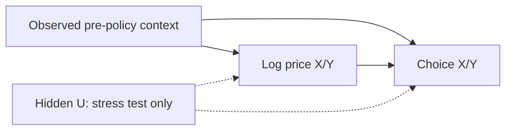

# Identification and interpretation

This document records the Week-1 causal specifications for three core responses
and the implemented controlled demand/choice model. GSM specifications below are
planned identification/evaluation contracts, not implemented or identified models.

## Sources and evidence

| Source | Use | Interpretation limits |
|---|---|---|
| NYC TLC HVFHV, pinned in configuration/manifests | Completed-trip marts and train-only context | Missing quotes, nonbookers, failed requests, online fleet, bonuses and SOC; realized fares are not prechoice quotes; platform codes are not GSM services |
| Synthetic/semi-synthetic data | Controlled effect recovery and operational tests | Declared behavior is evidence C; oracle values stay isolated from fitting and scenario prediction; operational tests do not establish GSM calibration |
| EPFL Swissmetro | Separate stated-preference choice baseline | `CHOICE=0` is unknown; travel time/headway are not pickup ETA; never join it to TLC/GSM. Dataset-specific use limits and validation are in the [benchmark protocol](BENCHMARK.md#swissmetro-choice-baseline) |
| GSM | Local identification, calibration and economics when sources qualify | Raw data is unavailable; public/synthetic coefficients cannot transfer directly |

A/B/C describe effect evidence rather than raw observations: C for controlled
synthetic effects, B for valid historical GSM identification under stated
assumptions, and A for an executed, valid experiment. Future combined forecasts
must retain evidence per dependency; the full chain may have mixed evidence.
Randomization in code remains evidence C, not a GSM field experiment.

## Week-1 causal specifications

Customer price sensitivity, driver labor supply and cross-service substitution
are the core targets. Planned GSM contrasts below require local data and
assignment review; missing results remain `not_evaluated`. The controlled
implementation retains its own scope, evidence C and benchmark protocol.

### Customer price sensitivity

| Field | Planned specification |
|---|---|
| Treatment/contrast | Assigned effective rider-price policy for X/Y, known before choice, versus unchanged policy; preserve displayed/applied prices and promotion/subscription versions. Use assignment-based contrasts for experiments; booked or realized average fares are not the treatment. |
| Outcome | Total original requests for each service and X/Y together, with retries handled by the frozen demand definition. Conditional quote conversion is a separate outcome. Completed trips are an operational outcome, not a substitute for requests. |
| Population | Total-demand mode covers the declared market/service population over a fixed observation period. Conditional-choice mode covers eligible quote opportunities, including nonbookers; it does not represent people who never entered the quote funnel. Freeze one decision/session independently of subsequent booking; refresh sequences need their own estimand. Incomplete observation retains censoring or an unknown outcome. |
| Unit | Absolute effects in requests per declared block/hour, or probability/percentage-point effects for conditional conversion. Report a price elasticity only when the price contrast, response form and outcome denominator justify it. |
| Horizon | Conditional choice: from a displayed quote to the frozen decision/observation-window end. Total demand: the assigned policy block and a declared follow-up period for traffic/return effects, with fixed calendar duration and carryover treatment chosen before fitting. Development-week numbers do not define these horizons. |
| Inference unit | Match the policy-assignment unit and spatial/time dependence; repeated sessions/customers cannot become independent replicates by default. Freeze local splits/resampling after inspecting the assignment and logging structure; the existing synthetic day protocol stays unchanged. |
| Identification | Identify the total request effect directly from policy-block request logs, or identify both quote exposure and conditional choice in a compatible system. Holding quote traffic fixed is valid only for the declared conditional estimand; it is not evidence that exposure has zero price response. Estimator-specific assumptions follow the linked identification gates. |
| Support | Both baseline and target need joint price/context support and valid probabilities where choice is modeled. Freeze the effective-price definition, observation coverage and estimable resolution; refuse unsupported contrasts. |
| Current status | Conditional choice has controlled evidence C only. GSM total-request effects, local conversion and price elasticities are `not_evaluated`; an exposure-response model is not implemented by this specification. |

The compatible exposure/direct-request alternatives are in
[Core design §6.1](reference/CORE_ENGINE_DESIGN.md#61-exposure-and-choice).
Multiplying a total-request effect by a conversion effect would count the same
price response twice.

### Cross-service substitution

| Field | Planned specification |
|---|---|
| Treatment/contrast | Change one service's effective price while holding the other at its declared policy, or estimate a supported joint contrast. Record each price column separately; promotion changes must preserve a defined effective-price treatment. |
| Outcome | Own/cross effects on X/Y requests and their total. Conditional X/Y/NONE probabilities can be reported separately with complete quote opportunities; NONE means observed nonbooking, not competitor choice or departure from GSM. |
| Population | The same market/observation scope as the corresponding demand estimand. Preserve actual choice sets and service availability; selecting a zone does not itself identify zone-specific coefficients. |
| Unit | A 2x2 outcome-by-price response matrix in declared request-rate or conditional-probability units; absolute contrasts and valid own/cross elasticities retain their denominators. Net changes do not identify individual customer switching. |
| Horizon | The same quote decision window or policy-block/follow-up horizon as the paired demand result. Aggregate X/Y/total over matching calendars; never combine a short conditional-choice effect with a longer total-demand effect as one matrix. |
| Inference unit | The assignment/dependence unit shared with the demand contrast, including repeated customers and spatial/time carryover where relevant. |
| Identification | Two columns require independent residual X/Y price variation. If only one is identified, deliver that column and its supported contrasts; collinear prices cannot identify a full matrix. Demand and substitution may share one estimation system rather than applying successive response multipliers. |
| Support | Check joint actions, context coverage, rank and choice availability at the reported resolution. Do not fill an unidentified column with zero or infer independent price support from separate min/max ranges. |
| Current status | The implemented synthetic common matrix has evidence C. A full/partial GSM matrix, total-demand substitution and GSM nonbooking effects remain `not_evaluated`. |

Resolution/rank/action gates follow
[Core design §6.3](reference/CORE_ENGINE_DESIGN.md#63-dml-and-baselines)
and [§6.4](reference/CORE_ENGINE_DESIGN.md#64-support-and-alternative-forms).

### Driver labor supply

| Field | Planned specification |
|---|---|
| Treatment/contrast | Compensation/incentive terms offered and known before the participation or work-hour decision, versus unchanged terms. Retain announcement, assignment, eligibility and effective time. Zero-base incentives use amount/category contrasts; realized post-shift income is an outcome or mediator. |
| Outcome | Entry/shift participation and total worked hours; retain conditional hours among participants separately. Bridge these labor outcomes to serviceable vehicle-hours using roster, charging/break and eligibility rules. Extra serviceable hours from less charging or relocation do not automatically mean more labor hours. |
| Population | The eligible driver/shift population determined before the decision, including nonparticipants and participants with zero trips. Track the same cohort across X/Y and neighboring zones; shared drivers/vehicles are counted once. |
| Unit | Participation probability/percentage points, worked hours per eligible driver/cohort and serviceable vehicle-hours over the declared horizon. Use amount effects for zero-base bonuses; any income elasticity needs a valid income domain and its own identification. |
| Horizon | Entry and within-shift hours: one complete offered shift, with terms fixed before its decision. Proposed total-labor follow-up: a complete policy-exposure week for the same eligible cohort, summing shifts and tracking unique driver-hours across monitored neighboring zones to distinguish added hours from shifted days/regions. Confirm the calendar and adequacy against local contracts/policy timing before evaluation; freeze announcement, follow-up and carryover rules. A weekly contrast does not by itself remove anticipation or deferred shifts. |
| Inference unit | Match incentive/shift assignment and dependence across repeated shifts of a driver, shared fleets and geographic/time spillovers. Freeze the grouping, chronological splits and resampling for this response before evaluation; do not inherit session-IID inference from quote data. |
| Identification | Assess assignment, contemporaneous shortage shocks, overlap, anticipation and feasible contract adjustments. Randomized offered terms or valid historical policy changes may identify their own contrasts. Expected income is a mechanism/information treatment requiring separate identification; an incentive effect does not identify an unrestricted income elasticity. |
| Support | Restrict terms and decision horizons to observed/approved variation, eligible driver/vehicle capacity and the compensation mechanism under which the effect was identified. Separate added total hours from relocation; fixed attendance is a declared mode, not an estimated zero labor response. |
| Current status | Labor estimation, the serviceable-hour bridge and income-response identification are planned. GSM participation/hours and supply effects are `not_evaluated`; no behavioral supply model is claimed by this specification. |

Outcome/compensation boundaries and candidate response forms follow
[Core design §7](reference/CORE_ENGINE_DESIGN.md#7-supply-response-engine).
Trip acceptance conditional on an actual dispatch offer is an auxiliary response:
its population, offer terms and response horizon differ from labor participation.
It needs its own identification and exposure checks and must not multiply down
physical supply; see [§7.4](reference/CORE_ENGINE_DESIGN.md#74-trip-acceptance-model).

Simple baselines, estimator assumptions and evidence gates follow
[Core design §5](reference/CORE_ENGINE_DESIGN.md#5-causal-identification-and-parameter-sources)
and the [benchmark protocol](BENCHMARK.md#objective-and-protocol). Keep model
selection, independent policy evaluation and final acceptance separate. Existing
controlled-DGP thresholds and reported results retain their original meaning;
new response/split/evaluation specifications must be frozen before new final tests.
Week 1 defines the identification and initial evaluation/experiment plan. An
executable assignment schedule, calibrated power, executed A/A and detailed frozen
forecast reconciliation remain later deliverables, not evidence created here.

## Controlled conditional-choice implementation

### Conditional-choice estimand

Each block contains a fixed number of quote viewers and three mutually exclusive
choices: X, Y and NONE. Outcomes are the X/Y choice proportions. Treatments are
the two natural log price multipliers. Rows of theta are outcomes; columns are
prices. A coefficient has units probability per unit log price.

The baseline elasticity is `theta[j,k] / p0[j]`, using the weighted mean baseline
probability of the selected evaluation contexts. Session count supplies weights.
There is one common matrix for the cluster. Selecting a zone changes the context
mix and predicted baseline without creating a separately estimated zone matrix.

The W→T edge is absent in randomized DGPs. The U edges exist only in the hidden
confounding stress test. DML can adjust W; it cannot adjust an unobserved U.

### DGPs and known-truth generator

Each block has peak/weekend in {0,1}, train-scaled distance d in [0,1], and hour h.
Freeze scaling on train; apply to validation/test and flag values outside support.
The following are declared experimental parameters, not TLC estimates:

$$
b_X(W)=0.30+0.05\,peak-0.04d+0.02\,weekend+0.02\sin(2\pi h/24).
$$

$$
b_Y(W)=0.25+0.04\,peak-0.03d+0.01\,weekend+0.02\cos(2\pi h/24).
$$

$$
\Theta=\begin{pmatrix}-0.60&0.15\\0.12&-0.50\end{pmatrix},\qquad
\begin{pmatrix}p_X\\p_Y\end{pmatrix}=
\begin{pmatrix}b_X(W)\\b_Y(W)\end{pmatrix}+\Theta T,\qquad
p_{\text{NONE}}=1-p_X-p_Y.
$$

Draw 50 mutually exclusive choices per block, optionally via multinomial counts
expanded to sessions. Use separate NumPy SeedSequence streams for context,
assignment, and choice.
Validate every probability before sampling; reject invalid configurations without
clipping/renormalizing, which would change the declared truth.

| DGP | Assignment | Outcome | Role |
|---|---|---|---|
| RCT_SYN | Independent prices; one-third probability per level | Declared equations | Basic recovery |
| OBSERVED_CONFOUNDING | Price-level probabilities depend on W | Same equations | Observed-confounding adjustment |
| HIDDEN_CONFOUNDING | Assignment depends on W and U | Add 0.025U to p_X and 0.020U to p_Y | Missing-variable stress |
| NULL_EFFECT | Random prices, all theta zero | Context only | False positives |
| COLLINEAR_PRICE | Identical X/Y multipliers | Basic equations | Reject full matrix identification |

OBSERVED_CONFOUNDING uses weights `exp(0.8 * s_j(W) * v)` for v=-1,0,1 and
multipliers 0.9,1,1.1, normalized to probabilities. Define
`s_X=clip(2*peak-1+0.5*weekend-0.5*d,-1,1)` and
`s_Y=clip(1.5*peak-0.75+0.5*sin(2*pi*h/24),-1,1)`.
Sample prices independently conditional on W.

For HIDDEN_CONFOUNDING, draw independent U ~ Uniform[-1,1] per block, replace
s_j with `clip(s_j+0.5*U,-1,1)`, and modify outcomes as above. U/truth probabilities
stay in oracle. Exclude `assignment_probability` from W because it may reveal U.

Training prices have three levels. Intermediate scenarios assume local linearity
in log price. Later nonlinear stress cases require truth derived from their new
generator, not reuse of the linear theta.

### Estimation and inference

Naive OLS regresses proportions on log prices and an intercept. Adjusted OLS adds
a fixed context basis. LinearDML uses multi-output random forests for E[Q|W] and
E[T|W], then estimates the residual relation. The initial nuisance defaults are
50 trees, depth 6, minimum leaf 20, with five GroupKFold splits by original day;
the effective run config and manifest identify the executed settings.
Continuous treatments and block proportions use `discrete_treatment=False`
and `discrete_outcome=False`.

Context contains zone, time-of-day sin/cos, weekday, weekend, peak and scaled
distance. IDs, assignment probabilities, hidden U, oracle probabilities, future
outcomes and session customer IDs cannot become features. The zone taxonomy is
fixed before cross-fitting. The baseline model is a linear regression on the
same explicit basis, fitted to `Q - T @ theta.T`; this matches the declared
additive DGP and does not use oracle baseline labels.

Invalid choice probabilities on validation stop the fit stage with the estimator
and failure reason recorded in the run manifest. No model is published from that
fit. Scenarios also reject saved bundles explicitly marked as failing validation,
even if the selected test-context predictions are valid.

Monte Carlo evaluates each estimator independently on the same generated seed.
A fit or validation failure counts against that estimator's attempted-run denominator
while other estimators retain their valid results. Shared data-generation failures
count against every configured estimator.

Training is January 1–20, validation January 21–25 and final evaluation January
26–31. Nuisance folds group all zones/blocks by original training day. Bootstrap
resamples days and refits nuisance models, theta and the probability baseline.
Duplicate copies of a sampled day retain their original group. Held-out evaluation
contexts remain fixed. Default estimator IID confidence intervals are disabled.
Bootstrap draws must retain the original training sample's active treatments.
A draw that loses variation in an originally varying price counts as a failed refit,
so coefficient columns stay aligned and the failure enters the interval-quality checks.

Intervals are individual day-bootstrap percentile intervals, not simultaneous
intervals. The reporting profile requires at least 199 successful draws, at most
5% fit failures, and no large half/full width sensitivity. Scenario intervals are
also withheld when any draw produces invalid probabilities. Development intervals
in effects/metrics remain explicitly labeled `interval_unstable`; scenarios show
the valid point estimate while withholding those intervals.

With only 20 independent training days, statistical inference needs empirical
coverage checks. Monte Carlo reports the interval denominator, failed or
unidentified estimates, per-cell bias/RMSE, coverage and exact binomial bounds.
Small development runs do not establish nominal coverage.

### Price scenarios

New multipliers equal baseline multipliers times `(1 + delta_price)`. Prediction
uses `theta @ (log(new) - log(baseline))`. A +10% change therefore uses log(1.1).
Both baseline and target must have joint price support. Interior price values use
the declared local linearity assumption; all required neighboring price corners
are checked. The minimum training-block count is checked separately for each
selected zone/weekend/peak group at every required price corner. Counts from other
groups do not substitute for a thin group; no automatic pooling fallback is used.
Unseen or small groups yield `insufficient_support`, with the group, count and
minimum in the warning. Values outside 0.90–1.10 receive no forecast.

Predictions are validated at every individual context before averaging. NONE is
the probability complement. Expected bookings equal assumed sessions times the
sum of X and Y probabilities. Separate columns are withheld when price residuals
have insufficient rank; only a varying, identifiable price may be reported alone.

### Limits and extension gates

TLC context comes from completed NYC trips. It does not reconstruct quote viewers,
conversion, canceled requests or unserved demand. X/Y are hypothetical services,
not Uber/Lyft estimates. Simulated coefficients cannot transfer to GSM.

Supply, charging, spatial interference, recurring customers and temporal carryover
are outside this choice DGP. Its model does not produce supply increases, idle
hours, cancellations, actual revenue or ROI. The separate fixed-supply simulator
currently produces synthetic operational trajectories; its assumptions and limits
are in [USAGE.md](USAGE.md#week-3-fixed-supply-simulation).
GSM causal extensions follow the three planned specifications above and their
identification gates. Simulation-dependent forecasts additionally require
qualified operational calibration. Live intervention still requires GSM approval.

API reference: [EconML LinearDML](https://www.pywhy.org/EconML/_autosummary/econml.dml.LinearDML.html).
