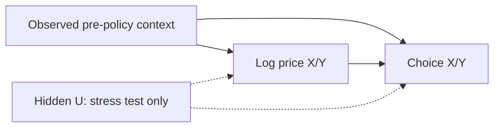

# Identification and interpretation

This PoC implements the first two weeks in the supplied proposal and detailed
design. Simulated behavior always carries evidence C, including the randomized
synthetic DGP. Randomization in code is not a GSM field experiment.

## Estimand

Each block contains a fixed number of quote viewers and three mutually exclusive
choices: X, Y and NONE. Outcomes are the X/Y choice proportions. Treatments are
the two natural log price multipliers. Rows of theta are outcomes; columns are
prices. A coefficient has units probability per unit log price.

The baseline elasticity is `theta[j,k] / p0[j]`, using the weighted mean baseline
probability of the selected evaluation contexts. Session count supplies weights.
There is one common matrix for the cluster. Selecting a zone changes the context
mix and predicted baseline without creating a separately estimated zone matrix.

The W→T edge is absent in randomized DGPs. The U edges exist only in the hidden
confounding stress test. DML can adjust W; it cannot adjust an unobserved U.

## DGPs

| Mechanism | Price assignment | Purpose |
|---|---|---|
| RCT_SYN | Independent three-level randomized prices | Parameter recovery |
| OBSERVED_CONFOUNDING | Independent conditional on observed W | Adjustment comparison |
| HIDDEN_CONFOUNDING | W and hidden block-specific U | Demonstrate omitted-variable limitations |
| NULL_EFFECT | Randomized prices, theta zero | False positive assessment |
| COLLINEAR_PRICE | X and Y multipliers identical | Reject separate unidentified effects |

The generator uses the exact equations in section 8.3 of the detailed design.
Context, assignment and outcome RNGs use separate NumPy SeedSequence streams.
Invalid probabilities cause failure; they are never clipped or renormalized.

## Estimation and inference

Naive OLS regresses proportions on log prices and an intercept. Adjusted OLS adds
a fixed context basis. LinearDML uses multi-output random forests for E[Q|W] and
E[T|W], then estimates the residual relation. Continuous treatments and block
proportions use `discrete_treatment=False` and `discrete_outcome=False`.

Context contains zone, time-of-day sin/cos, weekday, weekend, peak and scaled
distance. IDs, assignment probabilities, hidden U, oracle probabilities, future
outcomes and session customer IDs cannot become features. The zone taxonomy is
fixed before cross-fitting. The baseline model is a linear regression on the
same explicit basis, fitted to `Q - T @ theta.T`; this matches the declared
additive DGP and does not use oracle baseline labels.

Invalid choice probabilities on validation stop the fit stage with the estimator
and failure reason recorded in the run manifest. No model is published from that
fit. Scenarios also reject saved bundles explicitly marked as failing validation,
even if the selected test-context predictions are valid.

Monte Carlo evaluates each estimator independently on the same generated seed.
A fit or validation failure counts against that estimator's attempted-run denominator
while other estimators retain their valid results. Shared data-generation failures
count against every configured estimator.

Training is January 1–20, validation January 21–25 and final evaluation January
26–31. Nuisance folds group all zones/blocks by original training day. Bootstrap
resamples days and refits nuisance models, theta and the probability baseline.
Duplicate copies of a sampled day retain their original group. Held-out evaluation
contexts remain fixed. Default estimator IID confidence intervals are disabled.
Bootstrap draws must retain the original training sample's active treatments.
A draw that loses variation in an originally varying price counts as a failed refit,
so coefficient columns stay aligned and the failure enters the interval-quality checks.

Intervals are individual day-bootstrap percentile intervals, not simultaneous
intervals. The reporting profile requires at least 199 successful draws, at most
5% fit failures, and no large half/full width sensitivity. Scenario intervals are
also withheld when any draw produces invalid probabilities. Development intervals
in effects/metrics remain explicitly labeled `interval_unstable`; scenarios show
the valid point estimate while withholding those intervals.

With only 20 independent training days, statistical inference needs empirical
coverage checks. Monte Carlo reports the interval denominator, failed or
unidentified estimates, per-cell bias/RMSE, coverage and exact binomial bounds.
Small development runs do not establish nominal coverage.

## Price scenarios

New multipliers equal baseline multipliers times `(1 + delta_price)`. Prediction
uses `theta @ (log(new) - log(baseline))`. A +10% change therefore uses log(1.1).
Both baseline and target must have joint price support. Interior price values use
the declared local linearity assumption; all required neighboring price corners
are checked. The minimum training-block count is checked separately for each
selected zone/weekend/peak group at every required price corner. Counts from other
groups do not substitute for a thin group; no automatic pooling fallback is used.
Unseen or small groups yield `insufficient_support`, with the group, count and
minimum in the warning. Values outside 0.90–1.10 receive no forecast.

Predictions are validated at every individual context before averaging. NONE is
the probability complement. Expected bookings equal assumed sessions times the
sum of X and Y probabilities. Separate columns are withheld when price residuals
have insufficient rank; only a varying, identifiable price may be reported alone.

## Limits and extension gates

TLC context comes from completed NYC trips. It does not reconstruct quote viewers,
conversion, canceled requests or unserved demand. X/Y are hypothetical services,
not Uber/Lyft estimates. Simulated coefficients cannot transfer to GSM.

Supply, charging, spatial interference, recurring customers and temporal carryover
are outside this DGP. No supply increase, idle vehicles, cancellations, actual
revenue or ROI are produced. The next phase needs GSM compensation and vehicle
state data, explicit units, a matching simulator and a new identification review.
DiD and field switchback require appropriate policy variation and GSM approval.

API reference: [EconML LinearDML](https://www.pywhy.org/EconML/_autosummary/econml.dml.LinearDML.html).
