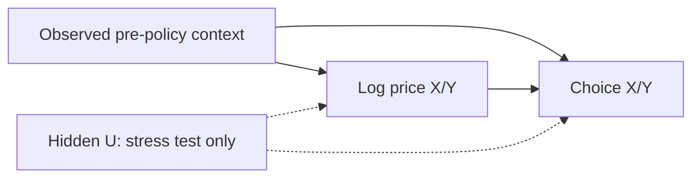

# Identification and interpretation

This document specifies the demand/choice model and its interpretation.
Simulated behavior always carries evidence C, including the randomized
synthetic DGP. Randomization in code is not a GSM field experiment.

## Sources and evidence

| Source | Use | Interpretation limits |
|---|---|---|
| NYC TLC HVFHV, pinned in configuration/manifests | Completed-trip marts and train-only context | Missing quotes, nonbookers, failed requests, online fleet, bonuses and SOC; realized fares are not prechoice quotes; platform codes are not GSM services |
| Synthetic/semi-synthetic data | Controlled effect recovery and operational tests | Declared behavior is evidence C; oracle values stay isolated from fitting and scenario prediction; operational tests do not establish GSM calibration |
| EPFL Swissmetro | Separate stated-preference choice baseline | `CHOICE=0` is unknown; travel time/headway are not pickup ETA; never join it to TLC/GSM. Dataset-specific use limits and validation are in the [benchmark protocol](BENCHMARK.md#swissmetro-choice-baseline) |
| GSM | Local identification, calibration and economics when sources qualify | Raw data is unavailable; public/synthetic coefficients cannot transfer directly |

A/B/C describe effect evidence rather than raw observations: C for controlled
synthetic effects, B for valid historical GSM identification under stated
assumptions, and A for an executed, valid experiment. Future combined forecasts
must retain evidence per dependency; the full chain may have mixed evidence.

Before fitting GSM data, review the DAG/estimand, assignment mechanism,
pretreatment features, support, compensation definitions and inference/resampling
units with local splits. DML does not remove hidden confounding. An adapter swap
does not establish identification or coefficient transferability.

## Estimand

Each block contains a fixed number of quote viewers and three mutually exclusive
choices: X, Y and NONE. Outcomes are the X/Y choice proportions. Treatments are
the two natural log price multipliers. Rows of theta are outcomes; columns are
prices. A coefficient has units probability per unit log price.

The baseline elasticity is `theta[j,k] / p0[j]`, using the weighted mean baseline
probability of the selected evaluation contexts. Session count supplies weights.
There is one common matrix for the cluster. Selecting a zone changes the context
mix and predicted baseline without creating a separately estimated zone matrix.

For observed sessions, assign NONE only after a complete observation window
with complete choice logs; otherwise retain censoring or an unknown outcome.
NONE does not establish competitor choice. Quote refreshes do not create
independent customers: freeze one decision/session rule before fitting, without
using subsequent booking to select the decision. Refresh sequences require a
separate estimand. Net choice changes do not identify individual switching customers.

The W→T edge is absent in randomized DGPs. The U edges exist only in the hidden
confounding stress test. DML can adjust W; it cannot adjust an unobserved U.

## DGPs and known-truth generator

Each block has peak/weekend in {0,1}, train-scaled distance d in [0,1], and hour h.
Freeze scaling on train; apply to validation/test and flag values outside support.
The following are declared experimental parameters, not TLC estimates:

$$
b_X(W)=0.30+0.05\,peak-0.04d+0.02\,weekend+0.02\sin(2\pi h/24).
$$

$$
b_Y(W)=0.25+0.04\,peak-0.03d+0.01\,weekend+0.02\cos(2\pi h/24).
$$

$$
\Theta=\begin{pmatrix}-0.60&0.15\\0.12&-0.50\end{pmatrix},\qquad
\begin{pmatrix}p_X\\p_Y\end{pmatrix}=
\begin{pmatrix}b_X(W)\\b_Y(W)\end{pmatrix}+\Theta T,\qquad
p_{\text{NONE}}=1-p_X-p_Y.
$$

Draw 50 mutually exclusive choices per block, optionally via multinomial counts
expanded to sessions. Use separate NumPy SeedSequence streams for context,
assignment, and choice.
Validate every probability before sampling; reject invalid configurations without
clipping/renormalizing, which would change the declared truth.

| DGP | Assignment | Outcome | Role |
|---|---|---|---|
| RCT_SYN | Independent prices; one-third probability per level | Declared equations | Basic recovery |
| OBSERVED_CONFOUNDING | Price-level probabilities depend on W | Same equations | Observed-confounding adjustment |
| HIDDEN_CONFOUNDING | Assignment depends on W and U | Add 0.025U to p_X and 0.020U to p_Y | Missing-variable stress |
| NULL_EFFECT | Random prices, all theta zero | Context only | False positives |
| COLLINEAR_PRICE | Identical X/Y multipliers | Basic equations | Reject full matrix identification |

OBSERVED_CONFOUNDING uses weights `exp(0.8 * s_j(W) * v)` for v=-1,0,1 and
multipliers 0.9,1,1.1, normalized to probabilities. Define
`s_X=clip(2*peak-1+0.5*weekend-0.5*d,-1,1)` and
`s_Y=clip(1.5*peak-0.75+0.5*sin(2*pi*h/24),-1,1)`.
Sample prices independently conditional on W.

For HIDDEN_CONFOUNDING, draw independent U ~ Uniform[-1,1] per block, replace
s_j with `clip(s_j+0.5*U,-1,1)`, and modify outcomes as above. U/truth probabilities
stay in oracle. Exclude `assignment_probability` from W because it may reveal U.

Training prices have three levels. Intermediate scenarios assume local linearity
in log price. Later nonlinear stress cases require truth derived from their new
generator, not reuse of the linear theta.

## Estimation and inference

Naive OLS regresses proportions on log prices and an intercept. Adjusted OLS adds
a fixed context basis. LinearDML uses multi-output random forests for E[Q|W] and
E[T|W], then estimates the residual relation. The initial nuisance defaults are
50 trees, depth 6, minimum leaf 20, with five GroupKFold splits by original day;
the effective run config and manifest identify the executed settings.
Continuous treatments and block proportions use `discrete_treatment=False`
and `discrete_outcome=False`.

Context contains zone, time-of-day sin/cos, weekday, weekend, peak and scaled
distance. IDs, assignment probabilities, hidden U, oracle probabilities, future
outcomes and session customer IDs cannot become features. The zone taxonomy is
fixed before cross-fitting. The baseline model is a linear regression on the
same explicit basis, fitted to `Q - T @ theta.T`; this matches the declared
additive DGP and does not use oracle baseline labels.

Invalid choice probabilities on validation stop the fit stage with the estimator
and failure reason recorded in the run manifest. No model is published from that
fit. Scenarios also reject saved bundles explicitly marked as failing validation,
even if the selected test-context predictions are valid.

Monte Carlo evaluates each estimator independently on the same generated seed.
A fit or validation failure counts against that estimator's attempted-run denominator
while other estimators retain their valid results. Shared data-generation failures
count against every configured estimator.

Training is January 1–20, validation January 21–25 and final evaluation January
26–31. Nuisance folds group all zones/blocks by original training day. Bootstrap
resamples days and refits nuisance models, theta and the probability baseline.
Duplicate copies of a sampled day retain their original group. Held-out evaluation
contexts remain fixed. Default estimator IID confidence intervals are disabled.
Bootstrap draws must retain the original training sample's active treatments.
A draw that loses variation in an originally varying price counts as a failed refit,
so coefficient columns stay aligned and the failure enters the interval-quality checks.

Intervals are individual day-bootstrap percentile intervals, not simultaneous
intervals. The reporting profile requires at least 199 successful draws, at most
5% fit failures, and no large half/full width sensitivity. Scenario intervals are
also withheld when any draw produces invalid probabilities. Development intervals
in effects/metrics remain explicitly labeled `interval_unstable`; scenarios show
the valid point estimate while withholding those intervals.

With only 20 independent training days, statistical inference needs empirical
coverage checks. Monte Carlo reports the interval denominator, failed or
unidentified estimates, per-cell bias/RMSE, coverage and exact binomial bounds.
Small development runs do not establish nominal coverage.

## Price scenarios

New multipliers equal baseline multipliers times `(1 + delta_price)`. Prediction
uses `theta @ (log(new) - log(baseline))`. A +10% change therefore uses log(1.1).
Both baseline and target must have joint price support. Interior price values use
the declared local linearity assumption; all required neighboring price corners
are checked. The minimum training-block count is checked separately for each
selected zone/weekend/peak group at every required price corner. Counts from other
groups do not substitute for a thin group; no automatic pooling fallback is used.
Unseen or small groups yield `insufficient_support`, with the group, count and
minimum in the warning. Values outside 0.90–1.10 receive no forecast.

Predictions are validated at every individual context before averaging. NONE is
the probability complement. Expected bookings equal assumed sessions times the
sum of X and Y probabilities. Separate columns are withheld when price residuals
have insufficient rank; only a varying, identifiable price may be reported alone.

## Limits and extension gates

TLC context comes from completed NYC trips. It does not reconstruct quote viewers,
conversion, canceled requests or unserved demand. X/Y are hypothetical services,
not Uber/Lyft estimates. Simulated coefficients cannot transfer to GSM.

Supply, charging, spatial interference, recurring customers and temporal carryover
are outside this choice DGP. Its model does not produce supply increases, idle
hours, cancellations, actual revenue or ROI. The separate fixed-supply simulator
currently produces synthetic operational trajectories; its assumptions and limits
are in [USAGE.md](USAGE.md#week-3-fixed-supply-simulation).
GSM extensions require compensation and vehicle-state data, calibrated operational
rules and a new identification review.
DiD and field switchback require appropriate policy variation and GSM approval.

API reference: [EconML LinearDML](https://www.pywhy.org/EconML/_autosummary/econml.dml.LinearDML.html).
