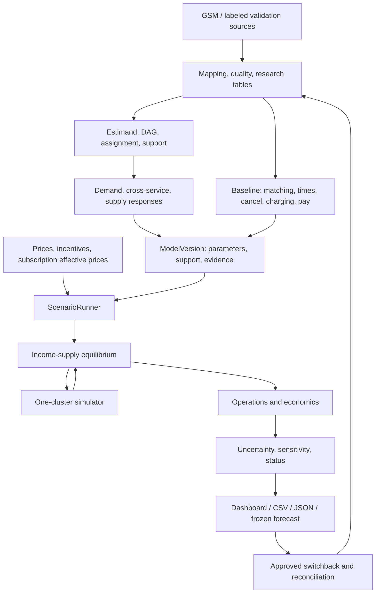

# Core Engine Design - GSM Causal Marketplace

**Basis:** [GSM Causal Marketplace Proposal](GSM_Causal_Marketplace_Proposal.md).
**Scope:** a two-sided marketplace prototype, one cluster, two services, five weeks.
**Document type:** implementation and acceptance design. Formulas, interfaces,
and starting values are design choices, not measurements or implementation status.

Sources, formats, grain, units, interfaces, and stage I/O follow
[GSM_DATA_CONTRACT.md](../GSM_DATA_CONTRACT.md). This document specifies algorithms;
executed results are recorded in [VALIDATION.md](../VALIDATION.md).

## 1. Objectives and required outputs

Given a price/incentive policy, baseline market, and versioned response models,
forecast the resulting market, compare with current policy, and freeze predictions
for experimental reconciliation.

Reference scenario: **raise service X price 10% in a cluster/time window**.
Report demand, serviceable supply, service choice, and idle supply. Customer
price changes affect supply through compensation and adjustable driver decisions.

| Requirement | Output | Component |
|---|---|---|
| Customer price sensitivity | Request response; quote conversion separately; explicit unit/population | DemandResponse |
| Cross-service response | Supported own/cross 2x2 matrix by zone/time/service | ChoiceResponse |
| Supply | Serviceable vehicle-hours versus expected income/incentives; extra hours versus relocation | SupplyResponse |
| Equilibrium | Consistent income/supply/utilization or nonconvergence status | EquilibriumSolver |
| Operations | Completed trips, wait, cancellation, idle, charging | MarketplaceSimulator |
| Economics | Revenue, costs, incremental contribution margin, supported ROI | EconomicEvaluator |
| Uncertainty/evidence | Intervals, support, assumptions, A/B/C per output | UncertaintyEngine, EvidenceRegistry |
| Validation | Switchback schedule, frozen forecasts, reconciliation ledger | ExperimentInterface |
| Handoff | Scenario dashboard, CSV/JSON, reproducible versions | ScenarioRunner, ArtifactStore |

The prototype supports decisions. Production execution requires GSM approval;
individual pricing, production trip dispatch, and citywide competition modeling
are outside this scope.

## 2. Architecture

### 2.1 Response estimation and market simulation

Use a structural marketplace model for forecasting. DML, DiD, or experiments
estimate responses; simulation combines them with operations and compensation.
DML alone does not produce completed trips, idle vehicles, or ROI.



### 2.2 Technology and execution

Use Python/SQL batch jobs, DuckDB/Parquet tables, EconML DML, and proposed SimPy
discrete-event simulation. SimPy supplies event/process scheduling; marketplace
rules must be implemented explicitly. Streamlit reads completed artifacts.

Fitting, calibration, bootstrap, and equilibrium run as bounded jobs. Display
changes read results; new scenarios create finite jobs with explicit status.
Avoid fitting/bootstrap during rendering. Kafka, a separate registry service,
and automated policy deployment are unnecessary for one cluster.

## 3. Market scope, time, and units

`MarketDefinition` fixes zones/boundary versions, monitored neighbors, services,
price control, eligible drivers/vehicles, and forecast horizon. Start with small
zones and 30-minute aggregation, adjusted to log coverage. Aggregation differs
from experiment blocks, driver shifts, and simulator event time.

Use seconds and timezone-aware simulator timestamps. Report windows in the
market timezone; use `Asia/Ho_Chi_Minh` for Vietnam only after source confirmation.
Never silently convert naive source timestamps to UTC.

| Quantity | Symbol/unit | Required distinction |
|---|---|---|
| Quote exposure | $\lambda_{\text{quote}}$: sessions/hour | Separate from requests/completed trips |
| Conversion | $p_j$: choice probability | Actual displayed choice set and observation window |
| Demand | $D_j$: requests/hour | Retry attempts versus original demand; declared business deduplication |
| Serviceable supply | $H_{\text{serviceable}}$: vehicle-hours | Idle + reserved/dispatch + pickup + on-trip; exclude charging/break/ineligible |
| Immediately available supply | $H_{\text{idle}}$: vehicle-hours or point-in-time count | Subset of serviceable supply |
| Expected income | $E$: VND/hour or VND/shift | Consistent denominator and predecision information |
| Price/incentive | $P/B$: VND or price multiplier | Before/after discount, tax/fees, unit, version |
| Operations | Trips, seconds, rates, vehicle-hours, kWh | Explicit denominators for rates |

Count a shared vehicle-hour once across X/Y. Eligibility represents multiple
services without duplicating supply. Include internal substitution in total GSM
outcomes. `NONE` does not imply competitor choice.

## 4. Input contract and research tables

### 4.1 Sources

Request **eight raw groups over the latest 12 months**, including neighbors and
controls, using Parquet, UTF-8 CSV, or native export with original schema/rate,
keys, metadata, and version history. Researchers map/check/build tables; GSM
need not prepare training data or causal coefficients.

Preserve session -> quote-set -> quote -> request/booking -> trip and
request -> dispatch -> driver/vehicle -> shift/charging-session links.
Nearest-time joins require error assessment and uncertainty labels.

### 4.2 Internal interfaces

Names/grains follow the [shared research tables](../GSM_DATA_CONTRACT.md#3-shared-research-tables).
These are proposed research interfaces. Python classes may use CamelCase;
functions, parameters, tables, and artifacts use snake_case.

| Engine input | Contract tables | Content |
|---|---|---|
| Demand/choice | `quote_session`, `quote_option`, `booking_event`, `policy_assignment`, `demand_block` | Prechoice display/availability/price/ETA, outcome/censoring, exposure/requests, assignment |
| Supply | `driver_offer_shift`, `driver_vehicle_state`, `policy_assignment` | Offered terms/eligibility, shift decisions, vehicle-hours/state/SOC, compensation |
| Calibration | `operational_event`, `booking_event`, `driver_vehicle_state`, `payment_cost` | Matching/timing/cancel/charging/earnings/cost rules |
| Simulation | `baseline_snapshot`, `demand_plan`, `admission_plan` | Initial states/roster/rates/rules, requests/hour, shift/serviceable-hour plans |

A refresh does not create another independent customer. Initially select one
decision/session using a rule fixed before fitting and independent of subsequent
booking. Refresh sequences need their own estimand.

Keep missing, unknown, not-applicable, and observed zero distinct. No linked
request means `NONE` only after complete observation/logging; otherwise censor
or mark unknown. No trips does not establish offline state. Reconcile durations,
requests/trips, and ledgers against the same source scope.

### 4.3 Blocking quality issues

Unmapped schema/keys, unexplained many-to-many joins, inconsistent timestamps,
missing essential coverage, or unknown currency/units block affected modules.
Independent outputs can continue. Keep scope, join rates, valid counts, and
exclusion/censoring reasons in artifacts.

## 5. Causal identification and parameter sources

Each `EstimandSpec` records treatment, outcome, population, horizon, assignment,
pretreatment features, inference unit, assumptions, support, and evidence source.
Conversion, request-rate, and completed-trip elasticities are distinct outcomes.

| Variation | Estimator | Identification gate | Evidence after validation |
|---|---|---|---|
| Randomized price/incentives | Assignment-based analysis; primary intention-to-treat | Valid assignment/A/A, exposure, interference, carryover | A |
| Historical changes with controls | Timing/group-appropriate DiD | Conditional parallel trends, anticipation, concurrent changes assessed | B |
| Historical observed confounding | DML plus adjusted baselines | Adequate pretreatment features, residual variation, overlap | B with explicit assumptions |
| Known-parameter mechanism | Estimators on observed synthetic data; evaluator-only oracle | No leakage, valid probabilities/states, frozen validation design | C |

Choosing an estimator or planning randomization does not upgrade evidence.
Record unconfirmed assumptions in model cards; unsupported responses remain
C assumptions or unavailable.

Use suitable group-time DiD estimands, preferably Callaway-Sant'Anna when event
structure fits. A single two-way fixed-effects regression does not handle all
heterogeneity/timing. A discrete-policy ATT is not automatically a log-price
derivative; limit actions to evidence or declare interpolation assumptions.
[Method](https://bcallaway11.github.io/did/).

DAGs distinguish pretreatment $W$, offered price/incentives, displayed income
information, choice, post-treatment operational states, and realized ledgers.
Realized earnings and policy-affected ETA are outcomes/mediators, not automatic
confounder features.

## 6. Demand and cross-service engine

### 6.1 Exposure and choice

With complete quote logs:

$$
D_j(z,t;\pi)=\lambda_{\text{quote}}(z,t;\pi)\,p_j(z,t;\pi),\qquad j\in\{X,Y\}.
$$

Expected requests over $\Delta t$ hours are $D_j\Delta t$. The simulator consumes
rates with declared scope/choice set, never completed-trip counts as demand.

Immediate price changes after session entry may hold exposure fixed under
`conditional_on_quote_population`. Longer-term traffic/return effects need an
identified exposure model. Without it, long-term total demand is unavailable;
zero exposure elasticity is an assumption, not a result.

A mutually exclusive alternative models requests directly by policy block when
request logs/identification qualify but quote logs are incomplete. It returns
total request effects, leaving conversion/outside choice unavailable. Never
multiply a total request effect by another conversion effect.

### 6.2 Initial choice function

Use a local log-price response with target-market baseline:

$$
p_{XY}(W;\pi)=p_{XY,0}(W)+\Theta_g(W)
\begin{pmatrix}
\log(P_X^{\text{eff}}/P_{X,0}^{\text{eff}})\\
\log(P_Y^{\text{eff}}/P_{Y,0}^{\text{eff}})
\end{pmatrix},\qquad p_{\text{NONE}}=1-p_X-p_Y.
$$

Effective prices are displayed prices after defined benefits/promotions.
Subscription effects require observed eligibility; do not arbitrarily allocate
subscription fees as trip discounts. Initially hold subscriber membership fixed;
adoption/churn needs separate identification.

Rows are chosen services; columns are changed prices. Own/cross conversion
elasticity at baseline is:

$$
\varepsilon^{\text{choice}}_{jk}=\theta_{jk}/p_{j,0}.
$$

With identified exposure elasticity $\xi_k=\mathrm{d}\log(\lambda_{\text{quote}})/\mathrm{d}\log(P_k)$:

$$
\varepsilon^{\text{request}}_{jk}=\xi_k+\varepsilon^{\text{choice}}_{jk}.
$$

Near-zero baselines require absolute effects and denominators instead of unstable
elasticities. Zero/negative prices need monetary or categorical treatments;
adding an arbitrary epsilon does not make log prices valid.

### 6.3 DML and baselines

Retain naive and adjusted OLS. DML learns $\mathbb{E}[Q\mid W]$ and
$\mathbb{E}[T\mid W]$ out of fold, then relates residuals. Cross-fitting and
orthogonal scores reduce nuisance-error sensitivity under method assumptions;
they do not remove hidden confounding or guarantee market transfer.
[Method](https://arxiv.org/abs/1608.00060).

Use LinearDML with a declared small effect basis for zone/time groups and
interactions. Keep context $W$ and effect features (`EffectBasis`) separate.
Select pooled/group effects on validation; avoid separate models for every sparse
cell. Verify APIs against locked versions. [LinearDML](https://www.pywhy.org/EconML/_autosummary/econml.dml.LinearDML.html).

`ResolutionPolicy` fixes minimum independent units, rank, and group support.
Fallback to supported pooled groups with `estimated_resolution` and
`fallback_reason`; pooled coefficients cannot be labeled zone-specific.
One varying price identifies one column; collinear prices do not identify both.

Fit baseline probabilities on train using compatible groups, units, and response
forms. Validate calibration/probabilities. Learned preprocessing stays inside
train/folds; oracle and test outcomes cannot enter fitting.

### 6.4 Support and alternative forms

`SupportEnvelope` records joint actions, price domains, context coverage, rank,
counts, and domain validity. Separate min/max ranges are insufficient. Derive
support from data and approved policy bounds; do not apply 0.90-1.10 universally.

Check each context before aggregation. Negative probabilities, probabilities
above one, or sums above one invalidate actions; no clipping/renormalization.
Supported actions satisfy data support, probability validity, and operational
bounds. Explicit C sensitivity runs outside support remain separate from forecasts.

Nested logit is a possible nonlinear extension with adequate alternatives and
availability logs, a model card, identification, and a separate benchmark.
Likelihood fit alone does not make price coefficients causal. Do not force a
DML matrix into logit through probability repair.

### 6.5 ETA and operational feedback

Initial mode is `reduced_form_policy`: request effects are defined for a policy
mechanism/horizon. Do not add post-treatment wait/ETA demand effects already
included in that estimate.

`structural_choice` can add price, ETA/availability, and simulator feedback after
identifying direct/mediated relationships and revising the DAG/estimand. Modes
cannot mix in one run. The initial income-supply loop does not require an
identified ETA-choice feedback model.

## 7. Supply response engine

### 7.1 Outcomes and treatment

Primary outcome is $H_{\text{serviceable}}$ for eligible drivers/vehicles over
the horizon, not trips worked. Shift acceptance, offers, trip acceptance,
relocation, and charging timing may need separate models/estimands.

Treatments are offered compensation/incentives and income information known
before decisions. Fixed contracts may imply zero extra hours; additional shifts,
acceptance, and charging timing remain possible responses. Never use the same
shift's realized earnings to manufacture a pretreatment expectation.

For positive baseline income and identified expected-income response:

$$
H^*_{\text{serv},g}=H_{\text{serv},0,g}\exp\left(
\gamma_g\log(E_g/E_{0,g})+\kappa_g(B_g-B_{0,g})\right).
$$

$\gamma$ is income elasticity; $\kappa$ has inverse-currency units. This structural
form applies only within validated support. If bonus is included in income,
use one path or an independently identified bonus effect; do not count it twice.
Zero baseline income/bonus requires amount or categorical treatments.

Zero baseline hours and discrete shifts need participation/shift-acceptance
models plus conditional hours. Retain nonparticipants and valid zero outcomes.

### 7.2 CompensationModel

Represent fixed pay, commissions/revenue share, piece rates, threshold bonuses,
guarantees, caps, and payment timing. Produce predecision offered terms and
post-simulation earnings ledgers. Customer price changes with unchanged expected
compensation do not enter supply directly.

Income feedback follows fixed compensation rules, not customer payments.
Threshold bonuses use individual driver/shift outcomes, not market-average fares.
Income denominators match the decision basis: presence hours, work hours, or paid shifts.

### 7.3 Hours to driver/vehicle schedules

`admission_plan` contains target serviceable hours, shifts/participation,
eligibility, relocation options, and support. `ScheduleBuilder` enforces driver,
vehicle, contract, and battery/charging constraints.

Serviceable targets already exclude charging/break/ineligible time. Build enough
presence time, then measure actual serviceable hours from state intervals.
Do not subtract charging again or create fractional drivers as physical drivers.
Unmet targets retain gaps and `capacity_constrained`; never exceed the roster.
Rounding/stochastic participation requires seeds and sensitivity checks.

Track cluster and neighbor totals. Relocation redistributes hours; only added
shifts/hours increase total supply. A shared `FleetPool` manages X/Y without
duplicating vehicle IDs.

## 8. One-cluster simulator

### 8.1 Entities and states

| Entity | States/properties | Invariant |
|---|---|---|
| Request | `created`, `queued`, `assigned`, `pickup`, `on_trip`, `completed`, `canceled`, `expired` | One state at a time; explicit terminal reason |
| Driver/shift | `off_shift`, `scheduled`, `present`, `break`, `ended` | Eligibility/shift constraints respected |
| Vehicle | `offline`, `idle`, `reserved`, `to_pickup`, `on_trip`, `charging_queue`, `charging`, `unavailable` | One trip/reservation at a time |
| Station | Capacity, charger availability, queue, outage | Active-port capacity respected |
| Boundary flow | Entry/exit, return time, SOC | Preserve trips/vehicles leaving the cluster |

States persist across reporting windows. Drivers and vehicles are separate
entities with assignments. Declare warm-up/initial snapshots; baseline and
target start from comparable conditions.

### 8.2 Request generation

Choose arrivals from baseline diagnostics. Initial piecewise Poisson rates $D_j$
with contextual OD/service mix are assumptions to test. For bursts/overdispersion,
use suitable count models or dependent block replay/resampling.

Rates already contain price effects. Freeze quote/booking price/promotion under
the applicable version; never apply elasticity again to completion. Retries retain
parent keys and horizon rules. Report attempts and business-defined demand separately.

### 8.3 Matching, acceptance, pickup

Eligible candidates are idle, service-compatible, in-shift, and sufficiently
charged. Initial versioned ranking minimizes ETA within declared radius/threshold;
otherwise queue or terminate by deadline. Calibrate this rule before claiming
GSM dispatch fidelity.

Offers expire. Calibrated acceptance/rejection or replay governs responses;
reserved vehicles cannot take another request. Bound attempts and overall deadlines.
Handle requeue/cancellation/responses in timestamp order with declared tie-breaking.

Pickup/service distributions follow OD/time/service. Keep displayed ETA, dispatch
ETA, and actual pickup separate. Prepickup cancellations may incur travel/costs.
Completion generates fare ledgers according to rules; bookings alone are not revenue.

### 8.4 Charging and energy

`EnergyModel` reduces SOC by distance/conditions. Admission requires energy for
pickup/service/reserve; otherwise route to charging or mark ineligible. Station
queues/chargers have finite capacity. Record queue/plug/start/end, kWh, cost, SOC.

Initial kWh/km and capped fixed charging power are declared assumptions. Calibrate
telemetry/logs before interpreting GSM results. Enforce SOC in [0,1], capacity,
and energy conservation without clipping away errors.

### 8.5 Boundaries and carryover

Keep trips picked up inside and dropped off outside. Use monitored buffer zones
or a declared boundary entry/return model. `closed_cluster` is C validation only.
Relocation, charging, and ongoing trips create carryover preserved in trajectories
and considered in experiment design.

### 8.6 Accounting

For a horizon of $L$ hours:

$$
H_{\text{serv}}=H_{\text{idle}}+H_{\text{dispatch}}+H_{\text{pickup}}+H_{\text{on\_trip}},
\qquad \overline{V}_{\text{idle}}=H_{\text{idle}}/L.
$$

Dispatch hours cover reservations before pickup. States do not overlap.
Report charging/queue/break/offline/ineligible separately over the same population
and coverage. `available_vehicle_count(t)` is eligible idle stock at time $t$.

$$
N_{\text{open,start}}+N_{\text{created}}=
N_{\text{completed}}+N_{\text{canceled}}+N_{\text{expired}}+N_{\text{open,end}}.
$$

Open requests include queued/assigned/pickup/on-trip states and snapshot carry-in.
Terminal counts are events within the horizon. Separate created-request cohorts
from carry-in when defining wait/cancel denominators. Export end-horizon censoring;
never count it as cancellation. Declare quantile methods. Request-capacity gaps
in trips/hour are diagnostic proxies, not idle vehicles or hours.

## 9. Baseline calibration

Calibrate arrivals/OD mix, pickup/service times, patience/cancel, acceptance,
returns, shifts, energy/charging, and applicable operating costs. Compensation
comes from versioned business rules, not average payment ratios.

Separate chronological fit/calibration, validation, and final baseline holdout.
Do not retune after inspecting final holdout. Policy identification and baseline
calibration retain separate lineage; future/post-treatment measurements cannot
become pretreatment confounders.

Assess completed trips, wait p50/p90, cancel/no-driver, utilization, idle hours,
charging, and earnings by zone/time. Matching total counts by inflating arrivals
cannot substitute for funnel, timing, and stock-flow checks.

Freeze quality/runtime thresholds after week-1 inspection and before holdout.
Missing logs leave dependent outputs `not_calibrated`. Synthetic truth validates
synthetic calibration only.

## 10. Income-supply equilibrium

### 10.1 Equations

For policy $\pi$, initial state $S_0$, and expected income $E$:

$$
H^*=\text{Supply}(E,\pi,W),\qquad
O=\text{Simulate}(\text{Demand}(\pi,W),H^*,S_0,\pi),\qquad
E^*=\text{IncomeSummary}(O,\pi).
$$

Require income and supply/state summaries to agree within tolerance. Include
eligible zero-trip drivers in denominators. A zero-hour denominator makes implied
income undefined; return meaningful failure/inactivity rather than fabricated zero.

Fixed supply takes one pass with `fixed_supply`. Separately identified ETA feedback
may add choice/ETA equations and residuals.

### 10.2 Bounded damped iteration

$$
E^{(k+1)}=(1-\alpha)E^{(k)}+\alpha E^{*,(k)},\qquad 0<\alpha\le1.
$$

```text
solve_equilibrium(policy, baseline_snapshot, model_version, seed_plan, limits):
    validate support, compatibility, snapshot, compensation
    expected_income = valid baseline expectation
    for iteration in bounded iteration range:
        plan = predict_supply(expected_income, policy)
        trajectory = simulate_marketplace(plan, same initial snapshot)
        implied_income = summarize_income(trajectory, decision_population)
        record income/hour residuals, uncertainty, capacity gaps
        if income is undefined or trajectory violates invariants: return failure
        if residual/noise gates pass for consecutive iterations:
            confirm with independent seeds; return convergence if valid
        if deadline/event/iteration budget is exhausted: return not_converged
        expected_income = damp(expected_income, implied_income)
    return not_converged with diagnostics
```

Every candidate starts from the same $S_0$ and horizon. Iterations are equilibrium
trials, not additional operating time. State evolves continuously within each trajectory.

### 10.3 Convergence and failures

Use positive unit-specific scales for relative residuals plus absolute tolerances;
never divide by zero baselines. Check income/hours by group and cluster with Monte
Carlo noise. Small damped updates do not establish small fixed-point residuals.

Development defaults: $\alpha=0.3$, at most 50 iterations, three consecutive passes,
600 seconds/job, finite event budgets. Relative tolerance 1% is a sensitivity
starting point, not acceptance. Freeze replicates, absolute tolerances, events,
and scales before batches; never silently expand budgets.

Use common seeds across candidates and independent confirmation seeds. Preserve
oscillation/saturation/support/budget failures, traces, and diagnostics. The last
nonconverged point is diagnostic only. Bounded multiple starts can assess dependence
on initialization; a single converged run does not prove uniqueness.

## 11. Policy comparison and economics

Solve baseline and target separately with common horizon, initial snapshot,
exogenous conditions, and paired seeds. Compare two simulated measurements;
observed totals validate baseline rather than serve as an incompatible comparator.

Version prices/promotions/bonuses by quote/offer. Create ledger entries for
payments/refunds, driver pay, incentives, electricity, fees, and agreed variable
costs. Cancellation costs/revenue follow rules. Fixed salaries change only through
defined shifts or allocation.

$$
\text{CM}(\pi)=R_{\text{GSM}}(\pi)-C_{\text{variable}}(\pi),\qquad
\Delta\text{CM}=\text{CM}(\pi_1)-\text{CM}(\pi_0).
$$

Finance confirms revenue definitions; gross customer payment is not automatically
GSM revenue. Reconcile taxes/tolls/refunds/subsidies/funders/driver pay without
double counting. Missing required costs leave CM unavailable; independently
supported operations/revenue may still be reported.

$$
\text{ROI}=\Delta\text{CM}/\Delta C_{\text{incentive}},\qquad
\Delta C_{\text{incentive}}>0.
$$

CM already subtracts incentives; do not subtract again from the numerator.
Report baseline/target costs and denominators. Missing/nonpositive denominators
leave ROI unavailable. Assumed-price toy metrics remain explicitly simulated.

## 12. Uncertainty and sensitivity

### 12.1 Separate sources

| Source | Handling | Output label |
|---|---|---|
| Estimation error | Resample assignment/dependence units; refit learned components in scope | Parameter/forecast uncertainty |
| Simulator randomness | Independent repeated trajectories, paired baseline/target | Simulation variability and Monte Carlo error |
| Unconfirmed assumptions | Deliberate supply/patience/boundary/charging/transfer variants | Sensitivity range, not confidence interval |

Resampling units follow assignment and dependence. Repeated/moving drivers may
need extra grouping. Sessions or single days are not universally sufficient.
Keep copies of each original unit on the same side of cross-fitting.

### 12.2 Refit and simulation per draw

Refit responses, baselines, and learned calibration components relevant to the
uncertainty target; fixed business rules remain fixed. Solve baseline/target in
each draw. Conditional forecasts keep roster/snapshot/context fixed; resampling
these requires another declared target.

For an expected difference, run $R$ pairs per bootstrap draw:

$$
\delta_b=\frac{1}{R}\sum_{r=1}^{R}
(\text{metric}_{\text{target},b,r}-\text{metric}_{\text{baseline},b,r}).
$$

Percentiles across $b$ describe uncertainty in expected forecasts. Choose $R$ so
simulation error does not dominate interval width. Future realized outcomes need
predictive intervals combining parameter and trajectory randomness. One trajectory
per draw cannot be described as parameter-only uncertainty.

Use independent seeds across draws and paired entity/event random streams within
baseline/target where possible. Record failures, nonconvergence, invalid probabilities,
and lost support. Never silently remove failed draws; quality/failure gates control
interval publication.

Draw counts have finite budgets and declared development/reporting profiles.
Distinguish individual/simultaneous intervals; select multiplicity handling before
final evaluation. More draws cannot repair identification or domain shift.

### 12.3 Full-chain evidence

Record A/B/C for effects and source/quality for calibration. Demand A plus assumed
supply C and uncalibrated simulation is not an A forecast. `mixed_evidence` preserves
module dependencies; one experimental elasticity does not make ROI evidence A.

## 13. ScenarioRunner contract

### 13.1 Scenario request

`ScenarioSpec` carries market/model/snapshot IDs, scope/horizon, baseline/target
policies, both price schedules, bonus/eligibility, subscription treatment where
available, demand mode, seeds, budgets, and uncertainty. Pass assumptions explicitly.

| Group | Logical fields |
|---|---|
| Identity | `scenario_id`, `market_id`, `model_version`, `baseline_snapshot_id` |
| Scope | `zone_ids`, services, start/end, timezone, horizon, warm-up |
| Policy | `baseline_policy_id`, `target_price_schedule`, `bonus_rule`, `effective_price_definition` |
| Assumptions | `demand_mode`, `compensation_mode`, `boundary_mode`, initialization |
| Compute | `seed_plan_id`, `max_iterations`, `max_events`, `wall_time_budget`, replicate/draw budgets |
| Evaluation | `interval_target`, level, support policy, `sensitivity_only` |

+10% applies to baseline effective price for the correct service/group, not
post-selection average fares. Zero-base bonuses use amounts. Schedules specify
announcement/effectiveness and shift-decision horizon, not payment time alone.

### 13.2 Execution

1. Validate schema, scope, units, policy, version compatibility, and budgets.
2. Check required identification/support and calibration quality.
3. Produce request flows, construct supply schedules, solve baseline/target.
4. Reconcile requests, vehicle-hours, SOC, and ledgers in each trajectory.
5. Compute operations/economics and paired differences.
6. Run bounded uncertainty/sensitivity, retaining every draw's status.
7. Atomically publish artifacts/manifests; expose forecasts only after gates pass.

### 13.3 Results and status

`scenario_result` includes baseline/target/delta, unit/population/denominator,
source/evidence/support/status per metric, with separate interval status. Outputs:
demand X/Y/total, net choices, serviceable/idle hours, completed trips, wait/cancel,
charging. Week 3 validates operations at C; week 4 adds full-chain uncertainty and
supported economics. Missing revenue/CM/ROI retain reasons.

Stage execution: `pending/running/succeeded/failed`. Module/metric behavior:

| Status | Behavior |
|---|---|
| `ok` | Scope gates pass; retain evidence/assumptions |
| `partial` | Supported outputs coexist with unavailable dependencies |
| `not_identified` / `insufficient_support` / `out_of_support` | Withhold affected official forecasts |
| `invalid_state` / `invalid_probability` | Block dependent forecasts; retain diagnostics |
| `not_calibrated` | Allow only explicitly chosen C sensitivity mode |
| `not_converged` / `budget_exceeded` | Never publish final state as equilibrium |
| `not_evaluated` | No data/result to evaluate the GSM metric/effect |
| `interval_unstable` / `interval_unavailable` | Separate interval status; valid points may remain available |
| `sensitivity_only` | Assumption-based results separate from supported forecasts |

If an action needs two matrix columns but only one is identified, never fill the
other with zero. Module failures do not turn missing metrics into zero. Display
flags alongside results and preserve them in CSV/JSON.

## 14. Proposed module and artifact interfaces

These are implementation contracts, not existing APIs:

```text
prepare_data(source_refs, mapping, quality_contract) -> ResearchDataset
fit_demand_choice(dataset, estimand_specs, split_plan) -> DemandChoiceBundle
validate_benchmarks(models, benchmark_spec, observed_data, evaluator_inputs) -> BenchmarkReport
fit_supply(dataset, compensation_spec, estimand_spec, split_plan) -> SupplyBundle
calibrate_baseline(dataset, calibration_spec, split_plan) -> BaselineModel
check_support(model_version, scenario_spec) -> SupportReport
predict_demand(response_bundle, scenario_context, policy) -> DemandPlan
predict_supply(response_bundle, expectations, policy, roster) -> AdmissionPlan
simulate_marketplace(demand_plan, admission_plan, initial_state, policy, seed_plan, limits) -> Trajectory
solve_equilibrium(model_version, snapshot, policy, seed_plan, limits) -> EquilibriumResult
evaluate_economics(trajectory, accounting_rules) -> EconomicLedger
compare_scenarios(model_version, snapshot, scenario_spec) -> ScenarioResult
design_switchback(market_spec, experiment_inputs, limits) -> ExperimentSpec
freeze_prediction(scenario_result, experiment_spec) -> PredictionRecord
reconcile_experiment(prediction_record, observed_outcomes, analysis_spec) -> Reconciliation
handoff(artifact_refs, acceptance_spec) -> DeliveryManifest
```

`ModelVersion` combines responses, baseline/calibration, taxonomy, support,
compensation/accounting, state/boundary conventions, and model cards. Check
compatibility when zones/services/currency/horizon/causal conventions change.
A DML file alone is insufficient.

Tables/draws/trajectories use Parquet; specs/manifests/diagnostics JSON; models
implementation bundles (`.joblib` in the PoC); handoff CSV/JSON. Mobility Assistant
`effects.csv` retains outcome/treatment/unit/resolution/horizon, baseline denominator,
interval/support/evidence. Supply outputs retain compensation, eligibility,
battery/charging, and vehicle-hours.

`ArtifactStore` records source hashes, revision, lock/environment, effective config,
splits, seeds, stage timings, and checksums. Reuse requires compatible dependencies
and intact outputs. Publish only completed artifacts; UI reads validated artifacts
and does not deserialize arbitrary uploaded models.

## 15. Switchback and forecast reconciliation

### 15.1 Assignment design

Choose geographic cluster x time block from movement/carryover measurements.
Combine connected zones when needed; monitor buffers/neighbors. Block/washout
reflect trip, charging, shift, and lingering effects, independently of dashboard
aggregation. [Bojinov, Simchi-Levi, and Zhao](https://arxiv.org/abs/2009.00148).

Identify X/Y prices separately and price x incentive interactions when required.
Use feasible supported actions with adequate power/safety, not every combination.
Store seeds, strata, probabilities, announcement/effectiveness, exposure,
applied policy, and overrides.

Primary analysis is intention-to-treat. Applied/exposure analyses require separate
noncompliance assumptions. Randomization or clustered inference matches assignment
and carryover; marketplace-wide inference cannot use session-IID errors.

### 15.2 A/A and pilot

Freeze estimands, detectable/worthwhile effects, primary metric, guardrails,
block/washout, analysis/stopping rules, and sample size before treatment outcomes.
A fixed-exposure metric such as revenue/assigned block-hour may accompany
revenue/quote. Quotes can be affected by price, so report traffic and conversion.

A/A checks schedules/logs, balance, missing exposure, overrides, metric
reconstruction, and null inference. Pilot requires conditions and GSM approval.
Continuous guardrail monitoring follows agreed thresholds; efficacy conclusions
follow the analysis schedule rather than favorable uplift peeking.

### 15.3 Prediction ledger

Freeze immutable `prediction_record`: model/snapshot/policy versions, scope,
assignment, point/interval forecast, assumptions, evidence, support, freeze time,
and analysis plan. Append observed/estimated causal impacts, uncertainty,
prediction errors, and issues after execution; never overwrite the forecast.

Compare target-minus-baseline forecast with causal effects at the same estimand
and horizon. Raw post totals minus predicted baseline remain confounded when
time changes are unaccounted for. Flag changed horizons/overrides as not directly
comparable. Reconciliation creates a new model version; A applies only to valid
experimental components within validated scope.

## 16. Market transfer and public validation

Separate market definitions, adapters, snapshots, and response parameters from
simulator code. Reuse structure; calibrate each market locally. New York coefficients
do not automatically transfer to Vietnam, nor Hanoi coefficients to Ho Chi Minh City.

If assuming invariant mechanisms, declare effect modifiers, overlap, and target
adjustment. Changed choice sets/compensation/mechanisms require new identification.
Currency conversion or automatic zone mapping does not transfer behavior.
[Pearl and Bareinboim](https://arxiv.org/abs/1503.01603).

TLC validates completed-trip schemas/context/operations; Swissmetro is a separate
choice benchmark; synthetic truth validates response/simulator behavior. Never
join these into one market or label them GSM effects. C development can proceed
without GSM; real forecasts/calibration/economics require corresponding sources.

## 17. Validation and acceptance

### 17.1 Invariants

| Group | Required assertions |
|---|---|
| Data | Grain/keys/cardinality/timezones/reconciliation; unknown differs from zero |
| Choice | X/Y/NONE conservation, availability respected, correct log ratios |
| Identification | Reject collinear full matrices and unidentified scenario effects |
| Leakage | No oracle/future outcomes in fitting; original units preserved in splits/folds |
| Supply | Relocation adds no hours; shared fleet/charging counted once |
| Simulator | No double assignment; correct request partition; retain censoring |
| Energy | Consistent SOC/kWh/station capacity/eligibility |
| Solver | Explicit zero-denominator, oscillation, budget, nonconvergence handling |
| Finance | Reconciled ledgers; no duplicate refunds/pay/incentives; valid ROI denominator |
| Artifacts | Versions/checksums, atomic completion, seeded reproducibility |

### 17.2 Benchmarks

Controlled cases include randomized, observed/hidden confounding, null, collinear
prices, zone heterogeneity, zero supply response, zero-base bonuses, fixed/variable
compensation, shared fleet, relocation, charging bottlenecks, and carryover.
Declare truths/assumptions and retain identification/convergence failures in counts.

Report per-effect bias/RMSE, per-output forecast error, coverage with binomial
uncertainty, null false positives, failures, and runtime. Freeze seeds/thresholds
before final evaluation. A simple baseline may win. Keep analytic/stock-flow,
statistical fitting, and real operational validation distinct.

Policy benchmarks select on train/validation and score frozen policies using
independent oracle tests or valid real-data evaluators. Include unchanged policy
and zero/negative uplift. Selection models cannot grade their own policies.

### 17.3 Acceptance gates

| Gate | Requirement |
|---|---|
| Reproducibility | Same versions/data/config/seeds agree within declared tolerance |
| Complete outputs | +10% price X and increased incentives traverse demand/supply/simulation/equilibrium/metrics |
| Transparency | Evidence/interval/support/dependencies displayed and exported per metric |
| Estimation | Recovery and repeated-run coverage in applicable validated DGPs |
| Simulator | Holdout errors meet frozen thresholds, or remain unevaluated on GSM |
| Counterfactual | Reconcile identified experimental/historical effects at the same estimand |
| Resources | Finite jobs, checkpoint/resume, declared runtime budgets |

Freeze `AcceptanceSpec` for business, operational error, coverage, and runtime
before final holdout. Never derive thresholds retroactively from achieved results.
Synthetic technical acceptance is not measured GSM business impact.

## 18. Five-week sequence

This is a dependency plan, not a completion record. Stage I/O follows the contract.

| Week/stages | Input | Output/downstream gate |
|---|---|---|
| 1 - `prepare_data` | Labeled raw/public/synthetic sources, metadata/keys, market/rules/estimands | Research tables, quality/manifest, split/acceptance; valid keys/grain/units/totals |
| 2 - `fit_demand_choice`, `validate_benchmarks` | Choice/assignment or controlled blocks; separate Swissmetro, independent evaluator | Demand/choice bundle, pooled/partial matrix, baseline/support/interval, method/choice/policy reports; no leakage |
| 3 - `fit_supply`, `calibrate_baseline`, `simulate_marketplace`, `solve_equilibrium` | Demand bundle, offers/states/operations or synthetic truth, roster/rules/snapshot/budgets | Supply/calibration bundles, plans/trajectories, equilibrium status, price/incentive scenarios, baseline-error report; correct accounting |
| 4 - `compare_scenarios`, `design_switchback` | Full model/snapshot, accounting/uncertainty, movement/carryover/power | Full-chain intervals, supported economics, dashboard/export, experiment spec, frozen forecast |
| 5 - `reconcile_experiment`, `handoff` | Completed artifacts/acceptance; actual experiment logs if available | Reproducible package, instructions, gate status; conditional A/A/pilot/reconciliation |

Without GSM, build modules, synthetic benchmarks, interfaces, and experiment
design. GSM calibration/effects/ROI remain unevaluated. Week-5 pilot prioritizes
process checks; impact evaluation may extend according to power analysis.

## 19. Configuration and business decisions

`EngineConfig` explicitly declares taxonomy/timezone, horizon/warm-up, demand
mode, effect resolution/support, compensation/accounting, roster/initialization,
matching deadlines, patience/acceptance, energy/charging/boundaries, solver limits,
uncertainty targets, and budgets. Defaults require documented development reasons;
unknown observations/business rules cannot default to zero.

| Decision | Correctness dependency | Frozen spec |
|---|---|---|
| Services/population | Alternatives, eligibility, ledger ownership | MarketDefinition |
| Quote versus request estimand | Traffic forecast versus conditional conversion | DemandModeSpec |
| Subscription/promotion | Displayed price, funder, treatment | EffectivePriceRule |
| Driver contracts | Feasible response and expected-income basis | CompensationSpec |
| Buffers/shared fleet | Relocation, capacity, interference | Boundary/FleetSpec |
| State/charging coverage | Supported calibration/outputs | OperationalQualitySpec |
| Revenue/cost/ROI | Consistent ledgers and denominators | AccountingSpec |
| Safety/action support/power | Feasible scenarios/pilots | Acceptance/ExperimentSpec |

Version these decisions. Synthetic assumptions remain declared; real forecasts
cannot silently inherit unconfirmed synthetic values.

## 20. References and use

- [GSM proposal](GSM_Causal_Marketplace_Proposal.md): scope and roadmap.
- [Data contract](../GSM_DATA_CONTRACT.md): sources, interfaces, units, and stage I/O.
- [Benchmark protocol](../BENCHMARK.md): recovery, policy value, and business impact.

This design specifies the target system. Choosing formulas/modules/configuration
does not prove implementation, measurement, or acceptance. Changes to estimands,
functional forms, conventions, or scope require updated design/model cards and
validation under the corresponding conditions before interpretation.
