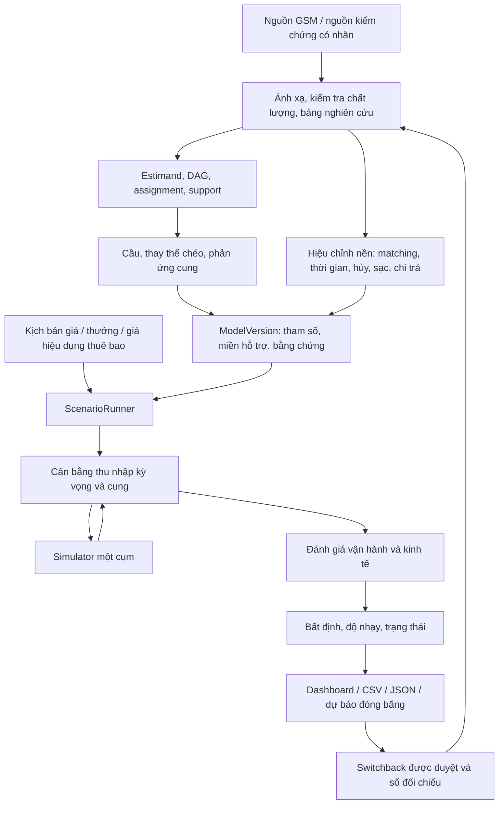

# Thiết kế chi tiết core engine — GSM Causal Marketplace

**Căn cứ:** [GSM Causal Marketplace Proposal](GSM_Causal_Marketplace_Proposal.md).
**Phạm vi:** nguyên mẫu thị trường hai phía, một cụm, hai dịch vụ, theo lộ trình năm tuần của proposal.  
**Loại tài liệu:** đặc tả thiết kế để triển khai và nghiệm thu. Công thức, giao diện và giá trị khởi đầu dưới đây là quyết định thiết kế; không phải kết quả thực nghiệm hoặc mô tả tiến độ mã nguồn.

## 1. Mục tiêu thiết kế và đầu ra bắt buộc

Core engine nhận một chính sách giá/thưởng, một thị trường nền và các mô hình phản ứng đã được phiên bản hóa. Nó dự báo trạng thái thị trường sau can thiệp, đặt cạnh chính sách hiện tại và lưu dự báo để đối chiếu với thử nghiệm.

Câu hỏi mẫu xuyên suốt thiết kế là: **tăng giá dịch vụ X 10% tại một cụm và khung giờ thì cầu, cung khả dụng, lựa chọn dịch vụ và nguồn cung nhàn rỗi thay đổi thế nào?** Tăng cung phải được tính từ cơ chế chi trả và phần hành vi linh hoạt của tài xế; không mặc định giá khách tăng thì cung tăng.

| Yêu cầu của proposal | Đặc tả đầu ra | Thành phần chịu trách nhiệm |
|---|---|---|
| Độ nhạy giá của khách | Tác động lên yêu cầu đặt; conversion từ báo giá báo riêng; đơn vị và tập dân số rõ | DemandResponse |
| Thay thế chéo | Ma trận trực tiếp/chéo 2×2 theo vùng/khung/dịch vụ đủ dữ liệu | ChoiceResponse |
| Phản ứng nguồn cung | Giờ xe có thể phục vụ theo thu nhập kỳ vọng/thưởng; phân biệt tăng giờ với chuyển vùng | SupplyResponse |
| Cân bằng mới | Thu nhập kỳ vọng, cung và mức sử dụng xe nhất quán; hoặc trạng thái không hội tụ | EquilibriumSolver |
| Vận hành | Chuyến hoàn thành, chờ, hủy, nhàn rỗi và sạc | MarketplaceSimulator |
| Kinh tế | Doanh thu, chi phí, biên đóng góp tăng thêm, ROI khi đủ dữ liệu | EconomicEvaluator |
| Bất định và bằng chứng | Khoảng bất định, vùng hỗ trợ, giả định và mức A/B/C gắn từng đầu ra | UncertaintyEngine, EvidenceRegistry |
| Kiểm chứng | Lịch switchback, dự báo đóng băng và sổ đối chiếu dự báo–thực tế | ExperimentInterface |
| Bàn giao | Dashboard so sánh, CSV/JSON và phiên bản có thể chạy lại | ScenarioRunner, ArtifactStore |

Nguyên mẫu hỗ trợ quyết định. Nó không tự áp giá trên GSM, không định giá cá nhân, không tối ưu dispatch từng chuyến trên hệ thống thật và không mô hình hóa cạnh tranh toàn thành phố. Người vận hành chọn kịch bản; một quy trình được GSM chấp thuận mới đưa chính sách sang thử nghiệm.

## 2. Quyết định kiến trúc

### 2.1 Tách ước lượng tham số khỏi mô phỏng thị trường

Thiết kế chọn **mô hình thị trường có cấu trúc** làm engine dự báo. DML, DiD hoặc thử nghiệm ngẫu nhiên cung cấp các quan hệ phản ứng; simulator kết hợp chúng với quy tắc vận hành và chi trả. DML không phải toàn bộ core và không trực tiếp suy ra chuyến hoàn thành, xe nhàn rỗi hoặc ROI.



### 2.2 Công nghệ và cách thực thi

Chọn Python/SQL cho batch, DuckDB/Parquet cho bảng, EconML cho estimator DML và SimPy cho mô phỏng sự kiện rời rạc. Streamlit đọc artifact và hiển thị kết quả. SimPy cung cấp tiến trình/sự kiện và môi trường mô phỏng; các quy tắc marketplace phải do thiết kế này xác định, không có sẵn trong thư viện.

Estimator, hiệu chỉnh nền, bootstrap và giải cân bằng chạy theo job có giới hạn. Đổi lựa chọn hiển thị có thể đọc kết quả đã tính; yêu cầu kịch bản mới tạo job hữu hạn với trạng thái rõ. Không tải dữ liệu, fit model hoặc chạy bootstrap trong mỗi lần render giao diện. Chưa cần Kafka, một model registry dịch vụ riêng hoặc tự động triển khai chính sách cho phạm vi một cụm.

## 3. Phạm vi thị trường, thời gian và đơn vị

`MarketDefinition` phải chốt danh sách vùng, ranh giới có phiên bản, vùng lân cận theo dõi, hai dịch vụ, quyền kiểm soát giá, nhóm tài xế/xe đủ điều kiện và horizon dự báo. Khởi đầu dùng các vùng nhỏ trong một cụm và khung tổng hợp 30 phút; kích thước khung có thể đổi theo độ phủ log. Khung tổng hợp này khác độ dài block thử nghiệm, khác ca tài xế và khác thời điểm sự kiện của simulator.

Simulator dùng giây và timestamp có timezone; báo cáo dùng ngày/khung theo timezone thị trường đã khai báo. Thị trường Việt Nam dùng `Asia/Ho_Chi_Minh` khi được xác nhận bởi metadata nguồn. Không chuyển timestamp không timezone thành UTC ngầm định.

| Đại lượng | Ký hiệu / đơn vị | Phân biệt bắt buộc |
|---|---|---|
| Lượt xem báo giá | $\lambda_{\text{quote}}$: phiên/giờ | Không phải request hoặc chuyến hoàn thành |
| Conversion | $p_j$: xác suất chọn dịch vụ $j$ | Tập lựa chọn thực thấy và cửa sổ quan sát rõ |
| Cầu đầu vào | $D_j$: yêu cầu/giờ | Tách request thử lại khỏi nhu cầu gốc; định nghĩa dedup có nghiệp vụ |
| Cung có thể phục vụ | $H_{\text{serviceable}}$: giờ xe | Idle + reservation/dispatch + đi đón + phục vụ, loại sạc/nghỉ/không đủ điều kiện |
| Cung sẵn sàng ngay | $H_{\text{idle}}$: giờ xe hoặc số xe theo thời điểm | Là một phần của $H_{\text{serviceable}}$ |
| Thu nhập kỳ vọng | $E$: VND/giờ hoặc VND/ca | Cơ sở giờ/ca và thông tin trước quyết định phải thống nhất |
| Giá/thưởng | $P / B$: VND, hoặc multiplier giá | Ghi trước/sau giảm, thuế/phí, đơn vị và phiên bản |
| Kết quả vận hành | Chuyến, giây, tỷ lệ, giờ xe, kWh | Mỗi tỷ lệ có mẫu số |

Hai dịch vụ có thể dùng chung đội xe. Một vehicle-hour chỉ được đếm một lần trong tổng cụm; năng lực phục vụ nhiều dịch vụ được biểu diễn bằng eligibility, không nhân đôi nguồn cung. Nếu cả hai dịch vụ thuộc GSM, tổng kết quả kinh doanh phải bao gồm thay thế nội bộ. Không suy diễn lựa chọn `NONE` thành chuyển sang đối thủ.

## 4. Hợp đồng dữ liệu đầu vào và bảng nghiên cứu

### 4.1 Dữ liệu nguồn

GSM cung cấp bảng/log hiện hữu, schema gốc, khóa nối, lịch sử phiên bản và metadata. Nhóm nghiên cứu tự ánh xạ, kiểm tra cardinality và dựng bảng. Phạm vi dữ liệu theo [GSM_DATA_CONTRACT.md](../GSM_DATA_CONTRACT.md); không yêu cầu GSM chuẩn bị sẵn bảng huấn luyện hoặc hệ số nhân quả.

Chuỗi nối cần giữ được session → quote set → quote → request/booking → trip và request → dispatch → driver/vehicle → shift/charging session. Nối theo thời điểm gần nhất chỉ được dùng khi có kiểm chứng sai số và nhãn liên kết không chắc chắn.

### 4.2 Các giao diện nội bộ được thiết kế

Tên dưới đây là **bảng logic được thiết kế**, không phải tên schema GSM hay interface đã có trong code.

| Giao diện | Grain / khóa logic | Nội dung tối thiểu |
|---|---|---|
| ChoiceObservation | Một lần hiển thị tập lựa chọn / `display_id` | Session, thời điểm, vùng, alternatives, giá/ETA/khả dụng đã hiển thị, outcome/censoring |
| PolicyAssignment | Một assignment / `assignment_id` | Đơn vị, assigned/applied, thời điểm, arm, rule/probability, override, policy version |
| DemandBlock | Vùng × thời gian × dịch vụ | Phiên, request, mẫu số exposure, bối cảnh trước treatment, nguồn đầy đủ |
| DriverDecision | Tài xế × quyết định ca/offer | Eligibility, điều kiện chi trả được biết, nhận/từ chối, outcome giờ phục vụ |
| VehicleStateHistory | Vehicle × interval/event | Vùng, shift, trạng thái, service eligibility, SOC, gap và nguồn |
| OperationalEvent | Request/dispatch/trip/charging event | Mốc thời gian, response, thời lượng, quãng đường, lý do và phiên bản quy tắc |
| FinanceEntry | Một ledger entry / `entry_id` | Khoản thu/chi, liên kết nghiệp vụ, currency, funder, thời điểm và điều chỉnh |
| BaselineSnapshot | Một cửa sổ nền có phiên bản | Rates, trạng thái ban đầu, phân bố thời gian, cung, pin/sạc, chất lượng |

Refresh báo giá trong một session không tạo thêm một khách độc lập. Thiết kế chọn một quyết định/session trong bản đầu: quy tắc chọn display dùng để xác định outcome được chốt trước fit, và không được chọn display dựa trên việc sau đó khách có đặt hay không. Phân tích chuỗi refresh là extension có estimand riêng.

Giữ `missing`, `unknown`, `not_applicable` và zero thực riêng. Phiên thiếu liên kết request chỉ là `NONE` khi đã đủ cửa sổ quan sát và log hoàn chỉnh; nếu chưa đủ thì censored/unknown. Không có chuyến không chứng minh tài xế offline. Tổng state duration, số request/trip và ledger phải được đối soát với nguồn cùng scope.

### 4.3 Điều kiện dừng dữ liệu

Schema/key không ánh xạ được, join nhiều–nhiều chưa giải thích, timestamp trái thứ tự, thiếu coverage cốt yếu hoặc tiền tệ/đơn vị chưa rõ phải tạo quality issue và chặn module bị ảnh hưởng. Không chặn mọi module khi lỗi chỉ làm một metric không khả dụng. Artifact giữ scope, tỷ lệ nối, số mẫu hợp lệ và lý do loại/censoring.

## 5. Thiết kế nhận diện nhân quả và nguồn tham số

Mỗi quan hệ phải có `EstimandSpec`: treatment, outcome, dân số, horizon, cơ chế assignment, biến trước treatment, đơn vị suy luận, giả định, support và nguồn bằng chứng. Cùng tên “độ co giãn” nhưng outcome conversion, request rate và completed trips không được dùng thay nhau.

| Nguồn biến thiên | Estimator theo thiết kế | Gate nhận diện | Nhãn khi đã kiểm chứng hợp lệ |
|---|---|---|---|
| Giá/thưởng phân bổ ngẫu nhiên | Ước lượng theo assignment, intention-to-treat làm chính | Assignment/A/A hợp lệ; exposure, interference và carryover được xử lý | A |
| Thay đổi chính sách lịch sử với đối chứng | DiD thích hợp theo timing/group | Xu hướng song song có điều kiện, anticipation và thay đổi đồng thời được xem xét | B |
| Dữ liệu lịch sử với gây nhiễu quan sát được | DML và baseline điều chỉnh | Biến trước treatment đủ, giá/offer còn biến thiên và overlap phù hợp | B với giả định nêu rõ |
| Cơ chế sinh biết tham số | Các estimator trên observed giả lập, oracle chỉ chấm điểm | Không leakage, xác suất/trạng thái hợp lệ và thiết kế kiểm chứng cố định | C |

Không nâng nhãn bằng chứng chỉ vì chọn tên estimator. Randomization chưa được thực thi không tạo bằng chứng A. Model card phải ghi những điều kiện chưa xác nhận; không có nguồn nhận diện phù hợp thì phản ứng được lưu là giả định C hoặc unavailable.

DiD nhiều thời điểm sử dụng estimand group-time thích hợp; không mặc định một hồi quy two-way fixed effects duy nhất xử lý được mọi timing và dị biệt. Thiết kế ưu tiên khung của Callaway–Sant’Anna khi cấu trúc sự kiện phù hợp. ATT của một mức can thiệp rời rạc không tự trở thành đạo hàm theo log giá; chỉ dự báo các action có bằng chứng, hoặc công bố giả định nội suy riêng. [Phương pháp DiD nhiều nhóm/thời điểm](https://bcallaway11.github.io/did/).

DAG phải phân biệt bối cảnh $W$ trước assignment, giá/thưởng được đề nghị, thông tin thu nhập đã hiển thị, hành vi lựa chọn, trạng thái vận hành sau can thiệp và ledger thực nhận. Thu nhập thực nhận và ETA bị chính sách làm thay đổi là outcome/mediator; không tự đưa chúng vào $W$ như confounder.

## 6. Engine cầu và thay thế chéo

### 6.1 Tách lượng exposure và lựa chọn

Thiết kế dùng quote funnel làm tuyến chính khi đủ log:

$$
D_j(z, t; \pi) = \lambda_{\text{quote}}(z, t; \pi) \, p_j(z, t; \pi), \qquad j \in \{X, Y\}.
$$

Với khung dài $\Delta t$ giờ, số request kỳ vọng là $D_j \times \Delta t$. `DemandResponse` trả rates cùng scope và tập lựa chọn; simulator sinh yêu cầu từ rates này, không từ completed trips.

Khi giá chỉ được thay sau khi khách vào phiên và chỉ xét phản ứng tức thời, thiết kế có thể giữ $\lambda_{\text{quote}}$ cố định với nhãn `conditional_on_quote_population`. Muốn dự báo tổng cầu gồm mở ứng dụng/quay lại trong horizon dài hơn, phải có mô hình exposure và assignment phù hợp cho tác động đó. Thiếu dữ liệu thì đầu ra tổng cầu dài hạn là unavailable; không ngầm dùng $\xi = 0$ như kết luận thực nghiệm.

Một tuyến thay thế dùng request rate trực tiếp theo policy block khi request logs và identification đủ nhưng quote funnel không hoàn chỉnh. Tuyến này trả tác động tổng lên $D$; conversion và outside choice được để unavailable. Hai tuyến là cấu hình loại trừ nhau: không nhân thêm tác động conversion vào request rate đã có tác động tổng.

### 6.2 Dạng hàm lựa chọn cho bản đầu

Chọn mô hình phản ứng cục bộ theo log giá, với mức nền từ dữ liệu thị trường đích:

$$
p_{XY}(W; \pi) = p_{XY,0}(W) + \Theta_g(W)
\begin{pmatrix}
\log(P_X^{\text{eff}} / P_{X,0}^{\text{eff}}) \\
\log(P_Y^{\text{eff}} / P_{Y,0}^{\text{eff}})
\end{pmatrix},
\qquad p_{\text{NONE}} = 1 - p_X - p_Y.
$$

Giá hiệu dụng là giá được hiển thị sau quyền lợi/khuyến mại được định nghĩa; subscription chỉ làm thay đổi giá hiệu dụng cho nhóm được ghi nhận đủ. Không coi toàn bộ phí thuê bao là giảm giá mỗi chuyến tùy ý. Bản đầu giữ tập người đăng ký cố định và không dự báo adoption/churn nếu chưa có module nhận diện riêng.

Mỗi hàng $\theta$ là dịch vụ được chọn, mỗi cột là giá thay đổi. Ma trận đồng thời biểu diễn hai own-price và hai cross-price effects. Độ co giãn conversion tại nền:

$$
\varepsilon^{\text{choice}}_{jk} = \theta_{jk} / p_{j,0}.
$$

Nếu mô hình exposure xác định được $\xi_k = \text{d} \log(\lambda_{\text{quote}}) / \text{d} \log(P_k)$, độ co giãn request rate là:

$$
\varepsilon^{\text{request}}_{jk} = \xi_k + \varepsilon^{\text{choice}}_{jk}.
$$

Không xuất tỷ số elasticity khi mức nền gần zero; thay bằng tác động tuyệt đối và mẫu số. Giá zero hoặc giá âm không có log; chương trình miễn phí phải có treatment tiền tệ/categorical riêng, không thêm $\epsilon$ để giả tạo log giá.

### 6.3 Ước lượng DML và baseline

Baseline bắt buộc gồm naive OLS và adjusted OLS. DML học $\mathbb{E}[Q \mid W]$ và $\mathbb{E}[T \mid W]$ bằng nuisance models, dự đoán ngoài fold, rồi ước lượng quan hệ giữa phần dư. Cross-fitting và orthogonal score giúp giảm nhạy với lỗi nuisance trong điều kiện của phương pháp; không loại nhiễu chưa quan sát hoặc tự bảo đảm chuyển thị trường. [Double/Debiased Machine Learning](https://arxiv.org/abs/1608.00060).

Dùng LinearDML cho effect tuyến tính trên một cơ sở nhỏ gồm nhóm vùng, khung giờ và tương tác được công bố. $W$ chứa bối cảnh trước assignment; effect features tách riêng trong `EffectBasis`. Theo dữ liệu, chọn pooled effect hoặc effect theo nhóm bằng validation, không mở model riêng ở mọi ô dữ liệu thưa. API cụ thể phải đối chiếu phiên bản đã khóa khi triển khai. [LinearDML](https://www.pywhy.org/EconML/_autosummary/econml.dml.LinearDML.html).

`ResolutionPolicy` quy định số mẫu/đơn vị độc lập tối thiểu, rank và hỗ trợ từng nhóm. Nếu nhóm nhỏ không đủ, fallback lên nhóm gộp có support, lưu `estimated_resolution` và `fallback_reason`. Không hiển thị hệ số pooled dưới nhãn đã học riêng cho vùng. Giá $X/Y$ cần biến thiên độc lập sau điều chỉnh; một giá biến thiên chỉ cho một cột, hai giá đồng tuyến không cho đủ ma trận.

Baseline probabilities được fit từ train với nuisance/response phù hợp; effect và baseline phải dùng cùng đơn vị, nhóm và dạng hàm. Kiểm tra calibration và xác suất trên validation. Mọi learned preprocessing fit trong train/fold; không đọc oracle hoặc outcome test.

### 6.4 Miền hỗ trợ và dạng hàm thay thế

`SupportEnvelope` theo thị trường/nhóm ghi miền giá, tập action chung, coverage context, rank, cỡ mẫu và domain validity. Một miền min/max riêng cho từng giá không đủ; phải có support chung. Không hard-code miền 0,90–1,10 cho mọi thị trường: dùng biến thiên dữ liệu và biên độ chính sách được duyệt.

Tính xác suất ở từng context trước tổng hợp. Âm, trên 1 hoặc tổng vượt 1 làm action invalid; không clipping/renormalization. Miền hợp lệ là giao của support dữ liệu, miền xác suất và biên độ vận hành. Ngoài miền có thể chạy sensitivity giả định C nếu người dùng chọn rõ, nhưng không xuất forecast chính thức như trong support.

Nested logit là lựa chọn mở rộng khi cần dạng lựa chọn phi tuyến và có log alternatives/availability đủ. Nó phải có model card, identification và benchmark riêng; likelihood fit tốt không tự làm hệ số giá nhân quả. Không ép một ma trận DML bất kỳ vào logit bằng sửa xác suất để giữ tên “nhân quả”.

### 6.5 Convention về ETA và phản hồi vận hành

Bản đầu chọn `reduced_form_policy`: tác động lên request được ước lượng cho horizon và cơ chế policy đã định; simulator nhận dòng request đó. Không tự nhân thêm tác động chờ/ETA sau can thiệp lên cầu nếu effect đã bao gồm các đường vận hành đó.

Một mode `structural_choice` có thể mô hình hóa giá, ETA/khả dụng và feedback từ simulator khi đã nhận diện các quan hệ trực tiếp/mediated thích hợp. Khi đó phải fit lại estimand và DAG, ghi rõ mediator nào được mô hình hóa. Hai mode không trộn trong cùng run. Bản đầu vẫn có vòng lặp thu nhập–cung; không cần giả định đã nhận diện feedback ETA để giải vòng lặp này.

## 7. Engine phản ứng nguồn cung

### 7.1 Outcome và treatment

Supply không phải số chuyến tài xế đã chạy. Outcome chính là $H_{\text{serviceable}}$ trên dân số tài xế/xe đủ điều kiện trong horizon. Outcome phụ gồm nhận ca, nhận offer, acceptance, relocation và thời điểm sạc, mỗi loại có model/estimand riêng nếu cần.

Treatment là điều kiện thưởng/chi trả được đề nghị và thông tin thu nhập kỳ vọng được biết trước quyết định. Với ca/lương cố định, engine phải cho phép phản ứng bổ sung giờ bằng 0; hành vi còn linh hoạt có thể là nhận thêm ca, acceptance hoặc dời sạc. Không suy ra expected earnings bằng realized earnings của chính ca rồi dùng nó như treatment.

Nếu $E$ nền dương và có nguồn nhận diện cho thu nhập kỳ vọng, dùng phản ứng cục bộ:

$$
H^*_{\text{serv},g} = H_{\text{serv},0,g} \exp\left(
\gamma_g \log(E_g / E_{0,g}) + \kappa_g (B_g - B_{0,g})
\right).
$$

$\gamma$ là elasticity theo thu nhập kỳ vọng; $\kappa$ có đơn vị nghịch đảo tiền. Công thức là một lựa chọn cấu trúc, chỉ dùng trong miền đã kiểm chứng. Nếu $B$ đã được tính vào $E$, chỉ dùng một đường hoặc ước lượng $\kappa$ như hiệu ứng riêng được nhận diện; không đếm cùng khoản thưởng hai lần. Khi $E$ hoặc bonus nền bằng 0, dùng tác động theo VND/ca/offer hoặc treatment categorical, không dùng tỷ lệ phần trăm không xác định.

$H_{\text{serv},0}$ bằng 0 hoặc các ràng buộc ca rời rạc không được xử lý bằng công thức nhân trên: dùng model xác suất tham gia/nhận ca và số giờ có điều kiện, giữ cả tài xế không tham gia trong mẫu. Các outcome zero vẫn là quan sát hợp lệ.

### 7.2 CompensationModel

`CompensationModel` mô tả fixed pay, commission/revenue share, piece rate, bonus theo threshold, guarantee, cap và thời điểm chi trả. Nó cung cấp hai hàm logic: điều kiện được tài xế biết khi quyết định và sổ chi trả sau mô phỏng. Nếu giá khách tăng không đổi điều kiện/thu nhập dự kiến của tài xế, không truyền giá khách trực tiếp vào đường cung.

Income feedback trong solver là kỳ vọng dưới quy tắc chi trả đã cố định, không tự đồng nhất với tiền khách trả. Các bonus threshold phải tính từ outcomes của từng driver/shift, không từ fare trung bình toàn thị trường. Cơ sở giờ dùng cho $E$ phải đúng với mô hình quyết định: giờ hiện diện, giờ làm việc hay ca được trả lương.

### 7.3 Từ target hours đến lịch tài xế và xe

`SupplyResponse` trả `AdmissionPlan`: target serviceable hours, lịch ca/nhận ca, eligibility, khả năng chuyển vùng và support. `ScheduleBuilder` chuyển target thành lịch hiện diện có ràng buộc xe, tài xế, hợp đồng và pin/sạc.

$H_{\text{serviceable}}$ đã loại charging/break/ineligible. Khi tạo lịch để đáp ứng target, builder dự kiến cả thời gian hiện diện cần cho charging/break, rồi simulator đo lại $H_{\text{serviceable}}$ từ state intervals. Không trừ charging lần thứ hai khỏi target hoặc tạo tài xế fraction như tài xế thật. Nếu lịch không đáp ứng target, lưu gap và `capacity_constrained`; không tự thêm xe vượt roster. Quy tắc làm tròn/stochastic participation phải có seed và sensitivity.

Theo dõi tổng giờ trên cụm và vùng lân cận. Relocation làm đổi phân bố vùng nhưng không tăng tổng giờ; nhận thêm ca/giờ mới tăng tổng cung. Một `FleetPool` chung quản lý xe phục vụ $X/Y$, không tách hai pool trùng cùng vehicle IDs.

## 8. Thiết kế simulator một cụm

### 8.1 Đối tượng và trạng thái

| Đối tượng | Trạng thái/thuộc tính | Bất biến |
|---|---|---|
| Request | `created`, `queued`, `assigned`, `pickup`, `on_trip`, `completed`, `canceled`, `expired` | Một trạng thái tại một thời điểm; có lý do terminal |
| Driver/shift | `off_shift`, `scheduled`, `present`, `break`, `ended` | Không làm ngoài eligibility/ca nếu policy không cho phép |
| Vehicle | `offline`, `idle`, `reserved`, `to_pickup`, `on_trip`, `charging_queue`, `charging`, `unavailable` | Một chuyến/dispatch reservation tại một thời điểm |
| Station | capacity, charger availability, queue, outage | Không vượt số cổng hoạt động |
| Boundary flow | vào/ra cụm, thời gian quay lại và SOC | Không xóa xe/chuyến ra ngoài chỉ để giữ cụm đóng |

Timestamp trạng thái liên tục; cuối khung không reset xe đang đón/chạy/sạc. Tài xế và xe là đối tượng riêng có lịch phân xe. Warm-up và state snapshot đầu kỳ phải được khai báo; baseline và target dùng cùng điều kiện ban đầu có thể so sánh.

### 8.2 Sinh request và service demand

Chọn arrival process theo baseline diagnostics. Bản đầu có thể dùng Poisson piecewise với rate $D_j$ và OD/service mix theo context; đây là giả định cần kiểm tra, không mặc định request thật độc lập. Nếu có burst/overdispersion, dùng mô hình count thích hợp hoặc replay/resampling block bảo toàn phụ thuộc.

$D_j$ đã chứa tác động giá. Khi một request được sinh, giá/khuyến mại được đóng theo policy version tại quote/booking. Không áp elasticity thêm lên xác suất hoàn thành. Retry có parent key và quy tắc horizon; report cả request attempts và demand đã xử lý retry theo định nghĩa chốt trước.

### 8.3 Matching, acceptance và pickup

Matcher chỉ xét xe idle, đúng dịch vụ, đủ SOC và ca. Chọn ranking đơn giản có phiên bản, ưu tiên ETA nhỏ nhất trong bán kính/threshold đã định; nếu không có candidate thì request nằm hàng đợi hoặc terminal theo deadline. Đây là quy tắc mô phỏng cần hiệu chỉnh với GSM, không tuyên bố tái tạo thuật toán dispatch nội bộ nếu log chưa đủ.

Mỗi offer có expiry; acceptance/rejection theo model hoặc replay được hiệu chỉnh; xe đã reservation không nhận request khác. Reject/timeout có số attempt tối đa và deadline tổng. Requeue, customer cancellation và arrival của response phải xử lý theo timestamp, có thứ tự ưu tiên khi trùng thời điểm được công bố để tránh double assignment.

Pickup và service time có phân bố theo OD/giờ/service phù hợp. ETA hiển thị, ETA dispatch và actual pickup được lưu riêng. Cancel trước pickup có thể tạo quãng đường/chi phí đã phát sinh; completed trip mới tạo fare ledger theo quy tắc, không tính tất cả booking là doanh thu.

### 8.4 Sạc và năng lượng

SOC giảm theo quãng đường/điều kiện trong `EnergyModel`. Xe chỉ nhận chuyến nếu đủ năng lượng cho pickup, service và reserve; nếu không đủ thì điều phối tới trạm/không đủ điều kiện. Charge queue và charger là tài nguyên có capacity; session lưu queue/plug/start/end, kWh, chi phí và SOC.

Trong bản đầu có thể dùng định mức kWh/km và công suất sạc cố định có cap, với giả định được công bố. Trước khi diễn giải trên GSM, phải hiệu chỉnh telemetry/charging logs; không gọi một curve tự đặt là thông số đo. SOC phải trong $[0, 1]$, không tạo năng lượng âm hoặc nhiều điện hơn dung lượng sau clipping che lỗi.

### 8.5 Ranh giới cụm và trạng thái carryover

Đón trong cụm, trả ngoài cụm được giữ. Thiết kế dùng vùng đệm hoặc boundary model cho thời gian xe ra/vào; loại nào được chọn phải xuất trong model card. Một bản `closed_cluster` chỉ dùng kiểm chứng C. Relocation, sạc và chuyến đang chạy kéo dài qua khung tạo carryover cần giữ trong trajectory và đưa vào thiết kế thử nghiệm.

### 8.6 Tổng hợp vận hành và đối soát

Trong horizon có độ dài $L$ giờ:

$$
H_{\text{serv}} = H_{\text{idle}} + H_{\text{dispatch}} + H_{\text{pickup}} + H_{\text{on\_trip}}, \qquad
\overline{V}_{\text{idle}} = H_{\text{idle}} / L.
$$

$H_{\text{dispatch}}$ là thời gian xe được reservation trong lúc offer/accept chưa chuyển sang đi đón. Các state không chồng lấn; giờ charging, queue charging, nghỉ, offline và ineligible được báo riêng theo cùng population/time coverage. `available_vehicle_count(t)` là count idle đủ điều kiện tại thời điểm $t$, khác $H_{\text{serv}}$ tổng.

Request accounting phải thỏa:

$$
N_{\text{open,start}} + N_{\text{created}} = N_{\text{completed}} + N_{\text{canceled}} + N_{\text{expired}} + N_{\text{open,end}}.
$$

$N_{\text{open}}$ gồm mọi request chưa terminal: queued, đang assignment, pickup hoặc `on_trip`. $N_{\text{open,start}}$ giữ request chuyển tiếp từ snapshot đầu kỳ; các terminal counts ở vế phải là sự kiện trong horizon. Báo cohort request tạo trong horizon riêng với carry-in để xác định đúng mẫu số cancel/wait. Horizon-end censoring được xuất, không gộp thành cancel. Wait/cancel rate giữ mẫu số và quantile method. Chênh $D_j$ với capacity tính bằng chuyến/giờ chỉ là proxy chẩn đoán; số xe nhàn rỗi chính thức lấy từ state-time accounting, không bằng $D - S$ khi khác đơn vị.

## 9. Hiệu chỉnh và đánh giá nền

`BaselineCalibrator` ước lượng arrival/OD mix, pickup/service time, patience/cancel, acceptance, return flow, trạng thái ca, energy/charging và các chi phí vận hành từ dữ liệu nền. Quy tắc chi trả lấy từ versioned business rules, không suy ngược chỉ từ tỷ lệ tiền trung bình.

Tách ba cửa sổ theo thời gian: fit/hiệu chỉnh, chọn cấu hình, và kiểm tra baseline cuối. Simulator không được tune lại trên cửa sổ baseline cuối sau khi xem kết quả. Dữ liệu dùng nhận diện policy và baseline calibration có lineage riêng; không dùng thông tin tương lai hoặc số đo sau can thiệp để tạo confounder trước can thiệp.

Đối chiếu baseline về completed trips, wait p50/p90, cancel/no-driver, utilization, $H_{\text{idle}}$, charging và earnings. Báo sai số theo vùng/giờ, không chỉ tổng cụm. Một tổng count khớp do tăng arrival để bù matching sai không đủ; phải kiểm tra funnel, time distributions và stock-flow đồng thời.

Threshold chất lượng và runtime được chốt sau khảo sát tuần 1, trước mở final holdout. Thiếu log của metric nào thì ghi `not_calibrated` ở metric và output phụ thuộc; không tạo số quan sát để đạt gate. Chế độ synthetic có baseline truth riêng, không thay thế calibration GSM.

## 10. Solver cân bằng thu nhập–cung

### 10.1 Hệ phương trình

Cho policy $\pi$, trạng thái nền $S_0$ và income expectation $E$, supply model tạo kế hoạch giờ/ca. Simulator trả trips, sử dụng xe và earnings ledger. `CompensationModel` và bộ tổng hợp tính income expectation implied cho dân số/horizon quyết định:

$$
H^* = \text{Supply}(E, \pi, W), \qquad
O = \text{Simulate}(\text{Demand}(\pi, W), H^*, S_0, \pi), \qquad
E^* = \text{IncomeSummary}(O, \pi).
$$

Điểm cố định yêu cầu $E$ gần $E^*$ và supply/state summaries ổn định. Thu nhập bình quân phải có mẫu số đúng theo contract, gồm người có zero trips nếu thuộc dân số; không chỉ lấy earnings của người đã có chuyến. Nếu denominator giờ bằng 0, $E^*$ undefined và solver trả lỗi/không hoạt động có nghĩa, không gán zero như một điểm cân bằng.

Nếu cung không phản ứng với $E$ trong contract được chốt, solver có thể chạy một lượt và báo `fixed_supply`, thay vì dựng vòng lặp giả. Trong mode ETA feedback được nhận diện riêng, solver bổ sung phương trình choice/ETA và kiểm tra các residual tương ứng.

### 10.2 Thuật toán có damping và giới hạn

Chọn fixed-point iteration có damping cho bản đầu:

$$
E^{(k+1)} = (1 - \alpha) E^{(k)} + \alpha E^{*,(k)}, \qquad 0 < \alpha \le 1.
$$

```text
solve(policy, baseline_snapshot, model_version, seed_plan, limits):
    kiểm tra support, compatibility, snapshot và điều kiện chi trả
    E = expectation nền hợp lệ
    với k từ 1 tới max_iterations:
        plan = SupplyResponse(E, policy)
        trajectory = Simulate từ cùng snapshot đầu horizon
        E_star = IncomeSummary(trajectory, decision_population)
        ghi residual E, hours, uncertainty và capacity gap
        nếu E_star undefined hoặc trajectory vi phạm bất biến: trả failure
        nếu residual và độ nhiễu đạt gate qua các vòng liên tiếp:
            chạy xác nhận với seed độc lập; nếu đạt thì trả converged
        nếu deadline hoặc event/iteration budget hết: trả not_converged
        E = damp(E, E_star)
    trả not_converged cùng diagnostics
```

Các iteration là thử các candidate equilibrium, nên mỗi iteration bắt đầu lại từ $S_0$ và cùng horizon; không nối thời gian của iteration như thể vận hành đã qua thêm một ngày. Bên trong một trajectory, state chuyển tiếp liên tục giữa các khung.

### 10.3 Tiêu chuẩn và xử lý không hội tụ

Residual tương đối dùng scale dương được cấu hình theo đơn vị, kết hợp absolute tolerance; không chia trực tiếp cho mức nền zero. Kiểm tra cả $E$ và $H_{\text{serv}}$, tính theo nhóm và toàn cụm, cùng độ nhiễu Monte Carlo. Tránh tuyên bố hội tụ chỉ vì damping làm bước cập nhật nhỏ khi residual $E^* - E$ vẫn lớn.

Giá trị phát triển đề xuất: $\alpha = 0{,}3$; tối đa 50 iteration; yêu cầu ba iteration liên tiếp đạt tolerance; tối đa 600 giây toàn job và budget event cấu hình. Relative tolerance 1% là điểm bắt đầu để kiểm chứng sensitivity, chưa là threshold nghiệm thu. Số trajectory replicate, absolute tolerance, max events và scale từng biến phải chốt trước batch; không đặt vô hạn hoặc tự tăng ngân sách khi chưa được phép.

Dùng cùng seed plan giữa candidate trong solve để giảm nhiễu, rồi xác nhận bằng seed độc lập. Không hội tụ, oscillation, saturation, thiếu support hoặc vượt budget phải giữ diagnostics và trace; point cuối chỉ là diagnostic, không xuất như equilibrium chính thức. Có thể chạy nhiều initialization có giới hạn để phát hiện nghiệm phụ thuộc khởi tạo; không khẳng định nghiệm duy nhất từ một lần hội tụ.

## 11. So sánh chính sách và engine kinh tế

Baseline và target phải được **giải riêng** với cùng horizon, initial snapshot, điều kiện ngoại sinh và paired seed plan. Baseline không lấy trực tiếp observed totals còn target lấy simulator rồi trừ, vì khác measurement process. Observed totals dùng kiểm chứng baseline; comparison chính dùng hai trajectory mô phỏng có phương pháp nhất quán.

Price, promotion và bonus đi theo version của từng quote/offer. `EconomicEvaluator` tạo ledger entry khi sự kiện phát sinh: payment/refund, driver pay, incentive, điện, phí thanh toán và các variable cost được thống nhất. Cancel có thể có khoản thu/chi theo rule, không mặc định zero. Khoản fixed salary chỉ thay đổi theo policy nếu số ca hoặc cost allocation được định nghĩa như vậy.

$$
\text{CM}(\pi) = R_{\text{GSM}}(\pi) - C_{\text{variable}}(\pi), \qquad
\Delta \text{CM} = \text{CM}(\pi_1) - \text{CM}(\pi_0).
$$

$R_{\text{GSM}}$ là ledger measure được tài chính xác nhận, không tự coi gross customer payment là revenue GSM. Các khoản thuế/toll/refund/subsidy/funder và driver pay phải hạch toán tránh đếm hai lần. Thiếu cost component cần cho $\text{CM}$ thì $\text{CM}$ unavailable; vẫn có thể báo vận hành hoặc revenue nếu đủ nguồn riêng.

Theo định nghĩa ROI lợi ích ròng tăng thêm chia chi phí ưu đãi tăng thêm của proposal:

$$
\text{ROI} = \Delta \text{CM} / \Delta C_{\text{incentive}}, \qquad \Delta C_{\text{incentive}} > 0.
$$

$\text{CM}$ trong công thức đã bao gồm incremental incentive cost; numerator không trừ incentive thêm lần nữa. Báo riêng baseline/target cost và denominator. Denominator không dương hoặc cost thiếu dẫn tới `roi_unavailable`. Metric toy dùng giá/cost giả định phải mang đơn vị và nhãn simulated; không đổi thành hiệu quả thực tế GSM.

## 12. Bất định và phân tích độ nhạy

### 12.1 Ba nguồn phải phân biệt

| Nguồn | Cách xử lý | Nhãn đầu ra |
|---|---|---|
| Sai số ước lượng từ dữ liệu | Resample theo đơn vị phụ thuộc/assignment và refit các thành phần learned trong scope | Parameter / forecast uncertainty |
| Ngẫu nhiên vận hành simulator | Lặp trajectory với seed độc lập; paired baseline–target | Simulation variability và Monte Carlo error |
| Giả định chưa xác nhận | Các cấu hình cấu trúc có chủ đích: supply, patience, boundary, charging, transfer | Sensitivity range; không gọi là confidence interval |

Đơn vị resampling phải theo thiết kế dữ liệu: cluster/time blocks có độ dài đủ cho phụ thuộc; driver lặp lại và di chuyển có thể cần grouping bổ sung. Không mặc định bootstrap từng session hoặc một ngày luôn đủ cho mọi GSM dataset. Bản sao cùng đơn vị gốc không được tách qua hai phía cross-fit.

### 12.2 Refit và chạy simulator trong từng draw

Mỗi bootstrap draw refit response parameters, baseline models và các thành phần calibration learned thuộc target bất định đã chọn; business rules cố định không refit. Với mỗi draw, giải baseline và target rồi tính paired differences. Cùng driver/vehicle roster, initial snapshot hoặc context được giữ cố định khi target là dự báo có điều kiện; resampling chúng phải dùng target khác và nhãn rõ.

Nếu target là chênh lệch kỳ vọng, với bootstrap draw $b$ chạy $R$ cặp trajectory và lấy trung bình $\delta_b = \frac{1}{R}\sum_{r=1}^R (\text{metric}_{\text{target},b,r} - \text{metric}_{\text{baseline},b,r})$; percentile theo $b$ tạo khoảng của dự báo kỳ vọng. $R$ phải đủ để Monte Carlo error không chi phối độ rộng khoảng. Nếu target là kết quả một lần vận hành tương lai, cần phân bố dự báo kết hợp randomness trajectory và parameter uncertainty với nhãn predictive interval riêng. Không dùng một trajectory mỗi draw rồi gọi khoảng thu được là chỉ có sai số tham số.

Seed độc lập giữa bootstrap draw; baseline–target trong một draw dùng random streams ghép theo entity/event khi có thể. Ghi mọi draw failure, nonconvergence, invalid probabilities và support loss. Không âm thầm bỏ draw lỗi rồi công bố khoảng từ một tập chọn lọc; quality gate và tỷ lệ failure quyết định interval có được xuất hay không.

Số draw là cấu hình có budget; phát triển dùng batch nhỏ có nhãn, nghiệm thu dùng số lượng được chốt sau benchmark runtime và sensitivity độ rộng. Intervals riêng/simultaneous phải được phân biệt; nếu cần quyết định đồng thời nhiều vùng/metric, thiết kế phương pháp multiplicity phù hợp trước test. Tăng số draw không tự sửa thiếu identification hoặc domain shift.

### 12.3 Bằng chứng toàn chuỗi

Mỗi effect có A/B/C, mỗi calibration component có nguồn và chất lượng. Forecast tổng hợp phải liệt kê dependency: cầu A kết hợp supply giả định C và simulator chưa hiệu chỉnh không tạo forecast “A”. Nhãn tổng hợp `mixed_evidence` giữ chi tiết theo module; không nâng ROI lên A chỉ vì một elasticity có thử nghiệm.

## 13. Hợp đồng ScenarioRunner và kết quả

### 13.1 Yêu cầu kịch bản

`ScenarioSpec` gồm market/model/snapshot IDs, vùng/khung/horizon, policy nền và target, hai lịch giá, bonus/eligibility, subscription treatment nếu có, demand mode, seed plan, limits và uncertainty config. Mọi giả định được truyền rõ, không lấy một giá trị global ẩn.

Yêu cầu tối thiểu phải xác định được:

| Nhóm | Trường logic |
|---|---|
| Danh tính | `scenario_id`, `market_id`, `model_version`, `baseline_snapshot_id` |
| Scope | `zone_ids`, services, start/end, timezone, horizon và warm-up |
| Policy | `baseline_policy_id`, `target_price_schedule`, `bonus_rule`, `effective_price_definition` |
| Assumptions | `demand_mode`, `compensation_mode`, `boundary_mode`, state initialization |
| Compute | `seed_plan_id`, `max_iterations`, `max_events`, `wall_time_budget`, replicate/draw budget |
| Evaluation | `interval_target`, level, support policy và `sensitivity_only` |

Giá +10% là multiplier trên giá hiệu dụng nền đúng dịch vụ/nhóm, không 10% trên fare bình quân sau lựa chọn. Thưởng mới từ zero nhận amount treatment. Schedule phải nêu thời điểm công bố, hiệu lực và horizon quyết định ca, không chỉ thời điểm thanh toán.

### 13.2 Thứ tự thực thi

1. Validate schema, scope, unit, policy, version compatibility và compute budget.
2. Kiểm tra identification/support của effect cần dùng và quality của baseline/calibration.
3. Tính dòng request; dựng lịch/điều kiện supply; giải baseline và target.
4. Đối soát request, vehicle hours, SOC và ledger trong từng trajectory.
5. Tính vận hành/kinh tế và paired differences.
6. Chạy uncertainty/sensitivity theo budget; giữ toàn bộ trạng thái draw.
7. Ghi artifact nguyên tử, manifest và kết quả; chỉ công bố forecast qua các gate.

### 13.3 Schema kết quả

`ScenarioResult` phải có baseline, target, absolute change, relative change khi denominator hợp lệ, unit, population, evidence, interval, support và status **cho từng metric**. Core outputs bắt buộc là `demand_X/Y/total`, `serviceable/idle hours`, choice changes, completed trips, wait, cancel và charging. Revenue/CM/ROI có thể unavailable với reason nếu thiếu dữ liệu.

Trạng thái cấp run và cấp module/metric tách riêng:

| Trạng thái | Hành vi |
|---|---|
| `valid` | Qua gate của scope đã xác định; vẫn kèm evidence/assumptions |
| `partial` | Một số output hợp lệ, số khác unavailable với dependency rõ |
| `not_identified` / `insufficient_support` | Không dự báo chính thức phần effect bị ảnh hưởng |
| `invalid_state` / `invalid_probability` | Chặn forecast phụ thuộc; giữ diagnostics |
| `not_calibrated` | Chỉ cho sensitivity C khi mode đó được chọn rõ |
| `not_converged` / `budget_exceeded` | Không xuất trạng thái cuối như cân bằng |
| `interval_unavailable` | Point hợp lệ có thể xuất, không tạo khoảng giả |
| `sensitivity_only` | Kết quả giả định, tách khỏi forecast được hỗ trợ |

Một target cần đủ cả hai cột nhưng chỉ nhận diện một cột thì không tự gán cột còn lại 0. Module failure không biến metric missing thành zero. Dashboard phải hiển thị các cờ ngay cạnh số liệu và giữ cùng thông tin trong CSV/JSON.

## 14. Giao diện module và artifact được đề xuất

Các chữ ký dưới đây là hợp đồng chức năng để triển khai, không là API hiện hữu:

```text
prepare_sources(source_refs, mapping, quality_contract) -> ResearchDataset
fit_responses(dataset, estimand_specs, split_plan) -> ResponseBundle
calibrate_baseline(dataset, calibration_spec, split_plan) -> BaselineModel
check_support(model_version, scenario_spec) -> SupportReport
predict_demand(response_bundle, scenario_context, policy) -> DemandPlan
predict_supply(response_bundle, expectations, policy, roster) -> AdmissionPlan
simulate(demand_plan, admission_plan, initial_state, policy, seed_plan, limits) -> Trajectory
solve_equilibrium(model_version, snapshot, policy, seed_plan, limits) -> EquilibriumResult
evaluate_economics(trajectory, accounting_rules) -> EconomicLedger
run_scenario(model_version, snapshot, scenario_spec) -> ScenarioResult
freeze_prediction(scenario_result, experiment_spec) -> PredictionRecord
reconcile_experiment(prediction_record, observed_outcomes, analysis_spec) -> Reconciliation
```

`ModelVersion` đóng gói response bundle, baseline/calibration models, taxonomy, support, compensation/accounting rules, state/boundary conventions và model cards. Không chỉ lưu file DML rồi coi đã có đầy đủ market model. Version change của vùng, service, currency, target horizon hoặc causal convention phải được kiểm tra compatibility.

Parquet lưu bảng, JSON lưu spec/metadata, CSV/JSON phục vụ bên nhận. `EffectRecord` dùng cho Mobility Assistant phải có outcome/treatment, unit, own/cross, resolution, horizon, interval, support và evidence. `SupplyCurve` cho nhóm vận hành/xe phải giữ compensation context, pin/sạc, eligibility và đơn vị giờ xe.

ArtifactStore giữ source hashes, revision, dependency lock/environment, effective config, split plan, seeds, stages/timings và checksum. Reuse phải khớp dependencies và output integrity; output tạm chỉ thành artifact sau khi hoàn thành. UI đọc dữ liệu đã kiểm tra, không nhận arbitrary serialized model từ upload.

## 15. Switchback và sổ đối chiếu dự báo–thực tế

### 15.1 Thiết kế assignment

Assignment unit là cụm địa lý × block thời gian được xác định sau đo movement/carryover. Cụm có thể gộp các vùng di chuyển mạnh để giảm contamination; vùng đệm/neighbor outcomes vẫn được theo dõi. Block/washout dựa trên duration chuyến, charging/shift response và tác động kéo dài, không mặc định bằng khung dashboard 30 phút. Carryover là phần thiết kế và inference của switchback. [Bojinov, Simchi-Levi và Zhao](https://arxiv.org/abs/2009.00148).

Lịch phân bổ phải tách được giá X và giá Y, cùng giá × thưởng khi muốn nhận diện tương tác. Chọn action grid có power và safety khả thi; không cố chạy tất cả tổ hợp nếu không đủ đơn vị độc lập. Seed, strata, assignment probability, announced/effective, exposure, applied/override được lưu.

Primary analysis là intention-to-treat theo assigned policy. Phân tích applied/exposure là phụ, cần giả định riêng nếu noncompliance. Randomization inference hoặc clustered inference phải khớp assignment/carryover design; không dùng session IID standard errors cho toàn thị trường.

### 15.2 Trình tự A/A và pilot

Chốt estimands, minimum detectable/worthwhile effect, primary metric, guardrails, block/washout, analysis schedule, stopping rule và sample size trước khi xem treatment outcomes. Primary business metric theo exposure cố định như revenue/assigned block-hour có thể bổ sung revenue/quote; denominator quote có thể chịu tác động giá, nên phải báo cả traffic và conversion.

A/A kiểm tra lịch/log, balance, missing exposure, overrides, metric reconstruction và inference dưới null. Pilot chỉ chạy khi đủ điều kiện và được GSM phê duyệt. Safety monitoring có thể liên tục theo ngưỡng đã chốt; kết luận hiệu quả theo lịch phân tích, không dừng tùy lúc thấy uplift thuận lợi.

### 15.3 Prediction ledger

Trước mỗi lượt, lưu `PredictionRecord` bất biến: model/snapshot/policy versions, scope, assignment schedule, forecast point/interval, assumptions, evidence, support, timestamp chốt và analysis plan. Sau lượt, tạo bản observed/estimated causal impact, uncertainty, prediction error và các issue; không ghi đè dự báo ban đầu.

So forecast **target trừ baseline** với effect thực nghiệm cùng estimand/horizon. Không lấy raw post totals trừ forecast baseline nếu vẫn còn confounding/time changes. Dự báo tại horizon khác hoặc policy bị override phải được đánh dấu không so sánh trực tiếp. Cập nhật model sau reconciliation thành version mới; mức A chỉ áp cho phần thực nghiệm đã hợp lệ trong scope được kiểm chứng.

## 16. Chuyển khu vực và dữ liệu kiểm chứng công khai

MarketDefinition, adapters, baseline snapshots và response parameters phải tách khỏi code simulator. Engine tái sử dụng cấu trúc; mỗi thị trường cần dữ liệu/quy tắc địa phương để hiệu chỉnh. Không mặc định $\theta$ từ New York áp cho Việt Nam, hoặc từ Hà Nội áp cho TP.HCM.

Nếu chuyển thị trường bằng giả định cơ chế invariant, phải ghi effect modifiers, overlap và phương pháp hiệu chỉnh phân bố đích. Nếu cơ chế/choice set/compensation khác, cần fit/identification mới. Không tự mapping vùng hoặc đổi USD thành VND để chuyển hành vi. Bài toán transportability cần giả định về điểm chung và khác giữa môi trường, ngoài việc chọn estimator. [Pearl và Bareinboim](https://arxiv.org/abs/1503.01603).

TLC dùng kiểm chứng schema, vận hành và context chuyến hoàn thành. Swissmetro dùng kiểm chứng module lựa chọn theo mục tiêu riêng. Dữ liệu tổng hợp kiểm chứng response/simulator với truth đã công bố. Các nguồn này chạy tách riêng, không nối bản ghi hoặc coi là hiệu ứng GSM. Toàn bộ hệ thống có thể triển khai và kiểm tra ở mode C khi chưa có GSM; forecast/calibration/economic impact thật cần nguồn tương ứng.

## 17. Kế hoạch kiểm chứng và tiêu chí nghiệm thu

### 17.1 Kiểm thử bất biến

| Nhóm | Assertion bắt buộc |
|---|---|
| Data | Grain/key/cardinality, timezone và reconciliation đúng; unknown không đổi thành zero |
| Choice | X/Y/`NONE` bảo toàn; unavailable alternative không được chọn; log ratio đúng |
| Identification | Giá đồng tuyến không tách cột; effect chưa nhận diện không dùng cho scenario |
| Leakage | Oracle/outcome tương lai không vào fit; split/fold giữ đơn vị gốc |
| Supply | Relocation không tạo giờ mới; shared fleet không đếm hai lần; charging không trừ hai lần |
| Simulator | Không double assignment; request partition đúng; horizon censoring được giữ |
| Energy | SOC, kWh, station capacity và eligibility nhất quán |
| Solver | Zero denominator, oscillation, budget và nonconvergence có trạng thái đúng |
| Finance | Ledger cân đối; refund/driver pay/incentive không đếm trùng; ROI denominator đúng |
| Artifact | Version/checksum, atomic completion và tái lập cùng seed/config |

### 17.2 Benchmark phương pháp và simulator

Controlled benchmark phải có randomized, observed/hidden confounding, null, collinear prices, dị biệt vùng, supply zero response, bonus nền zero, fixed/variable compensation, shared fleet, relocation, charging bottleneck và carryover. Mỗi DGP ghi truth và assumption; giữ những trường hợp không nhận diện hoặc không hội tụ trong mẫu số.

Báo bias/RMSE từng effect, forecast error từng output, coverage có binomial uncertainty, null false positives, frequency failures và runtime. Chọn seeds/thresholds trước final evaluation; baseline đơn giản có thể thắng. Tách kiểm tra toán giải tích/stock-flow khỏi kiểm tra fit thống kê và kiểm chứng vận hành thực.

Policy-value benchmark, nếu thực hiện, học/chọn action trên train/validation và chấm policy đóng băng bằng oracle test độc lập hoặc evaluator real-data hợp lệ. Baseline unchanged luôn có, giữ cả uplift zero/negative; không đánh giá chính sách chỉ bằng model đã chọn nó.

### 17.3 Gate theo proposal

| Gate | Điều kiện thiết kế để nghiệm thu |
|---|---|
| Tái lập | Cùng version/data/config/seed cho kết quả trong tolerance công bố |
| Đầy đủ đầu ra | Kịch bản +10% giá X và tăng thưởng đi trọn demand → supply → simulator → equilibrium → metrics |
| Minh bạch | Evidence, interval, support và dependency hiển thị/xuất cùng metric |
| Ước lượng | Parameter recovery và coverage qua nhiều lần lặp trong DGP được kiểm chứng |
| Simulator | Sai số baseline trên holdout ở trong threshold chốt trước; hoặc ghi chưa thể đánh giá trên GSM |
| Phản thực tế | So với effect thử nghiệm/lịch sử có nhận diện cùng estimand; nếu chưa có thì chưa thể đánh giá |
| Tài nguyên | Job hữu hạn, checkpoint/resume và runtime trong ngân sách được chốt |

Ngưỡng kinh doanh, sai số vận hành, coverage acceptance và runtime phải có `AcceptanceSpec` ký trước final holdout. Không lấy các số đạt được sau chạy làm threshold ngược. Gate có thể nghiệm thu kỹ thuật bằng synthetic; không chuyển thành kết luận business GSM khi chưa đo.

## 18. Trình tự triển khai theo năm tuần của proposal

Đây là kế hoạch phụ thuộc để xây engine, không phải bảng tiến độ hiện tại.

| Tuần theo proposal | Trọng tâm thiết kế/triển khai | Deliverable và điều kiện chuyển bước |
|---|---|---|
| 1: 28/09–04/10 | Chốt thị trường, compensation/accounting, dữ liệu, estimands/DAG, assignment và acceptance spec | MarketDefinition, DataMapping, EstimandSpecs, baseline/split plan, thử nghiệm sơ bộ |
| 2: 05–11/10 | Pipeline, Demand/ChoiceResponse, OLS/DML hoặc DiD thích hợp, controlled parameter recovery | ResponseBundle với ma trận/partial matrix, support/evidence và uncertainty plan |
| 3: 12–18/10 | SupplyResponse, schedule/fleet, matcher/service/cancel/charging, calibration và solver | Kịch bản giá/thưởng trọn luồng, equilibrium diagnostics, baseline error report theo nguồn có được |
| 4: 19–25/10 | End-to-end uncertainty, carryover/power, switchback schedule, dashboard/export | Acceptance checks, ScenarioResult, PredictionRecord, ExperimentSpec |
| 5: 26/10–01/11 | Tích hợp, run tái lập, handoff; A/A/pilot có điều kiện | Versioned package, hướng dẫn, gate status, reconciliation và kế hoạch pilot |

Không có GSM thì vẫn xây các module, synthetic benchmark, interface và thiết kế switchback. Calibration GSM, causal effects GSM và ROI ghi chưa thể đánh giá. Pilot tuần 5 ưu tiên kiểm tra quy trình; thời gian kết luận hiệu quả có thể kéo dài theo power analysis.

## 19. Cấu hình và các quyết định nghiệp vụ phải chốt

Các giá trị cần explicit trong `EngineConfig`: taxonomy/timezone, horizon/warm-up, demand mode, effect resolution, support policy, compensation/accounting rules, roster/state initialization, matching deadlines, patience/acceptance models, energy/charging/boundary, solver limits/tolerance, uncertainty target và budgets. Chỉ giá trị phát triển có lý do mới có default; không default unknown observation hoặc business rule thành zero.

| Quyết định | Vì sao ảnh hưởng tính đúng | Đầu ra cần chốt |
|---|---|---|
| Hai dịch vụ và dân số | Quyết định alternatives, eligibility và ownership ledger | MarketDefinition |
| Quote vs request estimand | Quyết định có dự báo traffic hay chỉ conversion | DemandModeSpec |
| Thuê bao/khuyến mại | Quyết định giá khách thấy, funder và causal treatment | EffectivePriceRule |
| Contract tài xế | Quyết định cung có thể phản ứng thế nào và $E$ đo theo gì | CompensationSpec |
| Vùng đệm và shared fleet | Quyết định relocation, capacity và interference | Boundary/FleetSpec |
| State/charging coverage | Quyết định calibration và output nào được hỗ trợ | OperationalQualitySpec |
| Revenue/cost/ROI | Quyết định ledger và denominator nhất quán | AccountingSpec |
| Safety, action support và power | Quyết định kịch bản/pilot nào được chạy | Acceptance/ExperimentSpec |

Các quyết định này được lưu thành cấu hình/version để triển khai. Khi chưa có xác nhận, synthetic mode dùng giả định được công bố; real-data forecast không được âm thầm mượn giá trị synthetic.

## 20. Tài liệu nền và nguyên tắc sử dụng thiết kế

- [Proposal GSM Causal Marketplace](GSM_Causal_Marketplace_Proposal.md): nguồn yêu cầu, phạm vi và lộ trình.
- [GSM data contract](../GSM_DATA_CONTRACT.md): nguồn và nguyên tắc dữ liệu; tên bảng nghiên cứu không là yêu cầu schema GSM.
- [Benchmark protocol](../BENCHMARK.md): phân biệt parameter recovery, policy value và business impact.

Thiết kế này cụ thể hóa đích hệ thống của proposal. Việc chọn công thức, module hoặc một giá trị cấu hình không chứng minh đã triển khai, đã đo hay đã đạt nghiệm thu. Khi triển khai, mọi thay đổi estimand, dạng hàm, convention hoặc scope phải cập nhật thiết kế/model card và kiểm chứng trên điều kiện tương ứng trước khi diễn giải đầu ra.
