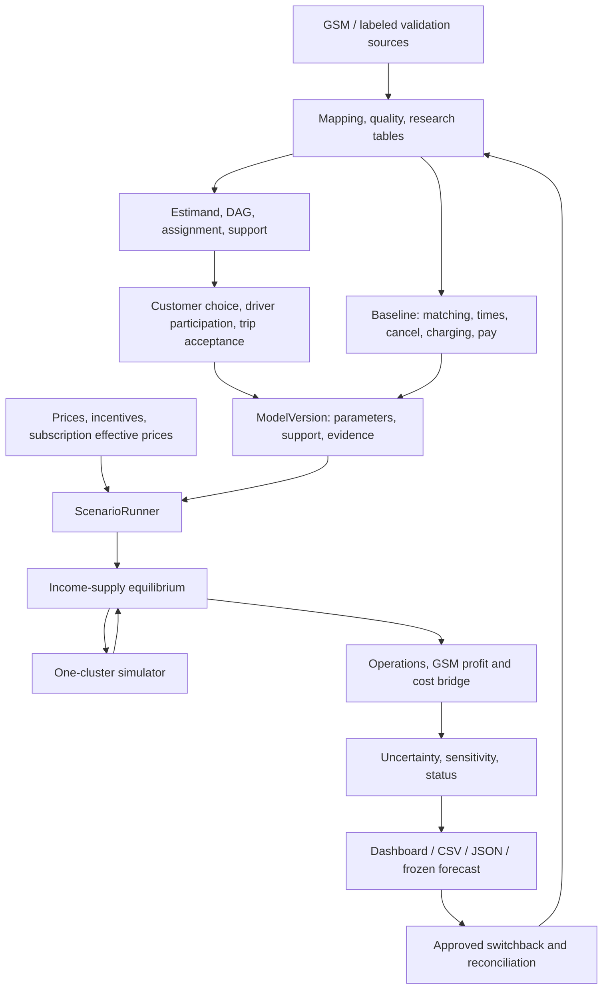
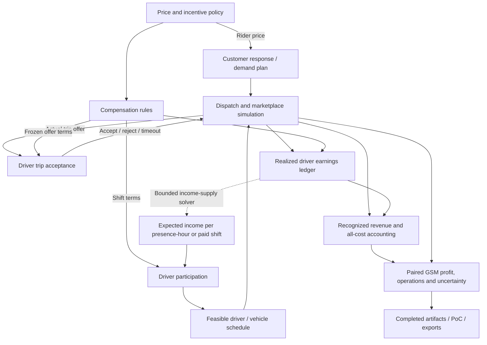

# Core Engine Design - GSM Causal Marketplace

**Basis:** [GSM Causal Marketplace Proposal](GSM_Causal_Marketplace_Proposal.md).
**Scope:** a reusable causal marketplace core engine powering an end-to-end PoC;
first validated scope is one cluster and two services, with a five-week development plan.
**Document type:** implementation and acceptance design. Formulas, interfaces,
and starting values are design choices, not measurements or implementation status.

GSM source requests, export formats, keys and units follow
[GSM_DATA_CONTRACT.md](../GSM_DATA_CONTRACT.md). This document specifies algorithms;
current progress and executed evidence are indexed in [docs README](../README.md).

## 1. Objectives and required outputs

Given a price/incentive policy, baseline market, and versioned response models,
estimate how customer demand, driver acceptance and serviceable supply, completed
trips, waiting times, and idle vehicle-hours change across the market horizon.
Evaluate operational service fulfillment and simulated gross booking value with
traceable uncertainty; report baseline and target comparisons across supported
scenarios. Freeze predictions for experimental reconciliation. Real GSM profit
and complete cost reconciliation remain conditional on confirmed GSM accounting
policies and data.

Reference scenario: **raise service X price 10% in a cluster/time window**.
Report demand, serviceable supply, service choice, completed trips, waiting times,
and idle supply. Customer price changes affect supply through compensation, offer
dispatch, and adjustable driver trip acceptance.

| Requirement | Output | Component |
|---|---|---|
| Customer price sensitivity | Request response; quote conversion separately; explicit unit/population | DemandResponse |
| Cross-service response | Supported own/cross 2x2 matrix by zone/time/service | ChoiceResponse |
| Driver attendance and supply | Feasible shifts and serviceable vehicle-hours under offered terms; extra hours versus relocation | DriverParticipation, ScheduleBuilder |
| Driver trip acceptance | Acceptance conditional on an actual offer; rejection, timeout and offer exposure separately | DriverAcceptance |
| Equilibrium | Consistent income/supply/utilization or nonconvergence status | EquilibriumSolver |
| Operations | Completed trips, wait, cancellation, idle hours, charging | MarketplaceSimulator |
| Economics | Simulated gross booking value and driver earnings summary; profit and ROI reported conditionally when GSM cost ledgers exist | EconomicEvaluator |
| Uncertainty/evidence | Intervals, support, assumptions, A/B/C per output | UncertaintyEngine, EvidenceRegistry |
| Validation | Switchback schedule, frozen forecasts, reconciliation ledger | ExperimentInterface |
| Handoff | Scenario dashboard, CSV/JSON, reproducible versions | ScenarioRunner, ArtifactStore |

The engine supports decisions. Production execution requires GSM approval;
individual pricing, production trip dispatch, and citywide competition modeling
are outside this scope.

### 1.1 Engine delivery standard

The PoC is built on a core engine with independently verified behavior and
declared operating limits. PoC delivery includes a scenario dashboard and exports
using the same versioned results as headless execution. A small market scope
bounds the validation domain; it does not relax correctness, inference or failure
handling. These are target
requirements, not claims that current implementation has passed them.

| Area | Required behavior/evidence |
|---|---|
| Execution and interfaces | Python/CLI execution independent of UI; explicit schema/version, scope, units and configuration at module boundaries; dashboard reads completed results |
| State and accounting | Valid request/vehicle transitions, no double assignment, conserved request/state-time/energy/ledger quantities; carryover retains unfinished work and applicable operational state |
| Failure behavior | Identification/support failures, invalid states, nonconvergence and exhausted budgets retain reasons and withhold dependent official forecasts; valid independent outputs keep their own status |
| Scientific validity | Simple baselines, leakage-free splits, independent controlled truths/holdouts, support/rank checks, repeated-run accuracy and empirical interval coverage; missing GSM evidence stays explicit |
| Reproducibility | Versioned data/models/rules/configuration/environment, explicit event ordering and random streams, verified artifact reuse and replay; operational continuation separately validates saved event/RNG state |
| Resource limits | Freeze representative workloads and acceptance budgets before final checks; measure runtime, memory, work counts and failure rates; expose bounded exhaustion |
| Extension | Map new sources and replace declared response/operational rules through explicit interfaces; rerun contract and regression checks and record the newly validated scope |

Use the simplest model that meets these gates. Statistical and operational
fidelity must be supported by evaluation; additional model complexity does not
substitute for evidence. The benchmark protocol and release gates are in
[section 17](#17-validation-and-acceptance).

## 2. Architecture

### 2.1 Response estimation and market simulation

Use a structural marketplace model for forecasting. DML, DiD, or experiments
estimate responses; simulation combines them with operations and compensation.
DML alone does not produce completed trips, idle vehicles, GSM profit or ROI.

The target extends the existing customer-response engine with two driver
decisions: participation/working hours and acceptance of an individual trip offer.
Dispatch determines offer exposure; it is not another name for either decision.
Use `rider_price`, `customer_id` and `driver_id` for these concepts; X/Y remain
service alternatives throughout the existing demand model.

Offline fitting produces separate demand/choice, participation and trip-acceptance
bundles, plus operational calibration. Each retains its estimand, decision
population, predecision information, split plan, support and evidence. Freeze them
in a compatible `ModelVersion` before scenario execution. This is target
architecture; current implementation and executed gates remain in the
[progress index](../README.md#tiến-độ-hiện-tại).



### 2.2 Technology and execution

Use Python/SQL batch jobs, DuckDB/Parquet tables, EconML DML, and SimPy
discrete-event simulation. SimPy supplies event/process scheduling; marketplace
rules must be implemented explicitly. Streamlit reads completed artifacts.

Fitting, calibration, bootstrap, and equilibrium run as bounded jobs. Display
changes read results; new scenarios create finite jobs with explicit status.
Avoid fitting/bootstrap during rendering. Kafka, a separate registry service,
and automated policy deployment are unnecessary for one cluster.

### 2.3 Customer and driver execution

`ScenarioRunner` evaluates baseline and target separately with the same initial
snapshot, horizon, exogenous conditions and paired random streams. Within each
policy trial, the following components execute using the frozen model version:



| Component | Responsibility and boundary |
|---|---|
| CompensationModel | Translate policy into terms known before each decision; settle actual earnings under the same versioned rules. Rider payment and driver pay are distinct. |
| CustomerResponse | Predict service choice and requests within the declared exposure/demand mode; retain the existing demand bridge. |
| DriverParticipation | Predict participation and conditional hours, or an identified aggregate hours response, over the eligible population and feasible decision horizon. |
| ScheduleBuilder | Convert the response into physical driver/vehicle shifts; enforce roster, contract and availability limits and report capacity gaps. |
| DriverAcceptance | Predict a decision only after an actual trip offer, using its frozen terms and predecision context. |
| MarketplaceSimulator | Own dispatch, offer reservations, request/vehicle transitions, cancellation, deadlines and carryover. |
| EarningsLedger and EquilibriumSolver | Reconcile realized driver earnings and update income expectations in bounded trials from the same initial state. |
| EconomicEvaluator | Reconcile recognized revenue and every in-scope direct or allocated cost against a finance-approved accounting definition; calculate profit only when coverage is complete. |
| ScenarioRunner and evaluation | Compare policies, propagate uncertainty and evidence, and publish validated artifacts consumed by both the PoC and exports. |

These are logical responsibilities within the existing packages, not requirements
for separate services or one file per component. Package ownership and internal
schemas are maintained in [ARCHITECTURE.md](../ARCHITECTURE.md).
Driver rejection can change matching and utilization while leaving serviceable
hours unchanged. Never approximate physical supply as serviceable hours multiplied
by trip-acceptance probability. ETA-to-choice feedback is a separate model mode
under [section 6.5](#65-eta-and-operational-feedback).

## 3. Market scope, time, and units

`MarketDefinition` fixes zones/boundary versions, monitored neighbors, services,
price control, eligible drivers/vehicles, and forecast horizon. Start with small
zones and 30-minute aggregation, adjusted to log coverage. Aggregation differs
from experiment blocks, driver shifts, and simulator event time.

Use seconds and timezone-aware simulator timestamps. Report windows in the
market timezone; use `Asia/Ho_Chi_Minh` for Vietnam only after source confirmation.
Never silently convert naive source timestamps to UTC.

| Quantity | Symbol/unit | Required distinction |
|---|---|---|
| Quote exposure | $\lambda_{\text{quote}}$: sessions/hour | Separate from requests/completed trips |
| Conversion | $p_j$: choice probability | Actual displayed choice set and observation window |
| Demand | $D_j$: requests/hour | Retry attempts versus original demand; declared business deduplication |
| Serviceable supply | $H_{\text{serviceable}}$: vehicle-hours | Idle + reserved/dispatch + pickup + on-trip; exclude charging/break/ineligible |
| Immediately available supply | $H_{\text{idle}}$: vehicle-hours or point-in-time count | Subset of serviceable supply |
| Expected income | $E$: VND/hour or VND/shift | Consistent denominator and predecision information |
| Price/incentive | $P/B$: VND or price multiplier | Before/after discount, tax/fees, unit, version |
| Operations | Trips, seconds, rates, vehicle-hours, kWh | Explicit denominators for rates |

Count a shared vehicle-hour once across X/Y. Eligibility represents multiple
services without duplicating supply. Include internal substitution in total GSM
outcomes. `NONE` does not imply competitor choice.

## 4. Input contract and research tables

### 4.1 Sources

Request **eight raw groups over the latest 12 months**, including neighbors and
controls, using Parquet, UTF-8 CSV, or native export with original schema/rate,
keys, metadata, and version history. Researchers map/check/build tables; GSM
need not prepare training data or causal coefficients.

Preserve session -> quote-set -> quote -> request/booking -> trip and
request -> dispatch -> driver/vehicle -> shift/charging-session links.
Nearest-time joins require error assessment and uncertainty labels.

The existing raw source groups cover the customer and driver architecture;
coverage of a schema does not establish data availability or causal identification.
At mapping time, verify that the exact pay/conditions known at each dispatch offer
are logged or reconstructible from as-of rule versions, inputs and eligibility.
Final trip payments alone cannot reconstruct these terms. Missing offer terms or
eligible nonparticipants limit the corresponding driver model; they are not zero
pay or zero participation. Keep raw GSM requests in the data contract and derived
model interfaces here and in the architecture document.

### 4.2 Internal interfaces

The following are proposed research interfaces built from
[GSM source exports](../GSM_DATA_CONTRACT.md#1-gsm-data-requirements).
Their grains and artifact conventions are maintained in
[ARCHITECTURE.md](../ARCHITECTURE.md#research-table-schemas).
Python classes may use CamelCase;
functions, parameters, tables, and artifacts use snake_case.

| Engine input | Contract tables | Content |
|---|---|---|
| Demand/choice | `quote_session`, `quote_option`, `booking_event`, `policy_assignment`, `demand_block` | Prechoice display/availability/price/ETA, outcome/censoring, exposure/requests, assignment |
| Driver participation | `driver_shift_eligibility`, `driver_offer_shift`, `driver_vehicle_state`, `policy_assignment` | Eligible population including nonparticipants, offered shift terms, participation/conditional hours and predecision income information |
| Driver trip acceptance | `driver_trip_offer`, `driver_vehicle_state`, `policy_assignment` | Actual dispatch offers, immutable terms/context, accept/reject/timeout, observation coverage and dispatch exposure |
| Calibration | `operational_event`, `booking_event`, `driver_vehicle_state`, `payment_cost` | Matching/timing/cancel/charging/earnings/cost rules |
| Simulation | `baseline_snapshot`, `demand_plan`, `admission_plan` | Initial states/roster/rates/rules, requests/hour, shift/serviceable-hour plans |

A refresh does not create another independent customer. Initially select one
decision/session using a rule fixed before fitting and independent of subsequent
booking. Refresh sequences need their own estimand.

Keep missing, unknown, not-applicable, and observed zero distinct. No linked
request means `NONE` only after complete observation/logging; otherwise censor
or mark unknown. No trips does not establish offline state. Reconcile durations,
requests/trips, and ledgers against the same source scope.

### 4.3 Blocking quality issues

Unmapped schema/keys, unexplained many-to-many joins, inconsistent timestamps,
missing essential coverage, or unknown currency/units block affected modules.
Independent outputs can continue. Keep scope, join rates, valid counts, and
exclusion/censoring reasons in artifacts.

## 5. Causal identification and parameter sources

Each `EstimandSpec` records treatment, outcome, population, horizon, assignment,
pretreatment features, inference unit, assumptions, support, and evidence source.
Conversion, request-rate, and completed-trip elasticities are distinct outcomes.

| Variation | Estimator | Identification gate | Evidence after validation |
|---|---|---|---|
| Randomized price/incentives | Assignment-based analysis; primary intention-to-treat | Valid assignment/A/A, exposure, interference, carryover | A |
| Historical changes with controls | Timing/group-appropriate DiD | Conditional parallel trends, anticipation, concurrent changes assessed | B |
| Historical observed confounding | DML plus adjusted baselines | Adequate pretreatment features, residual variation, overlap | B with explicit assumptions |
| Known-parameter mechanism | Estimators on observed synthetic data; evaluator-only oracle | No leakage, valid probabilities/states, frozen validation design | C |

Choosing an estimator or planning randomization does not upgrade evidence.
Record unconfirmed assumptions in model cards; unsupported responses remain
C assumptions or unavailable.

Use suitable group-time DiD estimands, preferably Callaway-Sant'Anna when event
structure fits. A single two-way fixed-effects regression does not handle all
heterogeneity/timing. A discrete-policy ATT is not automatically a log-price
derivative; limit actions to evidence or declare interpolation assumptions.
[Method](https://bcallaway11.github.io/did/).

DAGs distinguish pretreatment $W$, offered price/incentives, displayed income
information, choice, post-treatment operational states, and realized ledgers.
Realized earnings and policy-affected ETA are outcomes/mediators, not automatic
confounder features.

Driver estimation respects both decision horizons and the dispatch selection
mechanism. Fit acceptance from actual offers, including unsuccessful ones, and
participation from the eligible population, including nonparticipants. A good
acceptance predictor does not identify a causal pay response: offer assignment,
price/incentive variation and overlap need their own checks. Start with simple
baselines; logistic or other behavioral models do not inherit the demand DML
model's evidence. Unidentified driver responses remain explicit C sensitivity
assumptions or unavailable, even when all requested columns exist.

## 6. Demand and cross-service engine

### 6.1 Exposure and choice

With complete quote logs:

$$
D_j(z,t;\pi)=\lambda_{\text{quote}}(z,t;\pi)\,p_j(z,t;\pi),\qquad j\in\{X,Y\}.
$$

Expected requests over $\Delta t$ hours are $D_j\Delta t$. The simulator consumes
rates with declared scope/choice set, never completed-trip counts as demand.

Immediate price changes after session entry may hold exposure fixed under
`conditional_on_quote_population`. Longer-term traffic/return effects need an
identified exposure model. Without it, long-term total demand is unavailable;
zero exposure elasticity is an assumption, not a result.

A mutually exclusive alternative models requests directly by policy block when
request logs/identification qualify but quote logs are incomplete. It returns
total request effects, leaving conversion/outside choice unavailable. Never
multiply a total request effect by another conversion effect.

### 6.2 Initial choice function

Use a local log-price response with target-market baseline:

$$
p_{XY}(W;\pi)=p_{XY,0}(W)+\Theta_g(W)
\begin{pmatrix}
\log(P_X^{\text{eff}}/P_{X,0}^{\text{eff}})\\
\log(P_Y^{\text{eff}}/P_{Y,0}^{\text{eff}})
\end{pmatrix},\qquad p_{\text{NONE}}=1-p_X-p_Y.
$$

Effective prices are displayed prices after defined benefits/promotions.
Subscription effects require observed eligibility; do not arbitrarily allocate
subscription fees as trip discounts. Initially hold subscriber membership fixed;
adoption/churn needs separate identification.

Rows are chosen services; columns are changed prices. Own/cross conversion
elasticity at baseline is:

$$
\varepsilon^{\text{choice}}_{jk}=\theta_{jk}/p_{j,0}.
$$

With identified exposure elasticity $\xi_k=\mathrm{d}\log(\lambda_{\text{quote}})/\mathrm{d}\log(P_k)$:

$$
\varepsilon^{\text{request}}_{jk}=\xi_k+\varepsilon^{\text{choice}}_{jk}.
$$

Near-zero baselines require absolute effects and denominators instead of unstable
elasticities. Zero/negative prices need monetary or categorical treatments;
adding an arbitrary epsilon does not make log prices valid.

### 6.3 DML and baselines

Retain naive and adjusted OLS. DML learns $\mathbb{E}[Q\mid W]$ and
$\mathbb{E}[T\mid W]$ out of fold, then relates residuals. Cross-fitting and
orthogonal scores reduce nuisance-error sensitivity under method assumptions;
they do not remove hidden confounding or guarantee market transfer.
[Method](https://arxiv.org/abs/1608.00060).

Use LinearDML with a declared small effect basis for zone/time groups and
interactions. Keep context $W$ and effect features (`EffectBasis`) separate.
Select pooled/group effects on validation; avoid separate models for every sparse
cell. Verify APIs against locked versions. [LinearDML](https://www.pywhy.org/EconML/_autosummary/econml.dml.LinearDML.html).

`ResolutionPolicy` fixes minimum independent units, rank, and group support.
Fallback to supported pooled groups with `estimated_resolution` and
`fallback_reason`; pooled coefficients cannot be labeled zone-specific.
One varying price identifies one column; collinear prices do not identify both.

Fit baseline probabilities on train using compatible groups, units, and response
forms. Validate calibration/probabilities. Learned preprocessing stays inside
train/folds; oracle and test outcomes cannot enter fitting.

### 6.4 Support and alternative forms

`SupportEnvelope` records joint actions, price domains, context coverage, rank,
counts, and domain validity. Separate min/max ranges are insufficient. Derive
support from data and approved policy bounds; do not apply 0.90-1.10 universally.

Check each context before aggregation. Negative probabilities, probabilities
above one, or sums above one invalidate actions; no clipping/renormalization.
Supported actions satisfy data support, probability validity, and operational
bounds. Explicit C sensitivity runs outside support remain separate from forecasts.

Nested logit is a possible nonlinear extension with adequate alternatives and
availability logs, a model card, identification, and a separate benchmark.
Likelihood fit alone does not make price coefficients causal. Do not force a
DML matrix into logit through probability repair.

### 6.5 ETA and operational feedback

Initial mode is `reduced_form_policy`: request effects are defined for a policy
mechanism/horizon. Do not add post-treatment wait/ETA demand effects already
included in that estimate.

`structural_choice` can add price, ETA/availability, and simulator feedback after
identifying direct/mediated relationships and revising the DAG/estimand. Modes
cannot mix in one run. The initial income-supply loop does not require an
identified ETA-choice feedback model.

Changing compensation or acceptance rules can change the policy mechanism under
which a reduced-form demand response was identified. Check that compatibility for
the full scenario; passing a price-support gate alone is insufficient. Holding
the existing request response fixed under an unvalidated driver mechanism is an
explicit C sensitivity assumption, not an identified total marketplace effect.

## 7. Supply response engine

### 7.1 Outcomes and treatment

Primary outcome is $H_{\text{serviceable}}$ for eligible drivers/vehicles over
the horizon, not trips worked. `DriverParticipation` models entry/shift decisions
and conditional hours; `DriverAcceptance` models a trip decision conditional on
an actual dispatch offer. Offer exposure is generated by matching. Relocation
and charging timing have separate estimands when modeled.

Treatments are offered compensation/incentives and income information known
before decisions. Fixed contracts may imply zero extra hours; additional shifts,
acceptance, and charging timing remain possible responses. Never use the same
shift's realized earnings to manufacture a pretreatment expectation.

One possible aggregate-hours specification, for positive baseline income and an
identified expected-income response, is:

$$
H^*_{\text{serv},g}=H_{\text{serv},0,g}\exp\left(
\gamma_g\log(E_g/E_{0,g})+\kappa_g(B_g-B_{0,g})\right).
$$

$\gamma$ is income elasticity; $\kappa$ has inverse-currency units. This structural
form applies only within validated support. If bonus is included in income,
use one path or an independently identified bonus effect; do not count it twice.
Zero baseline income/bonus requires amount or categorical treatments.

Zero baseline hours and discrete shifts need participation/shift-acceptance
models plus conditional hours. Retain nonparticipants and valid zero outcomes.
An aggregate hours response and a participation-plus-hours response are alternative
supply specifications; do not apply both as successive multipliers. The candidate
roster includes eligible nonparticipants, with driver/vehicle assignments and
feasible shift choices. Fixed attendance is an explicit mode with no additional
participation response.

Expected income must match the work decision: presence-hour or paid shift,
including expected idle time, offer frequency, fixed pay and applicable bonuses.
Net pay divided by pickup-plus-trip time describes one proposed trip and is not
an income expectation for a whole shift. Participation features use information
available before the decision, including opportunity costs only when measured or
explicitly assumed. The simulator measures actual serviceable hours from the
admitted physical schedules rather than treating expected hours as physical cars.

### 7.2 CompensationModel

Represent fixed pay, commissions/revenue share, piece rates, threshold bonuses,
guarantees, caps, and payment timing. Produce predecision offered terms and
post-simulation earnings ledgers. Customer price changes with unchanged expected
compensation do not enter supply directly.

Income feedback follows fixed compensation rules, not customer payments.
Threshold bonuses use individual driver/shift outcomes, not market-average fares.
Income denominators match the decision basis: presence hours, work hours, or paid shifts.

Freeze `rider_price` and driver-visible terms independently at their quote/offer
times. Each trip offer records its pay basis/currency, conditions, eligibility and
bonus progress where applicable, compensation version and information available
to that driver. A fixed piece rate can leave trip pay unchanged after a rider
price change; a declared revenue-share rule can transmit it. Even with fixed
trip pay, changes in offer frequency and idle time may affect shift income.
Demand price multipliers do not define monetary fares or driver pay: synthetic
runs need an explicit tariff/pay fixture and cannot infer GSM currency values.

Keep offered terms, realized driver earnings and rider payments as separate
records. Settle completed/canceled trips, guarantees and bonuses under their
applicable rules; do not pay an offer merely because it was created or accepted.
Do not use realized end-of-trip or end-of-shift earnings as offered treatment.

### 7.3 Hours to driver/vehicle schedules

`admission_plan` contains target serviceable hours, shifts/participation,
eligibility, relocation options, and support. `ScheduleBuilder` enforces driver,
vehicle, contract, and battery/charging constraints.

Serviceable targets already exclude charging/break/ineligible time. Build enough
presence time, then measure actual serviceable hours from state intervals.
Do not subtract charging again or create fractional drivers as physical drivers.
Unmet targets retain gaps and `capacity_constrained`; never exceed the roster.
Rounding/stochastic participation requires seeds and sensitivity checks.

Track cluster and neighbor totals. Relocation redistributes hours; only added
shifts/hours increase total supply. A shared `FleetPool` manages X/Y without
duplicating vehicle IDs.

### 7.4 Trip acceptance model

Model $P(\mathrm{accept}\mid\mathrm{actual\ offer},\mathrm{predecision\ context})$.
The context includes driver-visible pay/conditions, pickup and trip estimates,
service/zone/time, and measured or declared driver characteristics. It excludes
future demand, realized travel time and realized earnings. Not receiving an offer
is not a rejection, and a timeout is not automatically a deliberate refusal.

Retain immediate acceptance as the legacy reference and a constant-probability
baseline. A candidate behavioral model is a calibrated logistic response to
offered pay and known pickup/trip conditions. Net hourly pay for that trip may be
a feature only with positive duration and available cost assumptions; it must not
be reused as shift income. Specify feature units, missing-data behavior, response
latency/timeout rules and parameter provenance in the model card. Synthetic
coefficients test declared mechanisms at C, not GSM behavioral effects.

In counterfactual execution, evaluate the probability once for each immutable
offer and use a seeded decision keyed to its stable identity. Persist the offer,
decision and attempted driver/request pairs through continuation. Never repeatedly
resample an unchanged rejected offer until it happens to be accepted. Increased
pay implies monotone conditional acceptance only when that property is part of
the declared model and all other offer features are held fixed; the aggregate
acceptance rate can still change with offer composition.

## 8. One-cluster simulator

### 8.1 Entities and states

| Entity | States/properties | Invariant |
|---|---|---|
| Request | `created`, `queued`, `assigned`, `pickup`, `on_trip`, `completed`, `canceled`, `expired` | One state at a time; explicit terminal reason |
| Trip offer | `pending`, `accepted`, `rejected`, `timed_out`, `withdrawn`; request/driver/vehicle/attempt keys | Immutable terms; one final resolution; open offers retain censoring |
| Driver/shift | `off_shift`, `scheduled`, `present`, `break`, `ended` | Eligibility/shift constraints respected |
| Vehicle | `offline`, `idle`, `reserved`, `to_pickup`, `on_trip`, `charging_queue`, `charging`, `unavailable` | One trip/reservation at a time |
| Station | Capacity, charger availability, queue, outage | Active-port capacity respected |
| Boundary flow | Entry/exit, return time, SOC | Preserve trips/vehicles leaving the cluster |

States persist across reporting windows. Drivers and vehicles are separate
entities with assignments. Declare warm-up/initial snapshots; baseline and
target start from comparable conditions.

### 8.2 Request generation

Choose arrivals from baseline diagnostics. Initial piecewise Poisson rates $D_j$
with contextual OD/service mix are assumptions to test. For bursts/overdispersion,
use suitable count models or dependent block replay/resampling.

Rates already contain price effects. Freeze quote/booking price/promotion under
the applicable version; never apply elasticity again to completion. Retries retain
parent keys and horizon rules. Report attempts and business-defined demand separately.

### 8.3 Matching, acceptance, pickup

Eligible candidates are idle, service-compatible, in-shift, and sufficiently
charged. Initial versioned ranking minimizes ETA within declared radius/threshold;
otherwise queue or terminate by deadline. Calibrate this rule before claiming
GSM dispatch fidelity.

Start with sequential offers in the versioned candidate order. Create an offer,
freeze compensation/context and reserve the driver/vehicle while a response is
pending. Assignment and pickup begin only after acceptance. Rejection or timeout
releases the reservation and allows another eligible candidate; the original
request and its deadline remain unchanged. Record attempts and bound their count
and total time. No eligible candidate produces no offer, rather than a rejection.

Reserved drivers/vehicles cannot take another request. Cancellation/expiry
withdraws a pending offer and releases its reservation; late responses cannot
revive the request. Order simultaneous responses, deadlines and cancellations
explicitly. Distinguish a genuinely new offer with changed terms from an unchanged
offer already declined. Immediate decisions with zero latency remain a supported
reference mode; response latency requires its own calibrated or assumed rule.

Pickup/service distributions follow OD/time/service. Keep displayed ETA, dispatch
ETA, and actual pickup separate. Prepickup cancellations may incur travel/costs.
Completion generates fare ledgers according to rules; bookings alone are not revenue.

### 8.4 Charging and energy

`EnergyModel` reduces SOC by distance/conditions. Admission requires energy for
pickup/service/reserve; otherwise route to charging or mark ineligible. Station
queues/chargers have finite capacity. Record queue/plug/start/end, kWh, cost, SOC.

Initial kWh/km and capped fixed charging power are declared assumptions. Calibrate
telemetry/logs before interpreting GSM results. Enforce SOC in [0,1], capacity,
and energy conservation without clipping away errors.

Energy/charging is an operational availability constraint. The first driver-response
integration retains the current fixed shifts/static-SOC assumptions while adding
compensation and trip acceptance; participation and income-supply feedback follow
with explicit availability assumptions. Detailed energy/station behavior remains
a separately validated extension and is not evidence of a driver pay response.

### 8.5 Boundaries and carryover

Keep trips picked up inside and dropped off outside. Use monitored buffer zones
or a declared boundary entry/return model. `closed_cluster` is C validation only.
Relocation, charging, and ongoing trips create carryover preserved in trajectories
and considered in experiment design.

Driver-aware checkpoints also preserve pending offers/reservations, resolved offer
identities, prior refusals, frozen compensation/model versions, applicable bonus
progress and ledger state. Window boundaries cannot redraw decisions, forget a
reservation or settle the same earnings twice. Reject incompatible continuation
inputs; a new policy scenario starts from its declared initial snapshot.

### 8.6 Accounting

For a horizon of $L$ hours:

$$
H_{\text{serv}}=H_{\text{idle}}+H_{\text{dispatch}}+H_{\text{pickup}}+H_{\text{on\_trip}},
\qquad \overline{V}_{\text{idle}}=H_{\text{idle}}/L.
$$

Dispatch hours cover reservations before pickup. States do not overlap.
Report charging/queue/break/offline/ineligible separately over the same population
and coverage. `available_vehicle_count(t)` is eligible idle stock at time $t$.

$$
N_{\text{open,start}}+N_{\text{created}}=
N_{\text{completed}}+N_{\text{canceled}}+N_{\text{expired}}+N_{\text{open,end}}.
$$

Open requests include queued/assigned/pickup/on-trip states and snapshot carry-in.
Terminal counts are events within the horizon. Separate created-request cohorts
from carry-in when defining wait/cancel denominators. Export end-horizon censoring;
never count it as cancellation. Declare quantile methods. Request-capacity gaps
in trips/hour are diagnostic proxies, not idle vehicles or hours.

Reconcile pending offers at the start plus newly created offers against accepted,
rejected, timed-out, withdrawn and pending offers at the end. Offer attempts do
not add to request counts. For the declared offer cohort, report acceptance as
accepted / (accepted + rejected + timed-out), with withdrawals and unresolved
offers reported separately; a zero denominator is unavailable. Preserve explicit
rejection and timeout rates. Report offered-driver exposure separately from this
conditional rate, and distinguish expected probabilities from sampled outcomes.

Participation rates use the eligible decision population, including nonparticipants;
income per presence-hour includes present drivers with zero trips. Keep numerator,
denominator, cohort/window and carry-in handling with each metric. Rejecting a trip
does not itself remove idle time from serviceable hours.

## 9. Baseline calibration

Calibrate arrivals/OD mix, pickup/service times, patience/cancel, acceptance,
returns, shifts, energy/charging, and applicable operating costs. Compensation
comes from versioned business rules, not average payment ratios.

Separate chronological fit/calibration, validation, and final baseline holdout.
Do not retune after inspecting final holdout. Policy identification and baseline
calibration retain separate lineage; future/post-treatment measurements cannot
become pretreatment confounders.

Assess completed trips, wait p50/p90, cancel/no-driver, utilization, idle hours,
charging, and earnings by zone/time. Matching total counts by inflating arrivals
cannot substitute for funnel, timing, and stock-flow checks.

Freeze quality/runtime thresholds after week-1 inspection and before holdout.
Missing logs leave dependent outputs `not_calibrated`. Synthetic truth validates
synthetic calibration only.

## 10. Income-supply equilibrium

### 10.1 Equations

For policy $\pi$, initial state $S_0$, and expected income $E$:

$$
H^*=\text{Supply}(E,\pi,W),\qquad
O=\text{Simulate}(\text{Demand}(\pi,W),H^*,S_0,\pi),\qquad
E^*=\text{IncomeSummary}(O,\pi).
$$

Require income and supply/state summaries to agree within tolerance. Include
eligible zero-trip drivers in denominators. A zero-hour denominator makes implied
income undefined; return meaningful failure/inactivity rather than fabricated zero.

Fixed supply takes one pass with `fixed_supply`. Separately identified ETA feedback
may add choice/ETA equations and residuals.

Inside each trial, participation creates the admission plan, dispatch creates
actual offers and acceptance governs assignments. The compensation ledger then
produces the income summary on the decision's declared hour/shift basis, including
idle time and zero-trip drivers. Fixed attendance with behavioral trip acceptance
is still fixed supply and needs no participation-equilibrium claim. The first
driver upgrade keeps `reduced_form_policy` demand; the income-supply solver must
not append another operational ETA effect to those request rates.

### 10.2 Bounded damped iteration

$$
E^{(k+1)}=(1-\alpha)E^{(k)}+\alpha E^{*,(k)},\qquad 0<\alpha\le1.
$$

```text
solve_equilibrium(policy, baseline_snapshot, model_version, seed_plan, limits):
    validate support, compatibility, snapshot, compensation
    expected_income = valid baseline expectation
    for iteration in bounded iteration range:
        plan = predict_supply(expected_income, policy)
        trajectory = simulate_marketplace(plan, same initial snapshot)
        implied_income = summarize_income(trajectory, decision_population)
        record income/hour residuals, uncertainty, capacity gaps
        if income is undefined or trajectory violates invariants: return failure
        if residual/noise gates pass for consecutive iterations:
            confirm with independent seeds; return convergence if valid
        if deadline/event/iteration budget is exhausted: return not_converged
        expected_income = damp(expected_income, implied_income)
    return not_converged with diagnostics
```

Every candidate starts from the same $S_0$ and horizon. Iterations are equilibrium
trials, not additional operating time. State evolves continuously within each trajectory.

### 10.3 Convergence and failures

Use positive unit-specific scales for relative residuals plus absolute tolerances;
never divide by zero baselines. Check income/hours by group and cluster with Monte
Carlo noise. Small damped updates do not establish small fixed-point residuals.

Development defaults: $\alpha=0.3$, at most 50 iterations, three consecutive passes,
600 seconds/job, finite event budgets. Relative tolerance 1% is a sensitivity
starting point, not acceptance. Freeze replicates, absolute tolerances, events,
and scales before batches; never silently expand budgets.

Use common seeds across candidates and independent confirmation seeds. Preserve
oscillation/saturation/support/budget failures, traces, and diagnostics. The last
nonconverged point is diagnostic only. Bounded multiple starts can assess dependence
on initialization; a single converged run does not prove uniqueness.

## 11. Policy comparison and economics

Solve baseline and target separately with common horizon, initial snapshot,
exogenous conditions, and paired seeds. Compare two simulated measurements;
observed totals validate baseline rather than serve as an incompatible comparator.

Evaluate rider-price-only, driver-incentive-only and combined changes against a
common baseline within joint support. Declare whether the compensation rule passes
rider price through to driver pay; do not silently hold it fixed or assume a share.
Separate conditional offer-response checks from market comparisons where the
number and composition of offers change. A common seed alone is insufficient if
event ordering changes: use stable entity/event random streams and independent
replicates, preserving failed or unsupported runs in diagnostics.

Version prices/promotions/bonuses by quote/offer. Finance must confirm the profit
definition, GSM-owned services, recognition period, accounting scope, cost
classification and allocation rules before a GSM monetary forecast is supported.
Create reconciled ledger entries for recognized revenue, refunds/adjustments,
driver wages or trip pay, bonuses/incentives, energy, payment fees, vehicle costs
and every other applicable direct or shared expense. Include pay for shifts with
zero trips. Apply the same approved recognition and allocation rules to both
policies; a change in completed-trip count must not by itself reallocate shared
costs into an artificial profit gain.

For the declared scope and horizon, partition costs into nonoverlapping classes
whose union covers every expense in the agreed profit definition:

$$
P_{\text{GSM}}(\pi)=R_{\text{recognized,GSM}}(\pi)
-\sum_{c\in\mathcal{C}_{\text{all in-scope}}}C_c(\pi),\qquad
\Delta P=P_{\text{GSM}}(\pi_1)-P_{\text{GSM}}(\pi_0).
$$

**Marketplace fulfillment and simulated gross booking value lead policy comparisons.**
Completed trips, waiting times, fill rates and idle vehicle-hours explain the operational
trade-offs between pricing policies. In parallel, simulated gross booking value
and driver earnings provide commercial context under declared tariff and pay rules.

When confirmed accounting scope, complete cost classifications, and allocation rules
are supplied by GSM, **incremental profit $\Delta P$ serves as a conditional full-cost measure**:
report baseline and target profit, the revenue and cost-category bridge, coverage,
uncertainty and operating guardrails. Fixed costs that truly remain identical
cancel in $\Delta P$, but still belong in absolute profit. A cluster result is profit
for its declared accounting scope, not GSM-wide net income.

Finance must confirm revenue definitions; gross customer payment is not automatically
GSM revenue. Missing cost categories, incomplete ledger coverage, or unconfirmed
allocation rules leave GSM profit and $\Delta P$ `not_evaluated`, not zero.
Independently supported operations, completed trips, and simulated gross booking
value remain fully reportable and actionable. When variable costs are complete,
the narrower contribution margin may be reported separately:

$$
\text{CM}(\pi)=R_{\text{recognized,GSM}}(\pi)-C_{\text{variable}}(\pi).
$$

When profit and a positive incremental incentive expense are supported, the optional
net-benefit ratio may evaluate $\text{incentive ROI}=\Delta P/\Delta C_{\text{incentive}}$
for an isolated incentive contrast at fixed customer price. Missing cost coverage or
nonpositive denominators leave ROI unavailable. Simulated or illustrative economics
must remain explicitly labeled and never claim measured GSM profit.

## 12. Uncertainty and sensitivity

### 12.1 Separate sources

| Source | Handling | Output label |
|---|---|---|
| Estimation error | Resample assignment/dependence units; refit learned components in scope | Parameter/forecast uncertainty |
| Simulator randomness | Independent repeated trajectories, paired baseline/target | Simulation variability and Monte Carlo error |
| Unconfirmed assumptions | Deliberate supply/patience/boundary/charging/transfer variants | Sensitivity range, not confidence interval |

Resampling units follow assignment and dependence. Repeated/moving drivers may
need extra grouping. Sessions or single days are not universally sufficient.
Keep copies of each original unit on the same side of cross-fitting.

### 12.2 Refit and simulation per draw

Refit responses, baselines, and learned calibration components relevant to the
uncertainty target; fixed business rules remain fixed. Solve baseline/target in
each draw. Conditional forecasts keep roster/snapshot/context fixed; resampling
these requires another declared target.

For an expected difference, run $R$ pairs per bootstrap draw:

$$
\delta_b=\frac{1}{R}\sum_{r=1}^{R}
(\text{metric}_{\text{target},b,r}-\text{metric}_{\text{baseline},b,r}).
$$

Percentiles across $b$ describe uncertainty in expected forecasts. Choose $R$ so
simulation error does not dominate interval width. Future realized outcomes need
predictive intervals combining parameter and trajectory randomness. One trajectory
per draw cannot be described as parameter-only uncertainty.

Use independent seeds across draws and paired entity/event random streams within
baseline/target where possible. Record failures, nonconvergence, invalid probabilities,
and lost support. Never silently remove failed draws; quality/failure gates control
interval publication.

Draw counts have finite budgets and declared development/reporting profiles.
Distinguish individual/simultaneous intervals; select multiplicity handling before
final evaluation. More draws cannot repair identification or domain shift.

### 12.3 Full-chain evidence

Record A/B/C for effects and source/quality for calibration. Demand A plus assumed
supply C and uncalibrated simulation is not an A forecast. `mixed_evidence` preserves
module dependencies; one experimental elasticity does not make ROI evidence A.

## 13. ScenarioRunner contract

### 13.1 Scenario request

`ScenarioSpec` carries market/model/snapshot IDs, scope/horizon, baseline/target
policies, both price schedules, bonus/eligibility, subscription treatment where
available, demand mode, seeds, budgets, and uncertainty. Pass assumptions explicitly.

| Group | Logical fields |
|---|---|
| Identity | `scenario_id`, `market_id`, `model_version`, `baseline_snapshot_id` |
| Scope | `zone_ids`, services, start/end, timezone, horizon, warm-up |
| Policy | `baseline_policy_id`, `target_price_schedule`, `bonus_rule`, `effective_price_definition` |
| Assumptions | `demand_mode`, `compensation_mode`, `participation_mode`, `acceptance_mode`, `boundary_mode`, initialization |
| Compute | `seed_plan_id`, `max_iterations`, `max_events`, `max_offers_per_request`, `wall_time_budget`, replicate/draw budgets |
| Evaluation | `interval_target`, level, support policy, `sensitivity_only` |

+10% applies to baseline effective price for the correct service/group, not
post-selection average fares. Zero-base bonuses use amounts. Schedules specify
announcement/effectiveness and shift-decision horizon, not payment time alone.

### 13.2 Execution

1. Validate schema, scope, units, policy, version compatibility, and budgets.
2. Check required identification/support and calibration quality.
3. Produce request flows, construct supply schedules, solve baseline/target.
4. Reconcile requests, offers, driver/vehicle-hours, ledgers and any modeled energy in each trajectory.
5. Reconcile GSM revenue and all in-scope costs, then compute paired profit differences when accounting coverage permits; retain operational outcomes and guardrails.
6. Run bounded uncertainty/sensitivity, retaining every draw's status.
7. Atomically publish artifacts/manifests; expose forecasts only after gates pass.

### 13.3 Results and status

`scenario_result` includes baseline/target/delta, unit/population/denominator,
source/evidence/support/status per metric, with separate interval status. Its
primary evaluated fields are operational fulfillment and simulated gross booking
value: completed trips, fill/completion rate, wait times, cancellations, serviceable
and idle vehicle-hours, driver earnings and simulated revenue. Week 3 validates
operations at C; week 4 adds full-chain uncertainty and supported economics.
Full GSM profit, cost bridge, CM and ROI are reported conditionally and retain
the status `not_evaluated` when cost ledgers or allocation rules are unconfirmed;
missing financial policies do not prevent operational metrics from being reported.

Stage execution: `pending/running/succeeded/failed`. Module/metric behavior:

| Status | Behavior |
|---|---|
| `ok` | Scope gates pass; retain evidence/assumptions |
| `partial` | Supported outputs coexist with unavailable dependencies |
| `not_identified` / `insufficient_support` / `out_of_support` | Withhold affected official forecasts |
| `invalid_state` / `invalid_probability` | Block dependent forecasts; retain diagnostics |
| `not_calibrated` | Allow only explicitly chosen C sensitivity mode |
| `not_converged` / `budget_exceeded` | Never publish final state as equilibrium |
| `not_evaluated` | No data/result to evaluate the GSM metric/effect |
| `interval_unstable` / `interval_unavailable` | Separate interval status; valid points may remain available |
| `sensitivity_only` | Assumption-based results separate from supported forecasts |

If an action needs two matrix columns but only one is identified, never fill the
other with zero. Module failures do not turn missing metrics into zero. Display
flags alongside results and preserve them in CSV/JSON.

## 14. Proposed module and artifact interfaces

These are implementation contracts, not existing APIs:

```text
prepare_data(source_refs, mapping, quality_contract) -> ResearchDataset
fit_demand_choice(dataset, estimand_specs, split_plan) -> DemandChoiceBundle
validate_benchmarks(models, benchmark_spec, observed_data, evaluator_inputs) -> BenchmarkReport
fit_driver_participation(dataset, compensation_spec, estimand_spec, split_plan) -> ParticipationBundle
fit_driver_acceptance(offer_dataset, estimand_spec, split_plan) -> AcceptanceBundle
calibrate_baseline(dataset, calibration_spec, split_plan) -> BaselineModel
check_support(model_version, scenario_spec) -> SupportReport
predict_demand(response_bundle, scenario_context, policy) -> DemandPlan
predict_participation(participation_bundle, expectations, offered_shift_terms, roster) -> ParticipationPlan
build_admission_plan(participation_plan, roster, availability_rules) -> AdmissionPlan
create_driver_offer(request, driver_context, compensation_spec, policy, offered_at) -> DriverOffer
predict_driver_acceptance(acceptance_bundle, driver_offer) -> AcceptancePrediction
simulate_marketplace(demand_plan, admission_plan, initial_state, policy, model_version, seed_plan, limits) -> Trajectory
settle_driver_earnings(trajectory, compensation_spec) -> EarningsLedger
solve_equilibrium(model_version, snapshot, policy, seed_plan, limits) -> EquilibriumResult
evaluate_economics(trajectory, accounting_rules) -> EconomicLedger
compare_scenarios(model_version, snapshot, scenario_spec) -> ScenarioResult
design_switchback(market_spec, experiment_inputs, limits) -> ExperimentSpec
freeze_prediction(scenario_result, experiment_spec) -> PredictionRecord
reconcile_experiment(prediction_record, observed_outcomes, analysis_spec) -> Reconciliation
handoff(artifact_refs, acceptance_spec) -> DeliveryManifest
```

`ModelVersion` combines demand/choice, participation and acceptance bundles,
baseline/calibration, taxonomy, support, compensation/accounting,
state/boundary conventions, and model cards. Check
compatibility when zones/services/currency/horizon/causal conventions change.
A DML file alone is insufficient.

Tables/draws/trajectories use Parquet; specs/manifests/diagnostics JSON; models
implementation bundles (`.joblib` in the PoC); handoff CSV/JSON. Mobility Assistant
`effects.csv` retains outcome/treatment/unit/resolution/horizon, baseline denominator,
interval/support/evidence. Supply outputs retain compensation, eligibility,
battery/charging, and vehicle-hours.

Trip-offer artifacts retain decision-time terms/context, linked request/driver/
vehicle/shift IDs, dispatch exposure, predicted probability, response timing and
terminal status. Ledger items retain the frozen rule and source event and settle
once. Exact grains and required metadata are maintained in
[architecture schemas](../ARCHITECTURE.md#research-table-schemas).

`ArtifactStore` records source hashes, revision, lock/environment, effective config,
splits, seeds, stage timings, and checksums. Reuse requires compatible dependencies
and intact outputs. Publish only completed artifacts; UI reads validated artifacts
and does not deserialize arbitrary uploaded models.

## 15. Switchback and forecast reconciliation

### 15.1 Assignment design

Choose geographic cluster x time block from movement/carryover measurements.
Combine connected zones when needed; monitor buffers/neighbors. Block/washout
reflect trip, charging, shift, and lingering effects, independently of dashboard
aggregation. [Bojinov, Simchi-Levi, and Zhao](https://arxiv.org/abs/2009.00148).

Identify X/Y prices separately and price x incentive interactions when required.
Use feasible supported actions with adequate power/safety, not every combination.
Store seeds, strata, probabilities, announcement/effectiveness, exposure,
applied policy, and overrides.

Primary analysis is intention-to-treat. Applied/exposure analyses require separate
noncompliance assumptions. Randomization or clustered inference matches assignment
and carryover; marketplace-wide inference cannot use session-IID errors.

### 15.2 A/A and pilot

Freeze estimands, detectable/worthwhile effects, primary metric, guardrails,
block/washout, analysis/stopping rules, and sample size before treatment outcomes.
A fixed-exposure metric such as revenue/assigned block-hour may accompany
revenue/quote. Quotes can be affected by price, so report traffic and conversion.

A/A checks schedules/logs, balance, missing exposure, overrides, metric
reconstruction, and null inference. Pilot requires conditions and GSM approval.
Continuous guardrail monitoring follows agreed thresholds; efficacy conclusions
follow the analysis schedule rather than favorable uplift peeking.

### 15.3 Prediction ledger

Freeze immutable `prediction_record`: model/snapshot/policy versions, scope,
assignment, point/interval forecast, assumptions, evidence, support, freeze time,
and analysis plan. Append observed/estimated causal impacts, uncertainty,
prediction errors, and issues after execution; never overwrite the forecast.

Compare target-minus-baseline forecast with causal effects at the same estimand
and horizon. Raw post totals minus predicted baseline remain confounded when
time changes are unaccounted for. Flag changed horizons/overrides as not directly
comparable. Reconciliation creates a new model version; A applies only to valid
experimental components within validated scope.

## 16. Market transfer and public validation

Separate market definitions, adapters, snapshots, and response parameters from
simulator code. Reuse structure; calibrate each market locally. New York coefficients
do not automatically transfer to Vietnam, nor Hanoi coefficients to Ho Chi Minh City.

If assuming invariant mechanisms, declare effect modifiers, overlap, and target
adjustment. Changed choice sets/compensation/mechanisms require new identification.
Currency conversion or automatic zone mapping does not transfer behavior.
[Pearl and Bareinboim](https://arxiv.org/abs/1503.01603).

TLC validates completed-trip schemas/context/operations; Swissmetro is a separate
choice benchmark; synthetic truth validates response/simulator behavior. Never
join these into one market or label them GSM effects. C development can proceed
without GSM; real forecasts/calibration/economics require corresponding sources.

## 17. Validation and acceptance

### 17.1 Invariants

| Group | Required assertions |
|---|---|
| Data | Grain/keys/cardinality/timezones/reconciliation; unknown differs from zero |
| Choice | X/Y/NONE conservation, availability respected, correct log ratios |
| Identification | Reject collinear full matrices and unidentified scenario effects |
| Leakage | No oracle/future outcomes in fitting; original units preserved in splits/folds |
| Supply | Relocation adds no hours; shared fleet/charging counted once |
| Driver decisions | No offer is not a rejection; acceptance does not scale physical hours; eligible nonparticipants and zero-trip drivers remain in their applicable populations |
| Offers | One resolution per offer; immutable terms, bounded attempts, no double reservations, no late-response revival and no redraw across windows |
| Simulator | No double assignment; correct request partition; retain censoring |
| Energy | Consistent SOC/kWh/station capacity/eligibility |
| Solver | Explicit zero-denominator, oscillation, budget, nonconvergence handling |
| Finance | Simulated fares and driver pay settle without duplicates; profit and cost bridge evaluated conditionally when complete inputs qualify |
| Artifacts | Versions/checksums, atomic completion, seeded reproducibility |

### 17.2 Benchmarks

The [core engine validation protocol](../BENCHMARK.md#core-engine-validation-protocol)
defines correctness, repeated-seed, failure and workload checks. Method and policy
protocols in the same document retain simple baselines, independent evaluators
and frozen holdouts. Declare truths/assumptions and retain all rejected/failed
attempts in their applicable denominators.

Driver integration adds controlled checks before market-level evaluation:

- With zero response latency and fixed attendance, 100% acceptance reproduces
  existing assignments, request events and hour accounting; 0% acceptance produces
  no assignments, preserves idle hours and terminates within offer/request budgets.
- Holding driver-visible terms and context fixed prevents rider-price metadata
  from directly changing the acceptance prediction. A declared monotone pay
  response is checked on the same offer contexts and paired random draws.
- No eligible driver produces no offer; rejection followed by another driver's
  acceptance cannot double-assign a shared vehicle or restart the request deadline.
- Fixed attendance retains its schedule; behavioral participation cannot exceed
  eligible driver/vehicle/shift capacity or manufacture hours through relocation.
- Continuous and split trajectories agree on offer decisions/reservations,
  request/vehicle accounting and earnings settlement; incompatible checkpoints fail.
- Price-only, incentive-only and combined scenarios use independent repeated runs,
  with separate synthetic recovery, baseline calibration and causal evidence gates.

### 17.3 Acceptance gates

| Gate | Requirement |
|---|---|
| Headless execution | End-to-end Python/CLI scenarios use declared interfaces without dashboard execution |
| PoC integration | A supported scenario walkthrough uses the same versioned results in headless execution, dashboard and CSV/JSON, preserving units, denominators, evidence and statuses |
| Reproducibility | Same versions/data/config/seeds agree within declared tolerance |
| Complete outputs | Price-only, incentive-only and combined policies traverse customer choice, driver participation/acceptance, compensation, simulation and applicable equilibrium across independent seeds and supported contexts |
| Business outcome | Completed trips, wait times, cancellations, idle hours and simulated gross booking value lead supported comparisons; real profit and ROI reported conditionally when accounting policies exist, or carry an explicit unavailable status |
| State and failure handling | Invariants pass through carryover and supported operational transitions; deliberate invalid inputs, budget exhaustion and nonconvergence yield explicit failures |
| Transparency | Evidence/interval/support/dependencies displayed and exported per metric |
| Estimation | Recovery and repeated-run coverage in applicable validated DGPs |
| Simulator | Independent controlled baseline errors meet frozen thresholds; GSM calibration is evaluated separately when logs exist |
| Counterfactual | Reconcile identified experimental/historical effects at the same estimand |
| Resources | Representative workload runtime/memory/work counts meet frozen budgets; stage reuse and operational continuation have separate verified semantics |

Freeze `AcceptanceSpec` for business, operational error, coverage, and runtime
before final holdout. Never derive thresholds retroactively from achieved results.
Synthetic technical acceptance is not measured GSM business impact.
Record technical and GSM-evidence gate conclusions separately. Open requirements
remain visible even when the calendar milestone or dashboard demo is complete.

## 18. Five-week sequence

Weekly requirements and expected outputs are maintained in the
[roadmap](../ROADMAP.md#weekly-inputs-and-outputs); it also records current work
and remaining acceptance gates. This design describes target algorithms rather
than implementation progress. Without GSM, calibration/effects/profit/ROI remain
unevaluated while synthetic development and experiment design can continue.

## 19. Configuration and business decisions

`EngineConfig` explicitly declares taxonomy/timezone, horizon/warm-up, demand
mode, effect resolution/support, compensation/accounting, participation/acceptance
modes, roster/initialization, matching/offer deadlines and attempt limits,
patience, energy/charging/boundaries, solver limits,
uncertainty targets, and budgets. Defaults require documented development reasons;
unknown observations/business rules cannot default to zero.

| Decision | Correctness dependency | Frozen spec |
|---|---|---|
| Services/population | Alternatives, eligibility, ledger ownership | MarketDefinition |
| Quote versus request estimand | Traffic forecast versus conditional conversion | DemandModeSpec |
| Subscription/promotion | Displayed price, funder, treatment | EffectivePriceRule |
| Driver contracts | Feasible response and expected-income basis | CompensationSpec |
| Driver decisions and offers | Eligible decision population, predecision information, participation horizon, acceptance and response timing | DriverResponseSpec, OfferSpec |
| Buffers/shared fleet | Relocation, capacity, interference | Boundary/FleetSpec |
| State/charging coverage | Supported calibration/outputs | OperationalQualitySpec |
| Profit, revenue, costs and ROI | GSM ownership/scope, recognition, complete cost coverage, allocation, consistent ledgers and denominators | AccountingSpec |
| Safety/action support/power | Feasible scenarios/pilots | Acceptance/ExperimentSpec |

Version these decisions. Synthetic assumptions remain declared; real forecasts
cannot silently inherit unconfirmed synthetic values.

## 20. References and use

- [GSM proposal](GSM_Causal_Marketplace_Proposal.md): scope and roadmap.
- [GSM data request](../GSM_DATA_CONTRACT.md): sources, export metadata, keys and units.
- [Benchmark protocol](../BENCHMARK.md): recovery, policy value, and business impact.

This design specifies the target system. Choosing formulas/modules/configuration
does not prove implementation, measurement, or acceptance. Changes to estimands,
functional forms, conventions, or scope require updated design/model cards and
validation under the corresponding conditions before interpretation.
